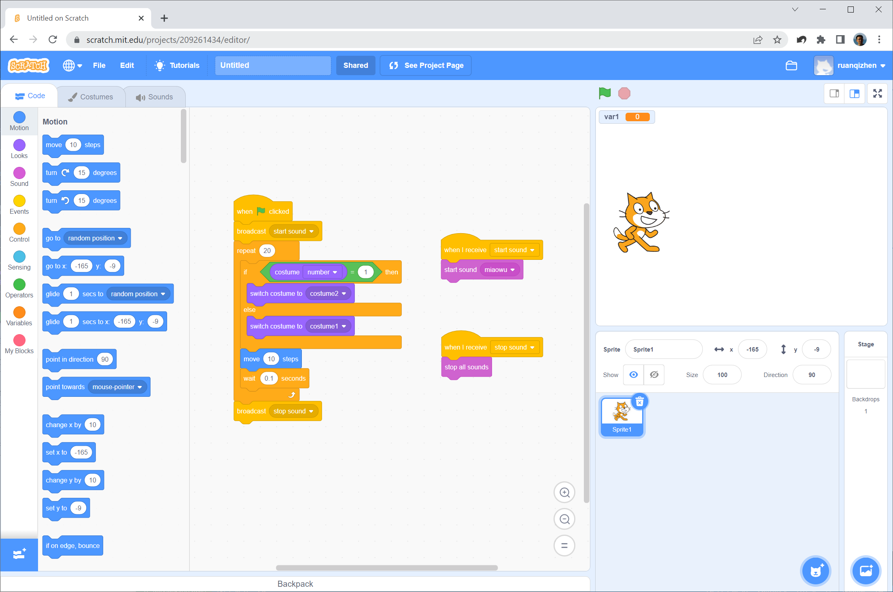

# 其它一些编程语言

如果想要精通一门编程语言，只潜心钻研这一门编程语言恐怕还不够。总是在同样的环境里思考问题容易产生局限，换一个角度再去考虑，有可能会感受到另一番天地。笔者正是在学习其它语言的过程中才开始领悟到了一些 LabVIEW 的设计精妙之处，也反思了一些之前忽视了的 LabVIEW 的缺陷。本书在讲解 LabVIEW 的时候，也常常把它与 C/C++ 等其它编程语言做对比，以便让读者更深入的理解问题。 

虽然这是一本关于 LabVIEW 的书，在本节中，LabVIEW 却并不是主角。我们将要粗浅的介绍其它一些编程语言，看看它们与 LabVIEW 有多大的差别，各自优缺点是什么。当然，编程语言的种类实在是太多了，笔者只能挑出少数几种比较有特色的语言，做最简要的分析。

## 为什么有那么多的编程语言？

很难统计这世界上到底有多少种编程语言了。有时候，一些计算机课程都会要求学生们去搭建一门新的编程语言。即便只考虑那些有正式规范，已经被很多人使用了的编程语言，也至少会有上千种。我们为什么需要那么多的编程语言呢？能不能只维护一种或少数几种编程语言，只用这几门语言去完成所有的工作？

这是几乎不可能的，因为总是会有一些新的工作，它们需要一些新的语言特性，而改进一个现有的编程语言的成本却非常之高。多数时候，创造一个新语言比改进已有的编程语言要经济的多。假设我们遇到了一个新的需求，现有的编程语言都不能满足这个新的需求。如果我们去修改一个现有的编程语言，让它适应新的需求，这很有可能就会导致已经使用这门语言编写的程序都无法运行了。这样的后果是无法接受的，所以，安全的做法是不要改动已有的语言，而是创建一门新语言来满足新的需求。于是，新的编程语言总是层出不穷。比如，本来 C 语言已经很流行了，但是为了支持面向对象编程，人们又开发了 C++、Java 等。

当然，这并不是说编程语言一旦被设计好，就只能一成不变。实际上有生命力的编程语言都是要不断的进化自己的。只是这些改进不能够影响任何已有的功能。比如，C++ 在发布之后，又经历了数次大改进：支持模板、完善STL、加入lambda函数等等。现在 C++ 的编程思想与早年已经大相径庭了。笔者早年在使用 C++ 开发项目时，主要的精力都被消耗在查找内存泄漏和野指针上；而如今，C++ 也可以自动管理内存了，程序员也可以把主要经历放在业务逻辑上，而不是放在调试 bug 上。尽管 C++ 经历了如此大的变化，它依然还是同一个语言，因为它的每一次改进都是向前兼容的，绝对不会破坏已有的程序，早年编写的程序拿到现在的 C++ 编译器上一样可以编译成功。

有时候，编程语言的设计者也会发现一些无法容忍的设计失误，即使破坏兼容性，也要对其做修改。一个例子是 Python 从 2.0 升级到 3.0。这个版本升级只是为了修正少数几处设计缺陷，比如支持 unicode，改变整数除法行为等，大多数的 Python 代码还是不受影响的。可就是这样的小变动，Python 也花了了十来年的时间才彻底升级成功。

LabVIEW 年年出新版本，因为每个新版本只是修修 bug 或扩展一些功能，所以依然可以保证向前兼容，不会有太大升级阻力。但即便如此，因为 LabVIEW 不能保证向后兼容，不能用低版本的 LabVIEW 打开高版本 LabVIEW 保存的 VI，LabVIEW 的兼容性还是受到了不少批评的。LabVIEW 有一些广为诟病的问题，由于修改这些问题后无法保证兼容性，所以 NI 公司迟迟无法下决心做更正。比如支持 unicode，尽管支持 unicode 本身并不困难，可是一旦支持了 unicode，原本那些依赖非 unicode 编码的程序就都无法正常运行或显示了，所以 LabVIEW 也不敢轻易就变换编码。

尽管新编程语言层出不穷，但是绝大多数的新语言通常都会与某个已有的语言极其类似。在最流行的编程语言中，C++、C#、Java、PHP、JavaScript 都是类 C 语言。这些语言在设计时直接借鉴了 C 语言的语法、结构、关键字、运算符等。这样做的主要原因是为了降低新语言的入门门槛，比如，因为 Java 和 C++ 的大部分用法是相似的，如果一个程序员已经可以熟练使用 C++ 了，那么掌握 Java 会容易得多，他可以跳过两门语言中大量类似的特性，集中学习一下两门语言的不同之处，就可以切换到新语言上编程了。

## Lambda Calculus 编程语言

这里先问读者一个问题，一个最精简的编程语言可以简化到什么程度？

编程语言的有些功能明显是为了方便开发者使用，但不是必须的，比如对面向对象编程的支持，一门极度精简的编程语言不需要这些特性。很多库函数也都是为了方便使用者的，也可以去掉。循环结构是必要的吗？似乎也可以去掉，凡是循环都可被递归代替。最不济，只要程序员不怕麻烦，把循环拆开多写几行代码似乎也可以。那么条件结构是必须的吗？没有 if else 的编程语言能实现所需的逻辑吗？最基本的运算符，比如加减乘除肯定是必须的吧？难道程序员能用一个没有加减法的编程语言实现加减功能吗？

笔者考虑这个问题的时候，是在刚刚开始学习 C 语言的时候。有一次调试一段 C 语言代码。笔者一层一层的跟踪进入到被调用的子函数中去，想看看一个数据到底是怎么产生的。终于在遇到一个库函数的时候，调试器无法再跟踪进去了。C 语言程序通常会调用很多已经编译好的库函数，程序员只知道这些函数的接口，但看不到它们的实现代码。这是出于效率的考虑，但却给笔者的学习带来了阻碍。笔者忍不住想，是否有一种编程语言，可以不调用任何预先编译好的库，所有功能都以源代码的形式提供给程序员？这样学习起来可以方便多了。后来进而又想，是否很多的关键字，运算符也不必提前编译好？编程语言必须提供的最小的功能集合是什么呢？

这些问题，一直到笔者学习到一门叫做 Lambda Calculus 的编程语言时才得到解答。Lambda Calculus 是由 Alonzo Church 发明设计的。 Lambda Calculus 是一种极度精简的编程语言。类似简洁的编程语言还有 SKI，Iota 和 Jot 等，不过 Lambda Calculus 始终还是最经典、最著名的。Lambda Calculus 精简到了什么程度呢？只需要用几行文字就可以把它的全部语法描述清楚：

* Lambda Calculus 中用到的全部字符包括：小写英文字母，英文句号，小括号和一个希腊字母 lambda “λ”。
* 名字 name：由单个英文小写字母构成，格式为 \<name\>。 比如 x，y，a 等；
* 函数定义 function：由“λ”字符跟一个变量名，跟一个英文句号，再跟一个表达式，结构为 λ\<name\>.\<expression\>。比如 `λx.x`，这个函数写成数学的形式是 f(x) = x；
* 函数调用 application：由函数定义加另一段表达式构成，格式\<function\>\<expression\>。比如： `(λx.x)a`，这表示，把 a 作为参数传递给前面那个函数，运算结果就是 a。
* name, function, application 又被统称为 expression （表达式）。
* 括号用于控制计算的优先级。有时代码里也会加入空格以方便阅读。

以上就是这个编程语言的全部语法了。笔者曾经给这个语言编写过一个编译器，其中最核心的部分只用了十来行代码就实现了，恐怕很难再有比这更简单的编程语言了。

可以直观的看出，这个编程语言的一些最基本的运算规则：

* `λx.x` 与 `λy.y` 是完全等价的，或者可以写成 `λx.x ≡ λy.y`
* `(λx.x)a` 可以简化成（推演运算得到） a，或者写成 `(λx.x)a = a`
* `(λx.y)a = y`
* `(λx.(λy.x))a = λy.a`

读者已经发现了，这个编程语言不但没有循环、条件等结构，甚至连数字、加减法等也没有。是的，编程语言必须提供的功能仅仅只是函数调用，只要有了函数调用，其它所有的运算都可以通过函数调用来实现。下面介绍一下如何在 Lambda Calculus 中定义和实现一些基本的编程功能：

* 实现多参数函数，这个方法有个专用名叫函数柯里化。比如实现函数f(x, y, z) = ((x, y), z) 可以使用如下的代码： `λx.λy.λz.xyz`
* 逻辑运算中的“真”被定义为：`TRUE ≡ λx.λy.x`。这里对于“真”的定义是：输入两个参数，返回第一个。推算一下
   * `TRUE a b ≡ (λx.λy.x) a b = (λy.a) b = a`
* 逻辑运算中的“假”被定义为：`FALSE ≡ λx.λy.y`。也就是输入两个参数，返回第二个。推算一下 
   * `FALSE a b ≡ (λx.λy.y) a b = (λy.y) b = b`
* 判断语句 if，假设我们需要当变量 b 为 真时，返回 t；当 b 为假时返回 f。那么可以定义 `IF ≡ λx.x` 即 `IF b t f ≡ λx.x b t f`。 推算一下 
   * `IF TRUE t f ≡ (λx.x) (λx.λy.x) t f = (λx.λy.x) t f = t`
   * `IF FALSE t f ≡ (λx.x) (λx.λy.y) t f = (λx.λy.y) t f = f`
* 有了以上的基础，逻辑运算的定义就简单多了，比如：
   * `AND a b ≡ IF a b FALSE`
   * `OR a b ≡ IF a TRUE b`
   * `NOT a ≡ IF a FALSE TRUE`
* 定义数字：
   * `0 ≡ λf.λx.x` 可发现 `0 ≡ FALSE`
   * `1 ≡ λf.λx.f x`
   * `2 ≡ λf.λx.f (f x)`
   * `3 ≡ λf.λx.f (f (f x))`
   * ……
* 为了方便数字运算还要先定义一个辅助的“后继函数”：`S = λn.λf.λx.f((n f) x)` 。调用这个函数会得到输出参数的下一个数，比如 `S4 = 5`。试验一下：
   * `S 0 ≡ (λn.λf.λx.f((n f) x)) (λf.λx.x) = λf.λx.f(λx.x f) x) = λf.λx.f x ≡ 1`
* 加法就可以定义为： `ADD ≡ λa λb.(a S) b` 。 拭一下：
   * `ADD 2 3 = (λa λb.(a S) b) 2 3 = 2 S 3 ≡ (λf.λx.f (f x)) S 3 = λx. S (S x) 3 = S (S 3) = S 4 = 5`

以上是 Lambda Calculus 一些最基本的功能，作为一个图灵完全的语言，它能做的远不止这些，其它编程语言能做的，它也都可以做。但是使用它，所有的功能都需要程序员自己实现，效率太过低下。尽管 Lambda Calculus 不能成为一门实用的编程语言，但作为最经典的教学语言，对后来编程语言的发展产生了深远的影响。函数式编程就是受此启发而来的。如今，Lambda 函数更是成了主流编程语言的标配。

## Scheme 编程语言

Scheme（Lisp 的一个方言）是笔者系统学习过的第一门函数式编程语言。Lisp 创建于上个世纪 50 年代，是人类开发出的第二款高级编程语言（第一款是 FORTRAN）。Lisp 的标志是两个 Lambda 字符“λ”，一眼就可以看出 Lambda Calculus 对 Lisp 的影响。Lisp 语言不但允许使用者使用这门语言编程，还允许使用者给这门语言本身添加额外的语言特性（不像 C++、Java 的标准，不能随意扩展），所以 Lisp 语言在之后的几十年里衍生出了无数的方言。有些方言就是针对一个应用程序设计的，比如著名的 Emacs 文本编辑器，就是使用自己的定制 Lisp 语言编写出来的。最原始的 Lisp 语言现在只能在文献上看到了，目前被广泛使用的都是 Lisp 的各种方言。

上世纪 70 年代，MIT 设计开发了 Lisp 语言的一个重要的分支 Scheme。Scheme 遵循极简主义，精简了 Lisp 语言的核心部分，它的标志也从 Lisp 的两个 λ 字符缩减成了一个 λ 字符。之后，Scheme 成为了包括 MIT 在内的众多大学的计算机科学课程的教学语言。Scheme 同样是一个语言家族而不是一个单个的语言。Scheme 定义了一些基本标准，凡是实现了这些标准的语言都可以被称为 Scheme。笔者在学习的时候，使用的是一门叫做 Racket 的方言，但是习惯上，仍然会使用 Scheme 来指代这些语言。

函数式编程的编程思想与笔者之前熟悉的面向过程、面向对象的编程思想差别还是比较大的。所以笔者在刚开始学习 Scheme 时的困惑不亚于刚接触 LabVIEW 时的困惑。顾名思义，在函数式编程中，函数的地位极其重要，函数同整数、字符串等一样成为了一种基本类型。在函数式编程范式的程序中，函数参数传递的常常不是数据，而是另一些函数；函数返回的也可能不是数据，而是一个函数。

要想全面的讲解 Scheme 程序设计，至少需要写一本书。在这里，只能介绍一些 Scheme 最最基本的特性。还是以 Hello world 程序为例。在 Scheme 中打印 Hello, world 的代码如下： `(display "Hello, World!")`

在这段中 display 是一个函数，用于在屏幕上打印文字，而后面的字符串则是 display 的参数。Scheme 中的数据（比如列表）和程序结构（比如函数、判断语句）等都要被包裹在括号内，所以这一段语句两边的括号不能缺少。

单看上面这一句，与常见编程语言的用法差距也不算太大。运算符的用法稍微有些差别，在 Scheme 语句中，运算符也是一个普通函数，函数名要写在参数前面。所以，如果要计算 “2+3”，写出来的程序是这样的： `(+ 2 3)` 。 

差别更大的是函数的使用。首先函数也可以像其它数据一样是可以没有名字的。比如 `2` 是一个没有名字的数据； `(lambda (x) (* x x))` 是一个没有名字的函数（匿名函数）。lambda 关键字表示这是一个函数定义；lambda 后面紧跟的是函数参数，这个函数只有一个参数 x；再后面的是函数体，这里表示计算 x 的平方。

有时为了使用方便，我们需要给函数定义一个名字，在 Scheme 中，可以使用 define 关键字定义数据和函数的名字。比如： `(define n 2)` 定义了一个名字为“n”的数据，值是 2； `(define square (lambda (x) (* x x)))` 定义了一个名为“square”的函数。在定义函数时，也可以把关键字 lambda 省略掉，让程序更简洁，比如之前的函数定义也可以写成 `(define (square x) (* x x))` 

假设我们有一组正方形，它们的边长分别是 2, 3, 4, 5。我们可以把这些数据放在一个列表里，Scheme 中可以使用 list 函数生成一个列表： `(list 2 3 4 5)`。接下来我们就可以利用 map 函数计算每一个正方形的面积。map 函数接收两个参数：第二个参数是一个数组表示需要被处理的一组数据； 第一个参数是一个函数，表示如何处理每一个数据。这样，我们可以利用刚刚定义的 square 函数来计算正方形面积： `(map square (list 2 3 4 5))` 运算结果是： `(list 4 9 16 25)`。这里就是把函数 square 作为一个参数传递给了函数 map 。

参数也可以是匿名函数，比如，计算每个正方形的周长，可以写为： `(map (lambda (x) (* x 4)) (list 2 3 4 5))` 运行结果为 `(list 8 12 16 20)`。

上诉的例子显示，使用同一个 map 函数，我们即可计算一组正方形的面积，也可以计算它们的周长或是其它数据。在面向对象的编程范式中，通常使用多态特性，也就是动态绑定，来实现这种调用同一个方法实现不同运算的功能。在函数式编程范式里，则通过把函数当作参数传递来实现。

把函数作为返回值，比作为参数更容易让人头晕。我们分析一下这一句代码： `(define (call-twice f) (lambda (x) (f (f x))))`。它定义了一个函数，名为 call-twice，有一个参数 f，它的返回值不是个数据，而是一个函数： `(lambda (x) (f (f x)))`。这个返回的函数也可以接收一个参数，然后用嵌套调用 f 这个函数两次。综合来看，就是 call-twice 这个函数可以接收另一个函数，然后返回一个新的函数，返回的函数的功能是嵌套调用那个输入的函数两遍。

比如把刚才定义的 square 函数传递给 call-twice 的话，那么就会产生一个新的函数，去计算平方的平方。比如程序 `((call-twice square) 3)` 运算的结果是 3 的 4 次方，81。如果是 `((call-twice (lambda (x) (* x 4))) 3)`，则结果为 3*4*4 = 48。读者可以心算一下下面这段程序的结果： `(map (call-twice square) (list 2 3 4 5))`

现在很多其它语言也都支持 lambda 函数了，用法与 Schema 中的函数类似。如果在其它语言中已经学习过了，上面的示例会更容易理解。

笔者在学习 Scheme 的过程中，最大的收获是把递归彻底弄清楚了。Scheme 语言没有循环，所有需要循环的地方都要使用递归来完成。这和早期的 LabVIEW 正相反，早期的 LabVIEW 是不支持递归，所有要用到递归的地方都必须转换成循环。递归的逻辑有时候还是比较绕的，比如把一个列表从头开始归并，和从尾开始归并要采用不同的递归策略。

目前 LabVIEW 不支持函数式编程。在 LabVIEW 中，通过[动态调用 VI](vi_server_for_subvi) 可以把一个预先写好的 VI 作为参数传递。但是，LabVIEW 中缺少一个简单实用的方法可以动态组装匿名 VI 作为返回结果，或传递给其它 VI。

## Scratch 编程语言

大约是两千零几年的时候，笔者观看了一个讲座，主题是演示一个 LabVIEW 专为儿童教育和乐高玩具开发的特别版本。对于少年儿童来说，图形化编程比文本编程要更有吸引力，这的确是 LabVIEW 一个值得投入的方向。可惜的是，LabVIEW 起了个大早，赶了个晚集。现在再提起儿童教育或玩具领域的图形化编程语言，多数人只会想到 Scratch 或者从 Scratch 衍生出来的各种语言。

Scratch 是 2003 年才诞生的一个新语言。它能够一出现就挤掉 LabVIEW，迅速占领整个儿童教育领域，肯定是有一些 LabVIEW 无法企及的优点的。笔者认为以下是比较重要的几条：

* 开源。Scratch 是由 MIT 开发的，它从一开始就采用了开源的策略。儿童使用的编程语言，一个重要的功能是控制各种玩具。反过来说，能被玩具厂商采纳的编程语言，才更容易被推广开来。玩具厂商想把自己的产品与 LabVIEW 结合，甚至直接发布一个定制版的 LabVIEW，成本是相当高的。即便是在工业界，LabVIEW 具有统治地位的测试测量领域，LabVIEW 也主要是与 NI 公司自己的硬件结合使用。可以与 LabVIEW 无缝衔接的第三方厂商非常有限。玩具行业的利润率更低，厂商们自然倾会向于低成本的解决方案。由于 Scratch 是开源的，玩具厂商可以直接学习和修改它的源代码。这样，玩具厂商就可以方便的开发相应的硬件接口，甚至对 Scratch 进行改造以适应自家硬件产品。现在，除了国外的玩具公司，比如乐高，很多中国厂商的玩具搭配的也是 Scratch 编程语言，比如小米公司的玩具。在教育和玩具领域之外，有很多 Scratch 的衍生语言与工业界的硬件相结合使用。
* 语法简单。Scratch 的语法与 LabVIEW 有着非常大的区别，它隐藏了更多的编程细节，让初学者可以更容易上手。LabVIEW 虽然也号称容易入门，但相比比起来， Scratch 才真正算得上是“傻瓜”型编程语言。
* 采用了更主流的技术。Scratch 是采用了 HTML 5 标准，使用 JavaScript 作为开发语言。LabVIEW 由于它的工业背景，总是倾向于采用成熟的，有大公司背书的技术。比如在 LabVIEW 开发网页版的时候，尽管当时已经可以明显看出 HTML 5 是发展趋势，LabVIEW 还是采用了微软公司的 SilverLight 作为开发平台。后来微软彻底抛弃了 SilverLight ，肯定也会对 LabVIEW 的开发推广造成影响。

Scratch 是提供了网页入口，所以也不需要在计算机上安装任何软件，用浏览器直接打开它的官方页面，就可以编程了：

Scratch 编程主页面分成左中右三个大区域。左边区域列出了程序中可选的功能模块，相当于 LabVIEW 的函数选板。中间区域是编程区，相当于 LabVIEW 的程序框图。右上角区域用于预览程序的运行结果，相当于 LabVIEW 的前面板。

Scratch 作为基于网页的编程语言，功能是有限的。用户可以在界面上绘制背景或一些卡通人物，也可以录制一些声音。程序能用接收用户在界面上的操作以及控制界面上的卡通人物动作、播放声音等。Scratch 程序的基本模块是一根根彩色的条形方块，被称作“积木”。它的编程方式也类似搭积木，不同的积木按顺序摞在一起即可。上图程序中的积木被搭成了三堆，这三堆之间由于不挨在一起，它们是并行运行的关系。贴在一起的一堆积木则按照从上至下的顺序运行。示例程序中每一堆积木都从一个事件开始。左边这一大堆是主程序，当接受到用户点击绿色旗帜的事件时开始运行，它在运行过程中会发出一些事件（通过 broadcast 积木）。另外两堆积木接受到相应的消息后就会被启动起来，然后播放或停止声音。主程序除了发送消息，还运行一个循环“repeat 20”，在循环内调用“move”功能，让屏幕上的一只小狐狸（绘制在“costume”里面）向前移动一段距离。右侧的这一小堆积木让小狐狸同时发出“喵呜”的声音。

通过上面这段程序，我们也可以看出，Scratch 和 LabVIEW 的一些明显不同之处。

* Scratch 的图形化没有 LabVIEW 彻底。它同时借鉴了一些文本编程语言的编程方式，在编程时也更依赖文字。比如，Scratch 中很多积木都有着完全相同的形状和颜色，只能靠积木上的文字进行区分。说的夸张点，如果把写好的 Basic 语言，每一行都加上长条的背景颜色，看起来也和 Scratch 程序差不多。LabVIEW 推荐给每个子 VI 都绘制一个有意义的图标，而不是依赖 VI 名区分它们。这可以让 LabVIEW 的代码看起来更美观，但是，也有很多程序员并不喜欢这个规范，他们宁可把时间用于改进程序的逻辑，而不是代码的美观程度。
* LabVIEW 中众多不同的节点，有着完全不同的外观。比如子 VI 看上去像小方块，而 for loop 等结构则看上去像是一块程序框图的框架（像相框）。在 Scratch 中，所有积木都长得差不多，最多使用颜色区分一下大的功能类别。比如，浅黄色的用于发送接收事件；深黄色的用于控制程序流程（比如循环结构，条件结构等）；紫红色的用于控制声音，蓝色的控制运动等等。LabVIEW 的程序会呈现更大的多样性，新手和老手很可能编写出风格迥异的程序，使用 Express VI，面向对象等也会造成程序风格点变化。Scratch 程序的风格是比较单调的，不论何种功能，看上去都是一堆堆垒在一起的积木。
* LabVIEW 使用数据线来传递数据和控制程序运兴顺序。Scratch 没有数据线，只能使用全局变量来传递数据。凡是挨在一起的积木，它就按照顺序从上至下执行每一个积木；没有粘连在一起的积木是可以并行执行的。
* LabVIEW 使用颜色区分数据类型。Scratch 则使用不同形状表示不同数据类型，比如数值类型数据放在一个两侧是圆弧的长条里；而布尔型数据放在两侧是尖角的长条里。这保证了程序具有一定的数据类型安全，比如某个积木上有一个两侧尖角的长条凹槽，那么在这个凹槽里就只能嵌入布尔型数据（相当于一个函数，具有一个布尔型的输入参数）。
* LabVIEW 希望就是用这一门语言去控制所有的硬件设备。而 Scratch 则衍生出了大量分支语言去匹配不同的硬件。这些衍生语言所做的最主要的修改是增加了可以接收硬件发出的事件，读取硬件传感器上的数据，以及控制硬件（比如小车、机器人等）运动。
