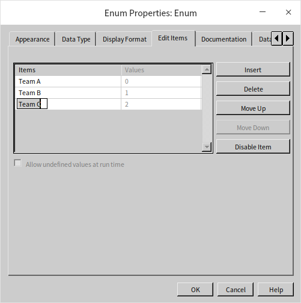
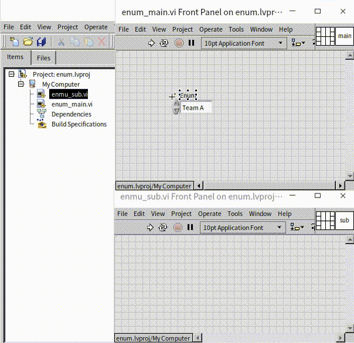
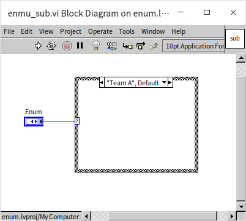
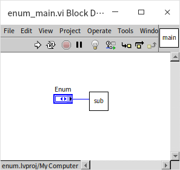
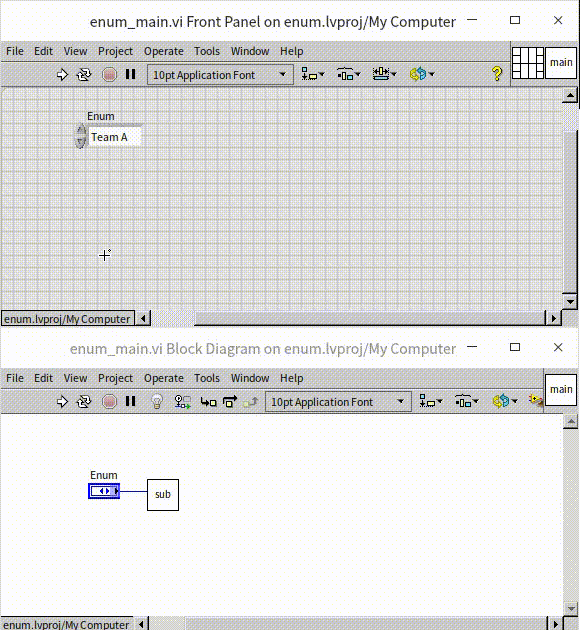
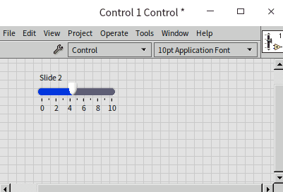
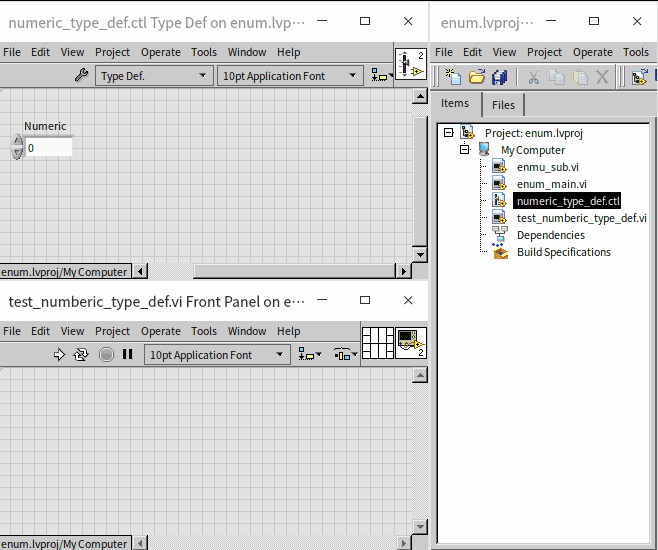

# 用户自定义控件

## 枚举

在介绍用户自定义控件之前，我们先来介绍一个新的数据类型：枚举类型。枚举是只列出一个有限数据集的所有成员，比如，“星期”的枚举类型，星期日、星期一、星期二、 星期三、星期四、星期五、星期六是这个枚举里面的成员。编程语言中，通常使用一段连续的非负整数来代表枚举类型中的每个程序员，比如用 0 代表星期日、1 代表星期一等等。有些编程语言也允许使用字符串数据来代表枚举类型，但是在 LabVIEW 中，枚举类型的定义是狭义的，它的数值必须是一段从 0 开始的连续非负整数。

### 枚举型控件与下拉列表控件的比较

讨论到枚举型（Enum）控件，就一定要提及下拉列表(Ring)控件，因为这两个控件在外观上极为相似。它们都在“下拉列表和枚举”控件选板上。当然它们都各自有一些不同风格的控件，下图两个控件采用的都是系统风格：

虽然它们看上去一模一样，但这两个控件的数据类型却是不同的：枚举控件的数据类型是枚举型；而下拉列表属于数值型。这也就造成了两种控件的行为有很大却别。下面以表格的形式列举一下这两种控件的主要区别：

| 控件类型 |  |  |
| ----- | ----------- | ----------- |
| 数据类型 | 数值型 | 枚举型 |
| 表示法 | 支持任何浮点实数类型，包括：EXT, DBL, SGL, I64, I32, I16, I8, U64, U32, U16, U8    | 正如之前提到的，枚举数据必须是一段从 0 开始的连续非负整数，所以它只支持三种无符号整数类型：U32, U16, U8    |
| 设置数值 | 可以给每个条目设定任意的数值，但每个条目的值必须唯一，不能有数值相同的条目。 | 只能按照顺序给每个条目设定一个整数值。从 0 开始，之后每个条目加 1。 |
| 作为条件结构的条件 | 作为一种数值型控件，它的行为与其它数值类型并无区别。在条件结构的选择标签中，按照每个条目的值来判断条件是否满足。条件结构无法知道下拉列表中有多少条目，必须手工输入所有可能出现的条件值。    | 按照每个条目的标签来判断条件是否满足。条件结构知道枚举类型中每个条目，条件结构鼠标右键菜单中可以选择自动为每个枚举中的条目添加分支。    |
| 动态修改条目标签 | 可以通过控件的属性设置，在程序运行时，动态修改下拉列表每一项的标签。 | 只能在编辑状态下修改枚举型每一项的标签。VI 运行时不能修改。 |
| 类型严格性 | 所有下拉列表都是同一种数据类型：数值型，条目有所不同的两个下拉列表可以直接相互赋值。     | 拥有不同条目的枚举属于不同数据类型（枚举型是一类数据类型，不是一个特定的数据类型），它们之间不能直接赋值。如需赋值，需要首先强制转换成一般数值类型，再转换成另一枚举类型。           |

通过上面的对比，我们可以得出以下一些结论：

在程序中，表示有限的几种物件、几个状态等含义时，应尽量使用枚举控件而不是下拉列表。因为枚举控件的数据类型更加严格，可以防止程序中的某些错误。并且，这样的数据在程序中通常会与选择结构相连，以对不同的状态、类别等进行分别处理。枚举控件能够让条件结构按照条目标签来选择分支，可以增加程序的可读性和可维护性。

当程序需要表示的依然是一个数值，只不过需要把用户的输入限定在某几个特定值的时候，应当使用下拉列表控件。

比如，我们编写一段程序，用于模拟一台示波器，它有三种触发模式：边沿触发，脉宽触发和斜率触发。此时程序应该选用枚举类型的控件表示触发模式。这台示波器可显示的波形幅值范围也有三档，分别是：0.1V、0.25V 和 1V。它们是离散的数值，应该用下拉列表来表示这三个幅值范围。

### 单选按钮控件

除了下拉式的枚举型控件外，LabVIEW 中单选按钮控件（Radio Buttons）的数据类型也是枚举型的。单选按钮只是在外观上与下拉式的枚举控件不同，它由一组布尔型控件组成（可以根据需要选择改变选项的外观，以及设置一定数量的选项）。在一组控件中，每次只能有一个值为真。整个单选按钮的值，就是为真值的那个布尔控件所在的位置。下图是几个不同外观的单选按钮控件：

 

单选按钮控件的优点是，所有可选的条目都直接显示在界面上，而枚举控件必须在操作中按下控件后才能查看条目内容；缺点是单选控件占用界面的尺寸比下拉式的枚举型控件大。

### 创建和使用一个枚举控件

假设有一个数学竞赛，有三支队伍参加比赛，分别是 Team A, Team B, Team C。我们需要编写一个程序对三支队伍的数据分别做处理，我们可以使用一个枚举类型来表示参赛的队伍。下面我们编写两个 VI，分别是主 VI 和 子 VI 来演示枚举类型控件的创建和使用。首先，创建一个枚举控件，在主 VI “enum_main.vi”的前面板上放置一个枚举控件。新放置的枚举控件是空，需要在它的鼠标右键菜单中添加成员条目。下图是枚举控件属性对话框中的“编辑条目”页面，我们在这里添加上三支队伍的名字：

假如，处理数据的工作是在子 VI “enum_sub.vi”中完成的，那么我们就需要把这个枚举数据传递到子 VI 中去，因此，子 VI 必须要有一个同样枚举类型的输入控件负责接收数据。因为两个 VI 中使用的是同样的控件，我们没必要再从头开始创建一个新的枚举控件，只要 Ctrl C，Ctrl V 把控件从主 VI 复制到子 VI 就可以了。除了用复制粘贴快捷键，直接使用鼠标把控件拖拽到另一个 VI 上，也可以实现复制：

子 VI 的程序框图如下，这里主要演示枚举类型控件，所以并没有在条件结构内添加真正的处理数据代码：

主 VI 的程序框图也是极其简单，仅仅是把枚举类型数据传递给子 VI：

这样一个简单的演示程序就完成了。可是这时候出现了一个新的需求：参赛队伍“Team C”改名为“Team D”了。我们可以在编辑条目的对话框上把主 VI 的枚举控件修改一下：

读者们可能已经发现了，在修改了主 VI 的枚举控件之后，VI 出错无法运行了。这是因为子 VI 中的枚举控件还没有被修改，主 VI 和子 VI 中的两个枚举控件现在具有不同的数据类型，它们之间无法传递数据。我们可以打开子 VI，对它的枚举控件做相同的修改。示例中只有两个 VI，所以这样的修改并不麻烦，但是，在一个大型项目中，同样的枚举控件也许被用在了数十个子 VI 中，逐一修改它们就太过繁琐了，有没有什么方法可以把不同 VI 中用到的相同数据类型的控件都关联起来呢？这样只要在一个地方修改这个控件，所有 VI 上相关的控件就都自动被更新好了。

确实有这样的方法，就是利用 LabVIEW 中的用户自定义控件。

## 用户自定义控件

在某些项目中我们会看到后缀名为 .ctl 的文件，这就是用户自定义控件。打开一个用户自定义控件，可以看到它有三种定义形式：“输入控件”（Control）、“自定义类型”（Type Def.）和“严格自定义类型”（Strict Type Def.）：

“输入控件”一般用于定义控件的外观；而“自定义类型”和“严格自定义类型”除了可以定义一个控件的外观，更主要的适用于定义控件的数据类型。下面分别介绍一下它们的用法。

### 创建一个自定义控件

虽然 LabVIEW 已经提供了种类繁多的控件，但肯定还是无法满足某些应用场景的需求。开发者有时会希望能够自制一些外观特殊的控件，这需要制作用户自定义控件。创建外观非常精美的控件，它的难度主要在于创意和美术设计方面，而非编程方面。制作这样的控件，首先要准备好相应的素材，即一些漂亮的图片。然后用这些漂亮图片代替 LabVIEW 控件原有的图片即可。

自定义控件只能改变一个 LabVIEW 自带控件的外观，并不会改变它的行为，所以，用户自定义控件都是在一个已有的 LabVIEW 控件上进行改造。如果需要创建一个行为也与 LabVIEW 所有自带控件都不相同而全新控件，需要使用 [XControl](ui_xcontrol) 技术，本书会在后续章节详细介绍。

比如，我们要创建一个“回退按钮”（一个显示为向左箭头的按钮 ），可以把 LabVIEW 已有的按钮作为模板，在其基础上进行改造。

创建自定义控件，首先要创建一个.ctl 文件。创建.ctl 文件有两种方法。可以从菜单项“文件 -> 新建 -> 自定义控件”开始。这样创建出来的是一个空白 .ctl 文件，在此 .ctl 文件界面上添加一个 LabVIEW 自带的按钮控件，再进行修改就可以了。此外，还可以右键点击某个 VI 前面板上的某一控件，选择“高级 -> 自定义”即可新建一个带有这一控件的 .ctl 文件：

.ctl 文件的界面与 VI 前面板看起来非常相似。在它的界面上只允许放置一个控件，缺少控件或超过一个控件，工具栏上就会出现错误提示标志：

自定义控件的面板上可以放置多个装饰图形或标签文字。 .ctl 文件没有程序框图，因此它只能定义控件的外观或数据类型，不能定义控件的行为。

### 自定义控件的组成部分

在自定义控件面板的工具栏上有一个显示为扳手或镊子图形的按钮，按动它，界面可以在“编辑模式”（扳手）和“自定义模式”（镊子）间切换。在编辑模式下，可以修改控件的尺寸、颜色等属性（这与在 VI 的前面板上直接修改控件属性相同）；在自定义模式下，则可以把控件的各个部分拆解开来，进行更细致的修改，从而彻底改变控件的外观。

在自定义模式下，控件每个可拆分的部分都被一个白色框所包裹，以利于区分。不同的控件，其组成成份完全不同。比如，最简单的按钮，由标签、按钮主体部分、布尔文本三部分组成；而滑动杆控件则复杂得多，它由标签、左移动按钮、右移动按钮，左侧背景颜色、右侧背景颜色、滑动杆、标尺、背景边框、数字显示、单位标签等多个部分组成：

 

### 修改控件组成部分

假如，要把控件做成类似浏览器的回退按钮模样。在修改自定义控件之前，先准备好需要使用的图片文件。我们已经为按钮准备了一张图片：

最简单的方法是用图片来代替控件原有的布尔文本。在自定义模式下，右键点击按钮的布尔文字部分，选择“从文件导入...”：

再选择已准备好的图片文件。这样，控件中原有的部分，就被导入的图片替代了:

使用这种方法做出来的按钮看上去类似 Windows 2000 之前的按钮风格。如果需要做一个不带边框的圆形按钮，则不能把圆形图片贴在方形按钮的布尔文字上，而是需要用导入图片替代模板控件的按钮主体部分。具体操作如下：

首先，对图片有一定要求：按钮是圆形的，而所有图片文件都是矩形的。为此，要求矩形图片上只有一个圆形图案，而圆形之外的部分是透明的。常见的图像文件中，png 文件对透明支持得最好。所以，需要采用 png 文件制作按钮素材。

按钮的主体部分需要四张图片分别表示四种不同的状态：真、假、真至假、假至真。但如果是一个触发型按钮，那只有两种状态：正常状态与鼠标按下状态。所以，在这个例子中只需要两幅图片：未按鼠标时，采用一种图片；鼠标按下时，采用另一幅颜色较深的图片：

在自定义模式下，鼠标右键点击控件的主体部分，可以看到“从剪贴板导入图片”、“从文件导入”等选项。利用这些选项可以把按钮控件当前状态的外观图片替换掉。通过鼠标右键菜单的“图片项”可以切换到按钮的其它状态，再把其它几个状态的图片都一一替换掉：

这个自定义控件的机械动作需要被设置为“释放时触发”。在应用程序中使用它的效果如下图。其中“布尔 2”正在被鼠标按下：

### 简单动画

LabVIEW 也支持 gif 格式的图形文件，gif 文件的最大优势是可以显示动画，把这样的图片导入控件，就可以让控件具有动画效果。比如笔者制作了一个颜色循环变化的矩形小方块：。它是一张 gif 格式的图片，我们可以用它来代替滑动条控件的滑块：

这样的滑动条就自带动画效果了。如果只是需要显示动画，不需要任何对其进行任何操作，也可以直接把一个 gif 图片拖拽或复制到 VI 的前面板上，这样，VI 的界面上就有了动画内容。

gif 只能实现一些简单的动画功能，本书后续还会介绍一些 LabVIEW 中实现复杂动画效果的方法。

### 自定义类行

为了更好的解释几种自定义控件的定义形式，先解释一个概念：我们把 .ctl 文件定义的控件叫做“用户自定义控件”，把通过拖拽或打开这个 .ctl 文件，在 VI 前面板上生成的控件叫做“实例控件”。
用户自定义控件有三种定义形式：“输入控件”（Control）、“自定义类型”（Type Def.）和“严格自定义类型”（Strict Type Def.）。

只用于改变控件外观的用户自定义控件一般会被保存为“输入控件”定义形式，这是一种无关联的用户自定义控件：这个用户自定义控件与它的实例之间没有任何关联。例如，我们制作了一个漂亮的按钮控件保存在 .ctl 文件中。需要用到它时，通过拖拽或打开这个 .ctl 文件就可以在 VI 前面板上生成这个用户自定义控件的一个实例。这个实例一旦生成，就和原来的用户自定义控件无任何关联了。这之后，无论是在 VI 前面板上修改这个实例，还是在 ctl 文件里修改户自定义控件，都不会对另一方产生任何影响。

但是，当设置为自定义类型件时，实例控件与用户自定义控件的数据类型就被绑定在一起了。如果自定义类型的数据类型发生改变，则该自定义类型的所有实例都会随之自动更新。比如说,自定义类行中的控件从 I32 数值控件变成布尔控件，那么所有用到了这个自定义控件的 VI 中控件的实例也都会自动变成布尔控件：

需要注意的是，只有当自定义类型控件的数据类型改变时，实例才会自动更新。如果自定义类型控件的数据类型不变，只是一些外观是属性放生变化，比如改变颜色，改变数值控件中的数据范围，因为这些变化不属于数据类型改变，所以实例控件是不会自动更新的。这种行为很多时候并不是我们希望的，比如，自定义类行是一个下拉列表控件，如果在其中增加或减少一个条目，我们多半会希望实例控件也自动更新，而不是保持原来的那些条目。这时候就需要使用严格自定义类型。

### 严格自定义类型

严格自定义类型的用法与自定义类行相同，所不同的是：当使用了严格自定义类型，实例控件的数据类型，外观以及多数属性都会始终与用户自定义控件保持一致。仅有少数信息，比如，值、默认值、标签、文档等，实例控件可以保持自己的特定设置。

一般来说，如果程序中需要使用到簇、下拉列表、枚举等复杂数据类型的控件时，都应该为它们制作一个严格自定义类型，以确保程序中所有的实例控件都能保持一致。

使用严格类型定义时有一点容易被误解：严格类型定义只与实例控件相关联，与实例常量的属性是不关联的。实例常量是指通过拖拽或生成常量等方法，在程序框图上生成的一个与 .ctl 文件相关联的常量。比如，一个严格自定义类型中的控件是下拉列表控件，在这个用户自定义控件中添加一项内容，相关的实例控件会跟随更新，但实例常量是不会发生任何改变的，并不会多出一个条目。按照一般的直觉，常量也应当自动更新，但实际上不行。

在更新了严格自定义类型后，程序中关联的实例控件会自动更新，但是，很多程序代码可能还是要手工做调整。比如一个下拉列表控件中增添了一个新条目，在程序中可能也需要添加一些相应的分支来处理这个新的条目。

## 变体

### 变体数据类型

变体是 LabVIEW 中一种比较特殊的数据类型，其它任何数据类型都可以通过 "编程 -\> 簇、类与变体 -\> 变体 -\> 转换为变体" 函数转换成变体数据类型。需要时，可再通过 "变体至数据转换" 函数将其转换为原数据类型。变体这种数据类型类似于 VB 中的 Variant 和 C 语言中的 void 数据类型。

### 类型转换

其它类型数据在转换为变体数据类型时（图
2.40），变体数据中会记录原数据的类型信息。因此，"变体至数据转换" 只能将变体转换回原数据类型，而不能转换为其它任何类型。在变体的控件上，选中鼠标右键菜单中的 "显示类型" 和 "显示数据"，可以根据要求显示出变体内原数据的类型和数值（图
2.41）。

图 .40 变体数据转换

图 .41 在变体控件上显示内部数据的数据类型和值

在程序中，若需要得到变体数据原本的类型，可以使用一个 LabVIEW 自带的 VI（"\[LabVIEW\]\\vi.lib\\Utility\\VariantDataType\\GetTypeInfo.vi"）取出变体中数据的原始类型，然后再根据其原数据类型进行下一步处理（图
2.42）。

图 .42 从变体中得到元数据类型信息

在这里，我们提到了一个 LabVIEW 自带的 VI，GetTypeInfo.vi。但是这个 VI 并不能在 LabVIEW 的函数选板上找到。在本书后续的章节中，还会继续介绍到多个类似这种情况的 VI。像这种不在函数选板上的 VI，它们一般并不是直接提供给用户去使用的，而是提供给 LabVIEW 中其它 VI 或工具的子 VI。NI 公司没有为这些 VI 撰写文档，所以一般用户无法确切得知这些 VI 的用途，也不知道如何使用它们。不过，这些 VI 中的大部分是公开源代码的，用户可以查看并借鉴它们的实现方法，甚至使用它们搭建自己的应用程序。但是，如果用户把这些 VI 应用在了自己的程序中，则必须要清楚意识到使用它们的风险：第一，NI 公司不提供对这些 VI 的支持和服务。第二，NI 公司不保证这些 VI 在将来的 LabVIEW 版本中不被改动，而一旦这些 VI 被改动，很可能造成直接使用了它们的客户的应用程序出现错误。

### 变体的应用

一般来说，LabVIEW 子 VI 的参数数据类型是固定的，一个子 VI 只能针对一种特定类型的数据进行操作。但是，有些算法也可以适用于多种数据类型。针对多种不同的数据类型，为这一算法编写多个不同的子 VI，这显然不是一个高效的办法。较为行之有效的办法是选用变体数据类型作为子 VI 的参数。这样，任何类型的数据在转变为变体后，都可调用这个子 VI 了。

类似的应用还有：不同类型的数据是不能够放在同一个数组中的。但遇到需要把不同元素放在同一数组中时，可以先把所有数据都转为变体类型，然后构成一个变体类型数组。

### 利用变体实现 Dictionary 容器（字典容器）功能

编程的时候经常会遇到这种情况：需要保存一些数据，这些数据的组织类似一张表格。表格由很多类型相同的条目组成，每个条目由一个唯一的标识符（比如 ID，名称等）和其它一些数据组成。程序能够保存这张表格；对表格中的条目进行修改；并根据标识符快速找到某个条目。

在 C++ 或 C# 中实现这样的功能非常简单，只要使用编程语言提供的 Map、Dictionary 等容器就可以了。这些容器已经具有了维护和查找这张表格的功能，用户只需使用它们的几个简单接口函数。遗憾的是，至今，LabVIEW 尚未提供类似的容器。当然，可以在程序中定义一个簇的数组来保存表单中的数据，然后再编写查询数据的代码。但这种方式编程复杂，查询效率太低。

有一种简便高效的实现类似的功能方法是利用 LabVIEW 自带的用来为变体数据类型设置属性的三个函数来保存和查询数据。这三个函数位于 "编程 -\> 簇、类与变体 -\> 变体" 函数选板，分别是 "获得变体属性"、"设置变体属性" 和 "删除变体属性" 这三个函数。从它们的名字就能知道它们原本的用途了。

\
图 2.43 变体函数选板

变体数据的属性由一个名字和一个数据组成：每个属性的名字都必须是唯一的，数据则可以是任何的数据类型。这样，它恰好适合于前文提到的容器程序需求。可以把表单中的每一个条目看作是变体数据的一个属性：条目的标识就是属性的名称；条目的其它部分是属性的数据。创建和修改表单使用 "获得变体属性" 和 "删除变体属性" 函数；查询表单的内容使用 "设置变体属性" 函数就可以了。

比如图 2.44 所示的程序，其功能是根据学生姓名来查询成绩。在这个程序中，数据是一张表格，表格的第一列为 "姓名"，第二列是 "成绩"。当用户输入一个姓名，程序就查找出相应的成绩，返还给用户。

\
图 2.44 使用变体属性实现 Dictionary 容器的程序框图

\
图 2.45 使用变体属性实现字典容器的程序运行结果

变体的属性在 LabVIEW 中是以哈希表格式存储的。它的查询效率极高，所以特别适合用于需要查询大量数据的程序。

但它毕竟不是一个真正的容器，还有一些局限性，比如它的标识只能使用字符串。在本书后续章节会更为详细地介绍一些更为实用的数据容器。

## 练习
* 我们常常会把表示平面上一个点的位置坐标的两个数据 x, y 包装在一个簇当中。为这个表示坐标的簇制作一个严格类型定义。再编写一个 VI，数据输入控件类型就是刚刚制作的用户自定义控件。在 VI 中把输入的坐标在 XY 图形控件上绘制出来。接下来在类型定义中，为簇添加一个元素 z，让它能够表示一个三维坐标系中点的位置，观察 VI 中的输入控件是否也同步发生了变化。