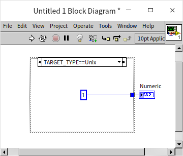

# 禁用结构

除了断点和探针这两种最常用的调试工具外，调试中还常常需要借助一些其它的工具和方法，以寻找到程序的问题所在。

调试有错误的程序，首要任务是要找到错误所处的部位。在大多数场合，可以在程序执行过程中使用探针一路跟踪数据的变化。如果某个节点的输出数据与预期的不一致，这个节点很可能就是问题所在之处。但在某些情况下，靠这种简单方法是无法找到错误所在之处的。

比如，程序运行中出现了数组越界的错误。但程序往往并不是在错误发生之处就立即表现出异常，而在程序又运行了一段不确定的时间之后，突然崩溃或报错。而且，每次调试时，程序报错、或者崩溃处所可能都不在同一处。或者，虽然找到了最终出错的代码处，但发现它是个最基本的 LabVIEW 节点，不能再进入节点内部调试了。而且，这个节点出错的可能性基本为零，错误肯定是在其它地方产生的。

再比如，有些错误是由于多线程的时序引起的。为程序添加断点或探针会改变程序的时序，导致程序调试时结果正常，而正常运行时，结果却错误。

## 程序框图禁用结构 （Diagram Disable Structure）

在断点和探针派不上用场的时候，可以采用这种思路查找程序故障：先把一部分代码移除，再看看程序运行是否还有问题。如果一切正常了，说明被移除的代码中存在错误。否则，问题应当出在没有被移除的那部分代码中。这样，就缩小了查找可能存在问题代码的范围。然后，在有问题的那部分代码中，把怀疑有问题的代码再移除一部分，再重复上述的检查过程。这样，就可以一步一步缩小查找的范围，最终定位到出错的位置。

程序框图禁用结构与条件结构有些类似。两者的区别在于：程序框图禁用结构并非在运行时输入分支选择条件，它执行哪一分支是在编辑程序时就确定好了的。程序框图禁用结构中可以有多个分支，但是只有一个名为 "启用" 的分支，其它所有分支都是 "禁用"。程序运行时，只运行名为 "启用" 的那个分支。

如果需要把程序中的某一段暂时跳过不运行，就可以使用程序框图禁用结构。比如下图中的程序，它有一个把字符串 "test" 写入文件的操作，编写程序过程中暂时无法确定最后是否使用它，但两种方案都需要调试。从函数选板上拉一个程序框图禁用结构，把这一部分框起来：

放置好程序框图禁用结构，程序就暂时不会再执行这段位于禁用分支内的、写入文本文件的代码了。

在写入文件操作被禁用的同时，禁用结构会默认生成一个启用分支。通常需要修改一下启用分支，以保证程序逻辑和输出数据无误。如下图所示，在这个例子中就需要把文件句柄和错误数据进出结构的隧道分别相连，才能保证后续程序得到正确的数据。

当再次需要运行这一段写入文本文件的代码时，把这个禁用分支设为“启用”分支即可，程序框图禁用结构边框上右键再点击选择“启用本程序框图...”。

在调试程序时常常要用到程序框图禁用结构，它的功能与用法相当于在调试文本编程语言程序时，将某些代码段注释起来。它可以帮助寻找并定位有错误的代码。对某段程序代码有怀疑，可以先禁用疑似有问题的部分，再逐步启用和禁用更小范围内的代码，最终定位到有错误的连线或节点。

程序框图禁用结构还可以用于其它一些场合，比如，在调试程序时，通常需要用写文件的方式记录下程序运行过程中的某些数据，但在程序发布后，就不再需要记录数据了。可以把记录数据文件这部分的代码放置在禁用结构中。调试时，启用这段代码；正式发布程序时，禁用它。

程序框图禁用结构与条件结构最重要的不同之处在于：程序框图禁用结构中启用哪个分支，是在编辑程序时决定的；而条件结构中执行哪一分支的代码，是程序运行中决定的。

运行程序时，禁用分支中的程序并不被生成可执行代码。如果被禁用的分支中包含了子 VI，LabVIEW 也不会把这些子 VI 调入内存。因此，使用禁用结构并不会影响程序的运行效率。如果程序框图禁用结构中，被禁用的分支有错误，比如把不同数据类型的接线端连接在一起了，这些错误都不会影响到 VI 的运行。

对于条件结构，LabVIEW 预先并不知道会执行到哪些分支，所以需要要把每一分支的程序都生成可执行代码，所有用到的子 VI 都装入内存之中。如果任何一个分支内的代码有错误，整个 VI 都无法运行。

## 条件禁用结构 （Conditional Disable Structure）

### 系统预定义符号

条件禁用结构的许多特性与程序框图禁用结构类似：它也是在编辑时决定要运行哪一个分支的。两者的区别在于：条件禁用结构是根据用户设定的符号的值来判断决定执行哪个分支上的程序的。它有些类似 C 语言中的 #ifdef 宏。条件禁用结构通常被用在跨平台上的程序中。

如果一个项目需要支持多个操作系统，我们当然可以为每个操作系统都编写一套包含所有子 VI 的完整的程序，但采用这种方式，程序中每个 VI 都需要同时维护多个版本，经管很多 VI 在每个操作系统上都是一模一样的，这极大增加了维护工作量。使用条件禁用结构，我们可以把针对不同操作系统的代码分别写在条件禁用结构的不同分支内，LabVIEW 会根据 VI 运行的系统选择正确的分支运行。这样，一个程序就可以适应所有的操作系统，最大可能的降低了维护成本。

打开一个 VI，在其中放置一个条件禁用结构。此时，条件禁用结构仅包括一个“默认”分支。

鼠标右键点击结构的边框，在快捷菜单中选择“编辑本子程序框图的条件”，弹出“配置条件框”。

配置条件框上的“符号”可以是系统与定义好的一些符号，比如 TARGET_TYPE，TARGET_BITNESS 和 RUN_TIME_ENGINE。“值”则是“符号”对应的数值。配置条件框配置的是个条件可以选相等或不想等。比如 TARGET_TYPE 表示当前 VI 运行的操作系统，大多数读者使用的是 Windows 操作系统,如果配置条件框为条件禁用结构的某一分支配置了“TARGET_TYPE == Windows”，那么这个分支的条件就满足了，这个分支就会编程启动状态。笔者使用的操作系统是 Linux，LabVIEW 中对应 Linux 的 TARGET_TYPE 的值是 Unix，所以在笔者的电脑上，这一个分支是被启用的：

TARGET_BITNESS 用于判断计算机上安装的是 32 bit 还是 64 bit 的 LabVIEW； RUN_TIME_ENGINE 则用 True 来表示 VI 被制作成了一个 DLL 共享库； False 表示 VI 被制作成了一个 EXE 应用程序。

一个应用程序如果需要保存一些设置信息，在 Windows 操作系统下可以选择保存在注册表中；而在 Linux 系统下则通常保存在配置文件里。Linux 等系统是没有注册表的，如果只写一份使用注册表的程序，在 Linux 操作系统下就无法运行？

那么，是否可以使用条件结构来区分当前的操作系统，选择不同的代码运行呢？条件结构运行哪一分支是在程序运行时决定的。程序运行时的确可以判断当前操作系统是什么，但问题在于，使用条件结构，程序装载时会检查所有条件结构分支中的代码，任何一个分支内的代码有错误，整个 VI 都无法运行。程序在 Linux 操作系统那个分支中找不到这注册表操作函数，出错，于是 VI 无法运行。

为了使这个 VI 也能够在其它操作系统下顺利运行，必须把平台相关的代码都放置在条件禁用结构中。在 MacOS 或 Linux 操作系统中，LabVIEW 不会试图装载 "TARGET_TYPE == Windows" 分支中的代码，代码的错误会被忽略：

上图中的三个子 VI 均位于 "互连接口 -\>Windows 注册表访问 VI" 函数子选板，依次为 "打开注册表项"、"读取注册表值" 和 "关闭注册表项"。

### 用户自定义符号

条件禁用结构还可以使用项目或项目运行的目标机器所定义的符号。

在项目浏览器的“我的电脑”项的鼠标右键菜单中选择“属性”，弹出“我的电脑属性”对话框：

我们可以在属性对话框中的“条件禁用符号”栏，添加了一个自定义的符号 "User"，它的值是 "QizhenRuan"。这样就可以在该运行目标机器下的 VI 中使用这一符号了：

在程序中，有时可能需要为不同的用户定制某些不同的服务：发布给不同用户的软件，基本功能是相同的，但在个别地方需要使用不同的代码。这种情况可以考虑使用条件禁用结构，用它来处理各用户之间有差异的代码。程序发布给不同用户时，只需更改一下项目属性中条件禁用符号的值即可。

程序框图禁用结构中，只能有一个启用分支，但条件禁用结构不同，可以有多个满足了条件的启用分支。比如，一个分支的条件是 TARGET_TYPE == Windows，另一个分支的条件是 TARGET_BITNESS == 64，那么两个分支在 Windows 64 计算机上都满足。在这种情况下，只有排在前面的，第一个被启用的分支会被程序装载和执行。

### 调试时专用代码

有的时候，某种错误只在程序正常运行时出现，但试图暂停或使用断点、探针等调试工具时，错误却消失了。有的时候，程序运行必须关闭所有的调试信息，或者出错的代码部分不允许使用 LabVIEW 的调试环境（比如代码运行在 LabVIEW RT 设备上）。在不能使用 LabVIEW 调试工具的情况下，调试起来就麻烦多了。对于这一类程序，可以采用其它方法来观察程序运行过程中的数据。比如，让数据通过弹出对话框显示出来，或者把数据记录在文件中。通过观察被显示或记录下来的数据，判断程序是否有错。

上图是一个使用文件记录程序运行中临时产生的一些数据的例子。假设，由于某种原因这个 VI 不能使用 LabVIEW 调试工具，但它通过调用 "数据记录.vi" 就可以把程序运行中重要的数据了记录下来。待程序运行结束，便可以在记录的文件中查阅这些数据。记录数据 VI 是程序功能之外额外增加的逻辑，它会增加程序对资源的消耗，降低程序效率。所以在不需要调试的时候，还是希望将其关闭的。一个解决方案是，可以在程序的项目中自定义一个“DEBUG”符号，如果 DEBUG == 1 则启动数据记录，反之则禁用数据记录：

