# 泛型编程

## 基础知识
我们在编写程序的时候总是要把一些通用的功能抽象出来。比如说，我们设计了一个排序的算法，我们一般不会直接在每个需要排序的地方都针对特定的数据重复为同一个算法编写代码。我们通常会把这个算法抽象成一个子函数（子 VI），把需要被排序的数据作为函数的参数。因为被抽象出来的算法是与具体数据无关的，所以同一个算法可以被应用到不同的数据上。比如，同一个排序算法即可以对数组 \[1,3,2] 排序，也可以对组数组 \[5,6,4] 排序。

泛型编程是一种抽象度更高的编程范式（程序的风格、执行方法），它把算法，又进一步，从不同的数据类型中抽象出来了。使用泛型编程编写出来的算法，不但不依赖于具体的数据，甚至也不依赖于具体的数据类型。比如，一个泛型排序函数不但可以给一组整数排序，也可以给一组字符串排序，还可以按大小给一组苹果排序，也可以按成绩给一组学生排序等等。

之前，我们创建子 VI，输入输出的数据类型（控件类型），一旦选定，就固定下来的。比如用一个数值控件表示输入数据的子 VI，就只能传递数值数据给它。把字符串数据线连接上，会出现语法错误。要在 LabVIEW 中使用泛型编程，我们需要编写一种子 VI，让它的某个参数可以接受不同类型的数据。大家可能已经注意到了，LabVIEW 自带的很多函数是支持泛型的，比如加法函数，可以接收数值类型的数据，也可以接受簇或者数组类型的数据（如下图）。再比如数组相关的函数，可以用来操作数值数组，一可以操作字符串数组。

如果一个 VI，使用变体作为参数数据类型，这个 VI 的参数就可以接收任何类型的数据了，这样是不是就算支持泛型编程了？（或者是像 Python 2.0 这样的编程语言，变量不需要有类型定义，任何类型的数据都可以传递给同一个变量，是不是就样就算支持泛型编程了？）

这样是不够的。要支持泛型编程，编程语言不仅要具备同一参数支持不同数据类型的功能，还要具有静态的类型检查功能才可以。静态类型检查，是指如果代码使用了错误的数据类型，程序在编译时就会报错，不至于要等到运行时才发现错误。比如，某一算法可以支持数值和字符串类型的数据，但是不支持布尔类型数据，那么就需要实现这样的功能，当把布尔数据类型于这个算法子 VI 的输入连线的时候，VI 就会立刻报告语法错误，不需要运行，VI 就可以提示数据类型出错。 子 VI 使用变体数据类型显然无法做到这一点，把任何类型的数据传递给变体都不会有语法错误。甚至更复杂的情况，如果创建了一个字符串类型的数组，再使用其它数组函数（比如插入、索引等）对这个数组操作时，函数应当也只能接收字符串类型的数据，连接到其它数据类型也需要报错。

在主流的编程语言中，最常采用两种方式来支持泛型编程：

一种是以 Java 为代表的类型擦除技术（erasure）。当编译器对带有泛型的 Java 代码进行编译时，会执行数据类型检查和类型推断，如果遇到类型错误会报错。但是编译器生成的执行代码是不带泛型的代码，也就是数据类型信息被擦除了，因此同样一段代码可以被 Java 虚拟机用来处理各种不同类型的数据。这样，Java 的泛型编程即可以及支持多重数据类型，又可以保证类型安全。

比如，在代码中定义了 ​​List<Int\>​​ 或 ​​List<String\>​​ 等类型。在代码编译时，编译器会检查传递的数据是否是 Int 或 String 等类型，在代码编译后，它们就都会变成 List。Java 虚拟机看到的只是 List，于是相关的函数不论 List 中数据是何类型，都能正常运行。

另一种是以 C++ 为代表的代码插入（代码膨胀）技术。在 C++ 中编写泛型函数或者泛型类的时候，其实并非直接编写一个特定的函数或类，而是编写了一个函数或类的模板。比如需要一个支持泛型的 List，那么就要编写一个 List 的模板。程序中使用到了 ​​List<Int\>​​ 或 ​​List<String\>​​ 等类型的地方，在编译时，会自动从模板生成对应特定数据类型的代码，插入到应用它的地方。 ​​List<Int\>​​ 或 ​​List<String\>​​ ​​生成的是不同的代码，在编译程序时，编译器就就会检查代码中是否有数据类型错误，确保类型安全性。由于程序中有大量从模板自动生成的代码，代码控件会比较大。与 Java 的泛型支持技术相比，C++ 的技术是以空间换时间。

在 LabVIEW 中，也有几种方法可以编写出支持多种不同类型数据的 VI，这一节会逐一介绍。

## 使用变体作为子 VI 的参数类型

### 变体数据类型

变体（Variant）是 LabVIEW 中一种比较特殊的数据类型，其它任何数据类型都可以通过“编程 -\> 簇、类与变体 -\> 变体 -\> 转换为变体”函数转换成变体数据类型。需要时，可再通过“变体至数据转换”函数将其转换为原数据类型。变体这种数据类型类似于 VB 中的 Variant 和 C 语言中的 void 数据类型。

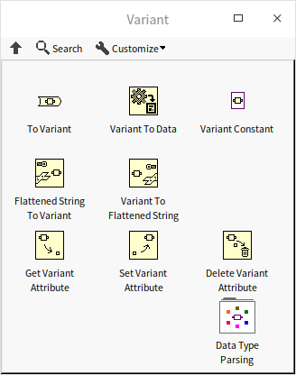

### 类型转换

其它类型数据在转换为变体数据类型时，变体数据中会记录原数据的类型信息。因此，“变体至数据转换”只能将变体转换回原数据类型，而不能转换为其它任何类型。比如下图中的程序，把一个簇类型数据转换成了变体，之后再由变体还原成簇：

在变体的控件上，选中鼠标右键菜单中的“显示类型”和 "显示数据"，可以根据要求显示出变体内原数据的类型和数值：

在程序中，若需要得到变体数据原本的类型，可以使用“变体”函数选板的“数据类型分析”子选板下的“Get Type Information.vi”取出变体中数据的原始类型，然后再根据其原数据类型进行下一步处理。这个“数据类型分析”子选板下还有很多分析数据类型的 VI，可以与用于解析各种数据类型，比如得到一个簇中每个元素的数据类型等：

下图中的程序，把一个簇类型数据转换成了变体，然后对数据的类型进行的解析：

### 变体的应用

一般来说，LabVIEW 子 VI 的参数数据类型是固定的，一个子 VI 只能针对一种特定类型的数据进行操作。但是，有些算法也可以适用于多种数据类型。针对多种不同的数据类型，为这一算法编写多个不同的子 VI，这显然不是一个高效的办法。较为行之有效的办法是选用变体数据类型作为子 VI 的参数。这样，任何类型的数据在转变为变体后，都可调用这个子 VI 了。类似的应用还有：不同类型的数据是不能够放在同一个数组中的。但遇到需要把不同元素放在同一数组中时，可以先把所有数据都转为变体类型，然后构成一个变体类型数组。

使用变体作为参数数据类型并不能真正实现泛型编程，因为无法利用它做静态数据类型检查。所谓静态数据类型检查是指在程序编译时，就检查数据的类型是否正确。上文介绍的几个解析变体中数据类型的 VI 都是要再程序运行时才能工作的，只能做动态数据类型检查。但是，变体在某些应用中依然至关重要，所以，我们在这一小节详细解释一下如何使用变体传递不同类型的数据，以及变体类型的局限性。

假设，我们需要一个具有加法功能的子 VI，这个 子 VI 需要支持两种数据类型：数值数据类型和字符串数据类型。如果输入两个数值，输出就是它们的和；如果输入两个字符串，则把字符串表示的数值相加然后再以字符串的形式输出。如果，VI 的输入参数选用数值型控件，或是选用字符串型控件，那么这个子 VI 就只能处理数值数据类型的数据，或者是只能处理字符串数据类型的数据，二者不能兼顾。因此，我们需要使用变体作为子 VI 的参数数据类型。任何数据类型的数据都可以转换成为变体，这样，就可以把任意类型的数据传入子 VI 了。在子 VI 中再把变体转换成相应的数据类型进行运算。使用此方法编写的子 VI 如下图
所示。

“变体加法.vi”的参数数据类型是变体类型，所以，调用它的程序可以传递任何类型的数据给它：

“变体加法.vi”的参数数据类型是变体类型，所以，调用它的程序可以传递任何类型的数据给它。

使用变体作为子 VI 的参数类型虽然可以让子 VI 处理多种数据类型，但是它也存在一些缺点。

首先，它的类型安全性比较差。比如，程序要求的算法只能处理两个数值或者两个字符串输入数据。但实际上，把任何类型的数据与这个子 VI 相连，或者给两个参数 x，y 输入不同类型的数据，VI 都不会报错。只有在运行到这一子 VI，进行数据类型转换时，程序才能发现错误。

对于程序员来说，上述这种错误最好在编程时就能够发现并有所提示，以便及时处理。也就是说，若输入的数据类型有错，VI 应当立即被禁止运行，并给出提示，而不是等到运行中才发现错误。

其次，由于子 VI 的输出也是变体类型，后续的程序还要再多加一个步骤，把它转换成具体的数据类型再继续使用。

因此，使用变体数据类型的参数，并不能完美的解决一个 VI 支持多种数据类型的问题。解决此类问题的一个更好的方案是使用下面将要介绍的多态 VI。

### 利用变体实现 Map 容器（字典容器）功能

从变体的函数选板上就能看到，它有一些函数可以为变体数据添加和读取属性，分别是“获得变体属性”、“设置变体属性”和“删除变体属性”。比变体数据的属性由一个名字和一个数据组成：每个属性的名字都必须是唯一的，数据则可以是任何的数据类型。如，把一个波形数据转换成变体类型数据后，可以为它添加属性来保存一些额外的信息，比如添加一个名为“采集设备型号”的属性，用来保存硬件信息；添加一个名为“操作员”的属性，保存人员信息。但是总的来说这不是一个好的保存信息方式。如果需要这些信息，应该设计专门的数据类型（簇或者类）或文件类型来保存信息，而不是使用变体这种过于灵活，容易出错的数据类型来保存数据。

但是，变体的属性也有一些优点，比如，它的内部实现使用的是散列表数据结构，换句话说，它的写入和查找速度都特别快。在 LabVIEW 还没有专门的 Map 数据类型的时候，程序员常常使用变体的属性来保存这种需要快速读写的键值类型的数据。下面看一个具体的实例：

假设我们需要编写一个程序，根据学生姓名来查询成绩。在这个程序中，数据是一张表格，表格的第一列为“姓名”，第二列是“成绩”。当用户输入一个姓名，程序就查找出相应的成绩，返还给用户。我们可以把成绩单中的每一个条目（每一行）看作是变体数据的一个属性：把学生的姓名作为属性的名称；把学生的成绩作为属性的数据。创建和修改成绩单使用“设置变体属性”和“删除变体属性”函数；查询学生成绩使用“获得变体属性”函数就可以了：

程序运行结果如下：

尽管使用变体属性实现的的查询效率极高，但它毕竟不是一个真正的数据容器，还有一些局限性，比如它的标识只能使用字符串。在 LabVIEW 有了 Map 数据类型之后，就没必要在使用变体来保存查询数据了。

## 多态 VI

LabVIEW 不但有可以接收多种不同类型的数据的函数，它自带的某些子 VI 的参数也是可以接收多种不同类型的数据的。比如读写配置文件的 VI，它们既可以读写数值型数据，也可以读写字符串、布尔等数据类型。类似的还包括声音输出的 VI、数据采集的 VI 等等。

一种常用的实现这种可以处理多种不同数据类型的 VI 的方法被称为 "多态 VI"。这个多态和“面向对象编程”中的多态不是一个意思，但是它们有相似的地方，多态 VI 也可以根据输入数据的不同类型，调用不同的代码。

多态 VI 本身并不实现任何实质性的程序功能，它的作用仅仅是根据传递给它的输入参数数据类型，选择调用一个对应这种数据类型实现程序功能的 VI。这些针对某种特定数据类型实现功能的 VI 被称作 "实例 VI"。一个多态 VI 可以调用多个实例 VI。

使用多态 VI 可以解决上文提到的数据类型安全的问题。多态 VI 的参数只能接收那些在它的实例 VI 中提供了处理方法的数据类型，而不能接收其它数据类型。比如，我们提供了一个多态 VI，它有两个实例 VI，分别能够处理两个数值和两个字符串输入数据。那么，在使用这个多态 VI 时，应用程序就只能同时传递给这个多态 VI 两个数值或两个字符串数据；否则，VI 会出错，禁止运行。

如果你需要提供给用户一个实现了某算法的子 VI，这个算法可能用到几种不同的数据类型。为了用户使用方便，提供给用户的不应该是一组不同的 VI，而应该是一个有统一接口的子 VI，这个 VI 可以接受指定的数据类型。否则，用户在使用前，还要根据不同的数据类型先去寻找适合的 VI。VI 根据不同输入数据类型，自动地使用针对每个数据类型的算法。多态 VI 就具有这种功能。

### 编写多态 VI

通过如下步骤，可以使用多态 VI 实现上文提到的示例： 编写一个具有加法功能的子 VI，这个 子 VI 需要支持两种数据类型：数值数据类型和字符串数据类型。如果输入两个数值，输出就是它们的和；如果输入两个字符串，则把字符串表示的数值相加然后再以字符串的形式输出。

我们把这个多态 VI 命名为 "add polymorphic.vi"，这个 VI 支持两种数据类型：数值和字符串。这个名为"add polymorphic.vi"的 VI 根据输入数据的类型，再分别调用两个实例 VI："add
numeric.vi"和"add string.vi" 来实现具体的加法功能。它们的调用关系如下图所示：

在实现多态 VI 之前，首先要实现它的实例 VI，即那些针对每个数据类型完成算法功能的 VI。在这里便是 add numeric.vi 和 add string.vi。实例 VI 就是普通的子 VI，例如，add
string.vi 的程序框图：

完成了实例 VI，就可以开始创建多态 VI 了。在 LabVIEW 的新建对话框中（选择菜单 "文件 -\> 新建"）选择 "VI-\> 多态 VI" 即可创建出一个新的多态 VI。

多态 VI 和普通 VI 看上去完全不一样：它没有前面板和程序框图，只有一个配置界面。因为多态 VI 的功能都是在实例 VI 中实现的，所以多态 VI 只要选择一下它的实例 VI 就可以了。

多态 VI 的主体部分是一张列表，表中列出的条目即是这个多态 VI 可以调用的实例 VI。通过 "添加" 按钮，可以增添实例 VI 到这张表中。上图中的实例 VI 列表中多了一项，它仅用于演示下文将会提到的多态 VI 的菜单。实际上按照本程序的要求，只需前两条实例 VI 即可。

在多态 VI 的界面上，右上方是这个多态 VI 的图标，按下 "编辑图标" 按钮，可以设计多态 VI 图标。

若选择左下角单选按钮的 "绘制多态 VI 图标"，调用了多态 VI 的程序框图上就会一直显示多态 VI 的图标；而如果选择 "绘制实例 VI 图标"，则多态 VI 将随数据类型的不同而显示相对应的实例 VI 的图标，以便让图标更清晰地显示出多态 VI 当前的功能。

多态 VI 右下方有两个多选选择框。若选中了 "允许多态 VI 自动匹配数据类型"，多态 VI 将根据输入数据类型的不同，自动选择调用相应的实例 VI；如果该项没被选中，编程者必须每次手动选择所需要的实例 VI。若选中了 "默认显示选择器"，那么当多态 VI 被新添到一个程序框图上时，将伴随图标在其下方显示出紫色的数据类型选择框，供用户选择数据类型。

无论 "允许多态 VI 自动匹配数据类型" 这一项是否被选中，多态 VI 调用的实例 VI 都可以通过其右键菜单被改变。

实例 VI 配置对话框中的 "编辑名称" 按钮用于编辑列表中的 "菜单名" 和 "选择器名" 栏，"菜单名" 和 "选择器名" 会分别在多态 VI 的右键菜单和选择栏中显示出来。

### 多态 VI 的注意事项

在设计多态 VI 时，有一些事项需要注意。

多态 VI 只能处理有限种数据类型，它只能支持实例 VI 中处理了的那些数据类型。实际上，有的算法可以支持无限种数据类型。比如，某一加法算法，可以支持各种簇数据类型。簇类型的数量是无限的：包含两个整数的簇（Cluster）是一种数据类型；包含三个整数的簇，成了另一种数据类型；包含三个字符串的簇，又是一种新类型。多态 VI 无法实现能够支持任何一种簇数据类型运算的算法。LabVIEW 自带的某些函数，比如加法函数，可以处理无限种数据类型，但使用多态 VI 是无法达到同样效果的。

多态 VI 的每个实例 VI 可以是完全不同的，前面板、程序框图、调用的更底层子 VI 等等都可以完全不同。但是，为了便于用户理解，一个多态 VI 应该局限于处理某一种算法：它的每个实例 VI 负责一种数据类型。并且，为了便于用户在不同的数据类型之间切换，每个实例 VI 的连线板应当使用同样的模式，接线的位置也应当保持一致。例如下图：

多态 VI 不能嵌套使用，一个多态 VI 不能作为其他多态 VI 的实例 VI。

### 菜单设计的小技巧

我们可以把多态 VI 的右键菜单 "选择类型" 项做成多层次的多级菜单，只要在多态 VI 设置对话框的 "菜单名" 一栏中输入菜单的层次结构即可。它使用冒号 ":" 作为层级分隔符。比如第一层为 "Numeric"，第二层为 "Float"，就在 "菜单名" 中写入 "Numeric:Float"。（参考上文 add polymorphic.vi 的配置界面）

这个技巧同样适用于多态 VI 选择器和其它需要编辑菜单的地方。

### 多态 VI 的缺点

多态 VI 虽然使用方便，但是制作过程还是相当麻烦的。它需要为每一种可能会用到的数据类型都编写一个 VI，更麻烦的情况是，某些算法是可以应用到无穷种数据类型上的，多态 VI 的开发者根本无法穷举所有可能出现的数据类型。解决这样的问题，需要另一种技术，下面将要介绍的“自适应 VI”。

## 自适应 VI

LabVIEW 有很多自带的自适应 VI，比如函数选板上，这种以橘红色为底色的 VI，就多是自适应 VI。

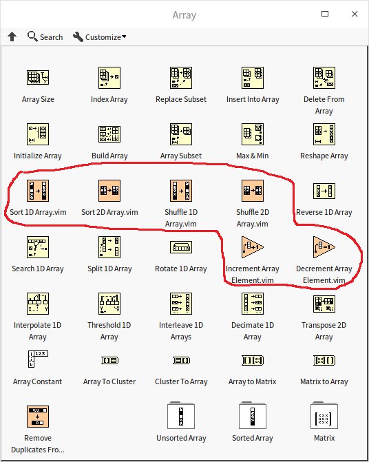

把这样的 VI 拖放到一个新 VI 的程序框图上，我们可以给它的输入段连接多种不同类型的数据：

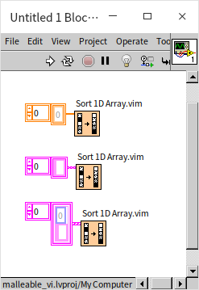

### 自适应 VI 工作原理

自适应 VI 是一种特殊的 VI，它看上去与普通的 VI 几乎没有任何区别。最明显的差别在于自适应 VI 的文件名是 \*.vim。一个普通的 VI 的后缀名被改为 .vim 后，就变成了自适应 VI。自适应 VI 必须是 [可重入](pattern_reentrant_vi) 的 [内嵌 VI](optimization_inline_subvi)。

与[内嵌子 VI](optimization_inline_subvi) 相似，当一个自适应 VI 被放置在程序框图上，它会把自己的代码嵌入到调用它的 VI 程序框图中去。不同之处在于：普通内嵌子 VI 的参数类型是固定的，就是它的前面板控件的数据类型；自适应 VI 前面板的控件更像是一个占位符，它还会根据调用 VI 传递给它的数据的类型被替换成相应的类型。任何它可以处理的数据类型都会被认作是合法的，这种机制与 C++ 在泛型编程中使用的模板机制有些类似。

对比自适应 VI 与多态 VI，它们主要有以下差别在于：多态 VI 是一组预先写好的 VI，每个实例 VI 之间可以完全不相关，甚至参数个数都可以不同；自适应 VI 只是一个单个的 VI。由于是一组多个 VI，制作多态 VI 的工作量更大，优点是功能也更强大，多态 VI 适合应对于编写功能复杂的工具包，提供给客户使用。自适应 VI 相对工作量低，又可以和普通 VI 之间灵活转换，因此，那些可以应用到多中不同类型数据上的算法或功能，尤其适合被制作成自适应 VI。

### 编写自适应 VI

这里使用一个 LabVIEW 自带的 VI 来演示如何编写和使用自适应 VI。假设我们需要编写一个洗牌的子 VI，把一副扑克牌传递给这个子 VI，这个 VI 会随机排列所有纸牌的顺序，然后输出新的顺序。这个洗牌的算法如下：

* 按顺序从前至后，逐一选取一张纸牌
   * 再从选中的纸牌后面的纸牌中随机选取一张
   * 调换两张纸牌的位置
   * 如果已经处理到最后一张纸牌了，程序结束。否则回到第一步继续处理下一张纸牌
   
这个算法可以保证每一张纸牌被放到任意位置的概率都是一样的，有兴趣的读者可以自己推算一下。

这个算法不但可以用来洗牌，也可以应用于随机打乱任意一组数据：无论是一组整数，一组字符串还是一组扑克牌，都是可以使用同样的洗牌算法。算法与具体数据类型无关。如果我们编写的子 VI 就只能用于扑克牌数据那就太可惜了。我们可以把这个 VI 做成自适应 VI，让它能够应用在任何类型的数据上。

首先我们创建一个空的自适应 VI：

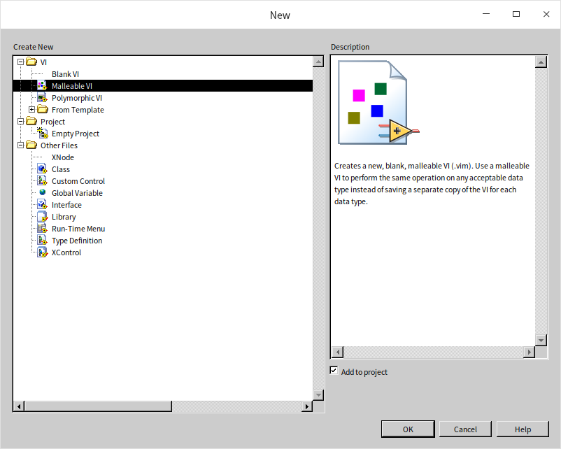

（如果是需要改造已有的 VI 成为自适应 VI，可以通过更改 VI 的文件后缀名把它变成自适应 VI。）

接下来为上面列出的洗牌算法逻辑编写代码。自适应 VI 也需要有输入输出控件，这里可以使用任何一种合法的数据类型：任意一种一维数组数据类型。这个数据类型会在自适应 VI 插入到调用 VI 的时候被替换。我们在示例中使用了最常见的数值数组：

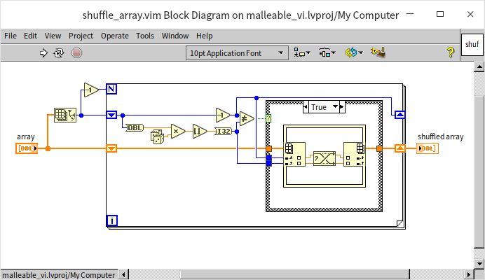

编写好的自适应 VI 可以把不同类型的一维数组都随机排序：

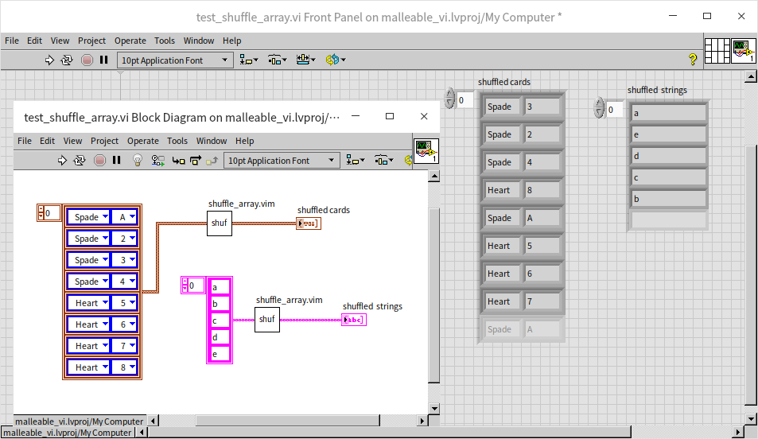

### 类型专用结构

上文编写的洗牌程序 shuffle_array.vim 只能处理一维数组，如果试图把其它类型的数据，比如二维数组，或者字符串数据传递给它，程序会报错，无法运行。

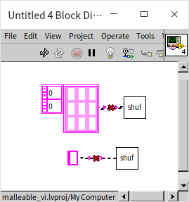

这里的机制是，如果在自适应 VI 中使用某种类型的控件，VI 出现语法错误，那么在调用自适应 VI 的程序中把这种类型的数据传递给自适应 VI 也会出错。我们可以尝试在上述示例的自适应 VI 中把输入输出控件改为字符串控件，VI 显示语法错误：

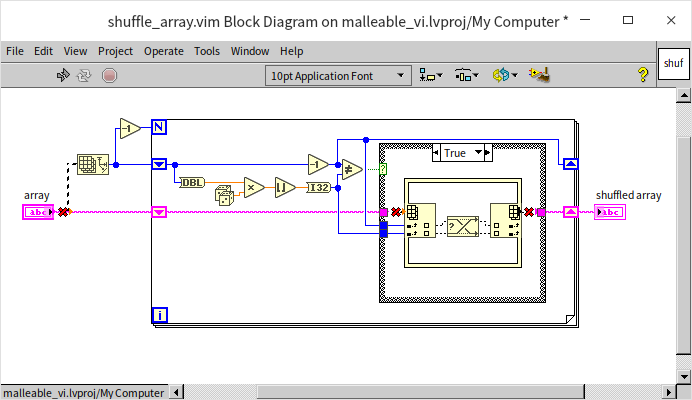

如果希望这个自适应 VI 能够支持字符串数据，那么我们首先要意识到，shuffle_array.vim 中现有的代码是不适用于字符串数据的，我们需要为处理字符串数据设计一个新的算法。假设，这里我们的需求是：如果输入一段字符串，自适应 VI 应当把字符串中的每个字符随机排序；如果输入数据是一维数组，则行为如上不变。定义好了这个行为，我们就可以实现一个新的自适应 VI 了：shuffle_string_and_array.vim。在这个新的自适应 VI 中，我们需要使用“类型专用结构”为自适应 VI 选择对应与不同输入数据类型的代码。

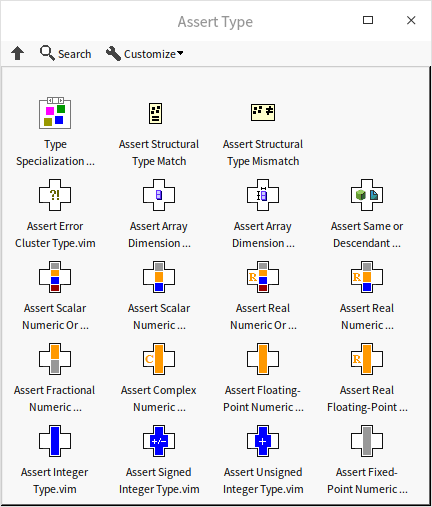

类型专用结构是一个专用于自适应 VI 的结构。它可以包括多个分支。LabVIEW 在编译程序代码时，会从前至后尝试类型专用结构的每一个分支，如果分支中存在语法错误，LabVIEW 会忽略这个分支的代码。直到 LabVIEW 遇到第一个没有语法错误的分支，就会采用这个分支中的代码进行编译。这样，我们就可以给一个 VI 准备多份不同的代码，让 LabVIEW 自动挑选采纳一份适合当前输入参数类型的代码。

下图是 shuffle_string_and_array.vim 的程序框图：

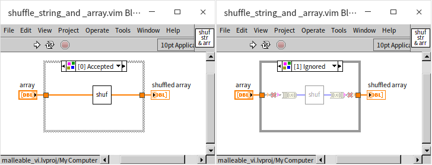

程序的主体是一个类型专用结构，它有两个分支：左图显示的 0 号分支直接调用了 shuffle_array.vim；图右显示的 1 号分支，先调用“String To Byte Array”函数，再调用 shuffle_array.vim，最后调用“Byte Array to String”函数，将结果输出。

在使用 shuffle_string_and_array.vim 自适应 VI 时：
* 如果输入参数是一个一维数组，那么类型专用结构的 0 号分支，就会被采纳，因为 shuffle_array.vim 可以接收一维数组输出类型，不会有语法错误。
* 如果输入参数是一个字符串，那么类型专用结构的 0 号分支会出现语法错误，因为 shuffle_array.vim 不能接收字符串数据。LabVIEW 会继续尝试下一分支。1 号分支把字符串转换成一维数值数组，然后才乱序排列，语法没有错误。所以 1 号分支会被采纳。
* 如果输入参数是其它类型的数据，类型专用结构的两个分支都有语法错误。调用它的 VI 也会显示语法错误。

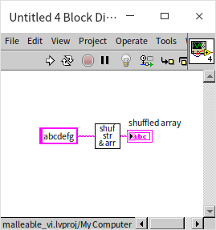

虽然我们可以在自适应 VI 实现很多套代码，支持各种不同的数据类型和算法，但是自适应 VI 最适合的应用场合还是用于把同一个算法（同一段代码）应用于一系列不同的数据类型。加入多套代码很容易破坏代码的可读性。在需要多套代码的场合，使用多态 VI，或者编写一个类很可能是更适合的方式。

### 类型检查

在某些应用中，我们可能需要一个自适应 VI 只可以接收某种特别的数据类型，或者需要一个自适应 VI 只拒绝某种特别的数据类型。这就需要用到各种类型对比函数和 VI 了（在函数选板“Programming -> Comparison -> Assert Type”上）。这其中，最为常用的是两个函数是：
“Assert Structural Type Match”和“Assert Structural Type Mismatch”。它们各自有两个输入参数。如果两个输入数据类型相同，Assert Structural Type Match 不会有语法错误；如果两个输入数据类型不同，Assert Structural Type Match 会出现语法错误。Assert Structural Type Mismatch 则正好相反，在两个输入数据类型相同时出现语法错误。

比如，我们需要编写一个自适应 VI，它可以把两个输入的数据捆绑成一个簇，然后输出。但是有一个额外的要求，就是两个输入的数据的类型必须相同，比如同为整数，或同为字符串。一个布尔型，一个字符串这种输入需要报语法错误。LabVIEW 自带的簇捆绑函数是不需要每个输入元素数据类型相同的。所以在这里无法依赖这个捆绑函数做类型检查，我们还需要在自适应 VI 中加入一个 Assert Structural Type Match 来检查两个输入数据的类型是否相同：

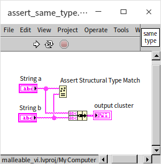

现在测试一下，可以看到，如果传入自适应 VI 的两个数据类型相同，则连线正确；若不同，则连线断裂：

Assert Structural Type Mismatch 的使用方法极其类似，比如我们需要一个自适应 VI 可以接收除了字符串以外的所有数据类型，就可以利用这个函数：

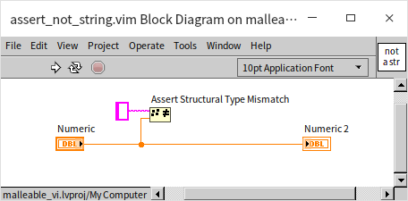

### 自适应 VI 的局限

自适应 VI 已经可以帮助我们实现绝大多数泛型编程的需求了，仅有少数一些更复杂的需求是自适应 VI 无法胜任的。

首先自适应 VI 是一种[内嵌 VI](optimization_inline_subvi)，有些 LabVIEW 功能是无法在内嵌 VI 中使用的，比如某些 [VI 服务器](vi_server__)的属性和方法无法使用。在内嵌 VI 中也无法对类的私有数据进行解除捆绑，即便是自适应 VI 就在同一个类中也不行。

此外，一些逻辑更复杂的与类型相关的操作也无法使用自适应 VI 实现。比如，我们若需要编写一个子 VI，它可以接收任意种类的簇类型的数据，对于接收到的簇数据，子 VI 会把簇中元素反向排列，然后输出新的簇数据。再比如，我们想编写一个输入参数数量可变的子 VI，就好像簇捆绑函数那样，可以通过拉长函数，增加输入参数数量。以上的需求目前都还无法使用自适应 VI 来实现。当然，LabVIEW 也提供了实现这些更加复杂的需求的方法，它是我们将在下一节介绍的 [Xnode](oop_xnode)。

## 应用实例 - 泛型双向链表容器

我们在[面向对象的应用实例](oop_use_cases)一节的最后实现了一个双向链表容器。这个双向链表的实现有一个比较大的缺陷，就是它只能用于存储一种固定类型的数据。在那个演示程序中，我们只能用它来保存和处理实数数据。假设现在又有了一个新的需求：需要一个用于保存字符串的双向链表容器，那么我们只能再重新编写一套类似的类和 VI 来处理字符串数据，尽管双向链表的每个算法与保存的数据的类型都是无关的。

在这一节，我们把它改进一下，让它成为一个可以支持多种数据类型的泛型容器。用户可以使用同一套 VI 来创建和操作用于保存实数、字符串或其它类型数据的双向链表。

之前我们用到的示例都是单个的泛型 VI：一个单个的 VI 可以支持多种数据类型。但是对于数据容器来说，我们需要实现的将是一套，多个相关的 VI。它们构成了一个泛型类（或者泛型库），库中不同 VI 可以接收的数据类型不是独立的，它与其它 VI 已经接收的数据类型是相关的。比如这个泛型双向链表容器，它虽然可以支持多种数据类型，但是一旦实例化，用户创建了一个具体的链表之后，这个具体链表容器内就只能保存一种类型的数据，容器内的每个方法 VI 都需要检查输入的数据是否符合创建时选用的数据类型。比如，用户创建了一个字符串链表，那么容器的每个插入数据方法，就应当确保插入的数据必须是字符串类型的。

为了实现这个功能，我们需要一种可以把数据类型信息在 VI 之间传递的机制。LabVIEW 的数据线就具备这个功能，LabVIEW 的数据线不但传递数据，也同时传递数据类型的信息。然而遗憾的是，我们没办法使用 LvClass 数据线来传递类中数据的可能变化的类型，因为 LabVIEW 中的类是静态的。在程序运行前，类中的数据类型就确定了，不支持泛型类。但是我们还是可以使用其它数据线来达到这一目的，比如使用簇数据类型。簇是可以在运行是创建的。

如果我们重零开始，设计一个全新的泛型双向链表，会有比较好的运行效率。但是因为我们之前已经实现了一个双向链表容器类了，为了简化工作，我们就不再重新设计了，而是把已有的类做微调，再包装一下。大致思路如下：把原有的双向链表容器类中的数据类型由实数类型，更换为变体类型，这样我们就可以把任何类型的数据都插入到这个容器里了，实现了运行时支持任意数据类型。再使用自适应 VI 对原双向链表容器类中的方法进行包装，并加入编译时的数据类型检查功能。这个实现泛型编程的方法与上文提到的 Java 支持泛型编程的方式有相似之处。

### 使用变体保存数据

双向链表类的详细制作过程在[面向对象的应用实例](oop_use_cases)一节已经介绍过了，这里不在重复。需要改造的地方是把链表节点用于保存数据的控件类型改为变体类型：

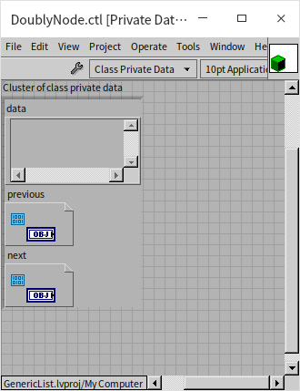

相应的，在所有与数据读写相关的 VI 中，对应的参数都需要改为变体类型，比如这是迭代器 Iterator 类中的读取数据的 VI：

这样做是为了在程序运行时，任何类型的数据都可以被保存在双向链表的节点类里。

### 封装泛型链表的方法

我们使用库（LvLibrary）来封装所有的泛型方法。下图是实现好的库：

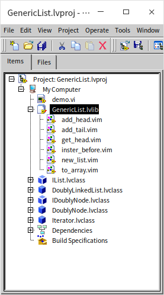

这个泛型链表容器的所有方法都是自适应 VI，而非普通 VI。

### 创建新链表方法

使用固定数据类型的链表容器时，不需要一个特别的初始化方法，因为没有必须在创建容器时被设置的参数。但是泛型链表容器必须要初始化一个参数，就是容器中保存的数据的类型。如果容器被设置为保存整数，那么之后再使用这个容器时就只能给它传递整数数据；类似的，如果容器被设置为保存字符串，那么之后再使用这个容器时就只能给它传递字符串数据。

我们实现了一个名为 new_list.vim 的自适应 VI，用于创建一个新的链表容器。它只需要一个输入参数“element data type”，用于表示新建链表中数据的类型。需要注意的是，这个控件中的数据是没有意义的，我们只需要用到它所代表的数据类型。链表中真正的数据还是被保存在我们之前已经改造好的双向链表类（DoublyLinkedList.lvclass）的对象中。所以，在这个创建链表方法中，我们还需要生成一个 DoublyLinkedList 的对象。DoublyLinkedList 的对象，和数据类型一起被捆绑成一个簇。其它的泛型链表容器的方法都需要使用到这个簇，这样那些方法 VI 才可以知道要被处理的数据在哪个容器中以及容器中数据的类型是什么。

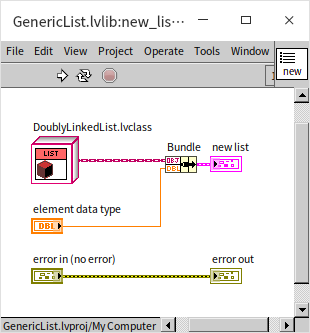

### 写入数据的方法

容器中每个写入数据的方法都是类似的，包含两个主要部分：1.检查输入数据的类型是否正确；2.调用 DoublyLinkedList 类中相应的方法保存数据。我们就以一个方法为例，下图是 inster_before.vim 的程序框图：

程序的 list in 输入参数，就是在 new_list.vim 中创建出来的代表泛型链表的那个簇。程序首先松绑 list in 数据得到 DoublyLinkedList 对象，和容器中数据的类型。接下来程序使用上文提到的 Assert Structural Type Match 函数，来比较需要插入的数据的类型是否与创建容器时指定的类型相匹配。如果数据类型不同，VI 会出现语法错误。如果相同，则调用 DoublyLinkedList 类中对应的 inster_before 方法，把新数据插入到 DoublyLinkedList 对象中。

### 读取数据的方法

因为保存在 DoublyLinkedList 类中的数据是变体类型，泛型容器的方法把数据从 DoublyLinkedList 对象中取出后，还要再转换成特定的类型再输出。下图是 to_array 方法，用于把链表中的所有数据读出，以数组的方式返回：

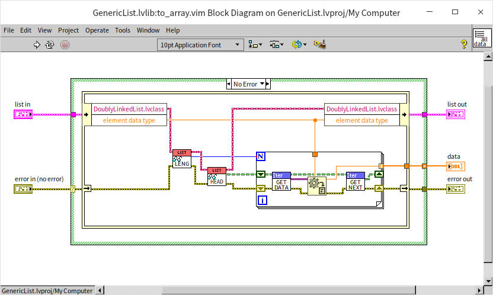

### 泛型链表的使用

下图是使用这个泛型链表的一个示例：

使用同样的一套自适应 VI，我们即可以创建一个用于保存实数的链表，也可以创建一个用于保存字符串，或者任何其类型数据的泛型双向链表。
