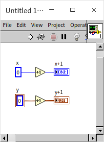

# 泛型编程

## 基础知识
我们在编写程序的时候总是要把一些通用的功能抽象出来。比如说，我们设计了一个排序的算法，我们一般不会直接在每个需要排序的地方都针对特定的问题把同一个排序算法用程序实现一遍。我们通常会把这个算法抽象成一个子函数，把需要摆排序的数据作为函数的参数。因为算法的实现与具体数据无关，同一个算法可以方便的应用到不同的数据上。比如，同一个排序算法即可以对数组\[1,3,2]排序，也可以对组数组\[5,6,4]排序。

泛型编程是一种抽象度更高的编程风格。使用泛型抽象和编写出来的算法，不但不依赖与具体的数据，甚至也不依赖于具体的数据类型。比如，同一个排序函数不但可以给一组整数排序，也可以给一组字符串排序，还可以以按大小给一组苹果排序，也可以按成绩给一组学生排序等等。由上可知，编程语言要支持泛型编程，一个前提条件是，使用这个语言能够编写出一个可以接受可以接受不同数据类型参数的函数是一个前提。

LabVIEW 中的很多函数是支持泛型的，比如加法函数，可以接收数值类型的数据，也可以接受簇或者数组类型的数据；还有数组相关的函数，可以用来操作数值数组，一可以操作字符串数组。

如果一个 VI，使用变体作为参数数据类型，这样这个 VI 就可以接收任何类型的数据了，这样是不是就可以支持泛型编程了？仅仅只是能够接受不同数据类型是不够的，还要具有类型检查功能才可以支持泛型编程。比如，某一算法可以支持数值和字符串类型的数据，但是不支持布尔类型数据，那么就需要实现这样的功能，当把布尔数据类型于这个算法子 VI 的输入连线的时候，VI 就会立刻报错，不需要运行，VI 就可以提示数据类型出错。 子 VI 使用变体数据类型显然无法做到这一点。甚至更复杂的情况，如果创建了一个字符串类型的数组，再使用其它数组函数（比如插入、索引等）对这个数组操作时，函数应当也只能接收字符串类型的数据，连接到其它数据类型也需要报错。

编程语言主要通过两种方式来支持泛型编程：

一种是以 Java 为代表的类型擦除技术（erasure）。当编译器对带有泛型的 Java 代码进行编译时，会执行数据类型检查和类型推断，如果遇到类型错误会报错。但是编译器生成的执行代码是不带泛型的代码，也就是数据类型信息被擦出了，因此同样一段代码可以被 Java 虚拟机用来处理各种不同类型的数据。这样，Java 的泛型编程即可以及支持多重数据类型，又可以保证类型安全。

比如，在代码中定义了 ​​List\<Int\>​​ 或 ​​List\<String\>​​ 等类型。在代码编译时，编译器会检查传递的数据是否是 Int 或 String 等类型，在代码编译后，它们就都会变成 List。Java 虚拟机看到的只是 List，于是相关的函数不论 List 中数据是何类型，都能正常运行。

另一种是以 C++ 为代表的代码插入技术。在 C++ 中编写泛型函数或者泛型类的时候，其实并非直接编写一个特定的函数或类，而是编写了一个函数或类的模板。比如需要一个支持泛型的 List，那么就要编写一个 List 的模板。程序中使用到了 ​​List\<Int\>​​ 或 ​​List\<String\>​​ 等类型的地方，在编译时，会自动从模板生成对应特定数据类型的代码，插入到应用它的地方。 ​​List\<Int\>​​ 或 ​​List\<String\>​​ ​​生成的是不同的代码，编译程序会在此时确保类型安全性。由于知道数据确切的类型，所以编译器进行代码生成的时候就不用运用动态的类型检查，运行效率较高。但是由于程序中有大量从模板自动生成的代码，代码控件会比较大。与 Java 的泛型支持技术相比，C++ 的技术是以空间换时间。

在 LabVIEW 中，也有几种方法可以编写出支持多种不同类型数据的 VI，下面逐一介绍。

## 使用变体作为子 VI 的参数类型

我们在[数据类型间的转换](data_datatype_cast)一节曾经介绍过“变体”这个数据类型。但是，使用变体作为参数数据类型并不能真正实现泛型编程。在这一段，我们详细解释一下如何使用变体传递不同类型的数据，以及变体类型的局限。

假设，我们需要一个具有加法功能的子 VI，这个 子 VI 需要支持两种数据类型：数值数据类型和字符串数据类型。如果输入两个数值，输出就是它们的和；如果输入两个字符串，则把字符串表示的数值相加然后再以字符串的形式输出。如果，VI 的输入参数选用数值型控件，或是选用字符串型控件，那么这个子 VI 就只能处理数值数据类型的数据，或者是只能处理字符串数据类型的数据，二者不能兼顾。因此，我们需要使用变体作为子 VI 的参数数据类型。任何数据类型的数据都可以转换成为变体，这样，就可以把任意类型的数据传入子 VI 了。在子 VI 中再把变体转换成相应的数据类型进行运算。使用此方法编写的子 VI 如下图
所示。

“变体加法.vi”的参数数据类型是变体类型，所以，调用它的程序可以传递任何类型的数据给它：

“变体加法.vi”的参数数据类型是变体类型，所以，调用它的程序可以传递任何类型的数据给它。

使用变体作为子 VI 的参数类型虽然可以让子 VI 处理多种数据类型，但是它也存在一些缺点。

首先，它的类型安全性比较差。比如，程序要求的算法只能处理两个数值或者两个字符串输入数据。但实际上，把任何类型的数据与这个子 VI 相连，或者给两个参数 x，y 输入不同类型的数据，VI 都不会报错。只有在运行到这一子 VI，进行数据类型转换时，程序才能发现错误。

对于程序员来说，上述这种错误最好在编程时就能够发现并有所提示，以便及时处理。也就是说，若输入的数据类型有错，VI 应当立即被禁止运行，并给出提示，而不是等到运行中才发现错误。

其次，由于子 VI 的输出也是变体类型，后续的程序还要再多加一个步骤，把它转换成具体的数据类型再继续使用。

因此，使用变体数据类型的参数，并不能完美的解决一个 VI 支持多种数据类型的问题。解决此类问题的一个更好的方案是使用下面将要介绍的多态 VI。

## 多态VI

LabVIEW 不但有可以接收多种不同类型的数据的函数，它自带的某些子 VI 的参数也是可以接收多种不同类型的数据的。比如读写配置文件的 VI，它们既可以读写数值型数据，也可以读写字符串、布尔等数据类型。类似的还包括声音输出的 VI、数据采集的 VI 等等。

一种常用的实现这种可以处理多种不同数据类型的 VI 的方法被称为 "多态 VI"。这个多态和“面向对象编程”中的多态不是一个意思，但是它们有相似的地方，多态 VI 也可以根据输入数据的不同类型，调用不同的代码。

多态 VI 本身并不实现任何实质性的程序功能，它的作用仅仅是根据传递给它的输入参数数据类型，选择调用一个对应这种数据类型实现程序功能的 VI。这些针对某种特定数据类型实现功能的 VI 被称作 "实例 VI"。一个多态 VI 可以调用多个实例 VI。

使用多态 VI 可以解决上文提到的数据类型安全的问题。多态 VI 的参数只能接收那些在它的实例 VI 中提供了处理方法的数据类型，而不能接收其它数据类型。比如，我们提供了一个多态 VI，它有两个实例 VI，分别能够处理两个数值和两个字符串输入数据。那么，在使用这个多态 VI 时，应用程序就只能同时传递给这个多态 VI 两个数值或两个字符串数据；否则，VI 会出错，禁止运行。

如果你需要提供给用户一个实现了某算法的子 VI，这个算法可能用到几种不同的数据类型。为了用户使用方便，提供给用户的不应该是一组不同的 VI，而应该是一个有统一接口的子 VI，这个 VI 可以接受指定的数据类型。否则，用户在使用前，还要根据不同的数据类型先去寻找适合的 VI。VI 根据不同输入数据类型，自动地使用针对每个数据类型的算法。多态 VI 就具有这种功能。

### 编写多态 VI

通过如下步骤，可以使用多态 VI 实现上文提到的示例： 编写一个具有加法功能的子 VI，这个 子 VI 需要支持两种数据类型：数值数据类型和字符串数据类型。如果输入两个数值，输出就是它们的和；如果输入两个字符串，则把字符串表示的数值相加然后再以字符串的形式输出。

我们把这个多态 VI 命名为 "add polymorphic.vi"，这个 VI 支持两种数据类型：数值和字符串。这个名为"add polymorphic.vi"的 VI 根据输入数据的类型，再分别调用两个实例 VI："add
numeric.vi"和"add string.vi" 来实现具体的加法功能。它们的调用关系如下图所示：

在实现多态 VI 之前，首先要实现它的实例 VI，即那些针对每个数据类型完成算法功能的 VI。在这里便是 add numeric.vi 和 add string.vi。实例 VI 就是普通的子 VI，例如，add
string.vi 的程序框图：

完成了实例 VI，就可以开始创建多态 VI 了。在 LabVIEW 的新建对话框中（选择菜单 "文件 -\> 新建"）选择 "VI-\> 多态 VI" 即可创建出一个新的多态 VI。

多态 VI 和普通 VI 看上去完全不一样：它没有前面板和程序框图，只有一个配置界面。因为多态 VI 的功能都是在实例 VI 中实现的，所以多态 VI 只要选择一下它的实例 VI 就可以了。

多态 VI 的主体部分是一张列表，表中列出的条目即是这个多态 VI 可以调用的实例 VI。通过 "添加" 按钮，可以增添实例 VI 到这张表中。上图中的实例 VI 列表中多了一项，它仅用于演示下文将会提到的多态 VI 的菜单。实际上按照本程序的要求，只需前两条实例 VI 即可。

在多态 VI 的界面上，右上方是这个多态 VI 的图标，按下 "编辑图标" 按钮，可以设计多态 VI 图标。

若选择左下角单选按钮的 "绘制多态 VI 图标"，调用了多态 VI 的程序框图上就会一直显示多态 VI 的图标；而如果选择 "绘制实例 VI 图标"，则多态 VI 将随数据类型的不同而显示相对应的实例 VI 的图标，以便让图标更清晰地显示出多态 VI 当前的功能。

多态 VI 右下方有两个多选选择框。若选中了 "允许多态 VI 自动匹配数据类型"，多态 VI 将根据输入数据类型的不同，自动选择调用相应的实例 VI；如果该项没被选中，编程者必须每次手动选择所需要的实例 VI。若选中了 "默认显示选择器"，那么当多态 VI 被新添到一个程序框图上时，将伴随图标在其下方显示出紫色的数据类型选择框，供用户选择数据类型。

无论 "允许多态 VI 自动匹配数据类型" 这一项是否被选中，多态 VI 调用的实例 VI 都可以通过其右键菜单被改变。

实例 VI 配置对话框中的 "编辑名称" 按钮用于编辑列表中的 "菜单名" 和 "选择器名" 栏，"菜单名" 和 "选择器名" 会分别在多态 VI 的右键菜单和选择栏中显示出来。

### 多态 VI 的注意事项

在设计多态 VI 时，有一些事项需要注意。

多态 VI 只能处理有限种数据类型，它只能支持实例 VI 中处理了的那些数据类型。实际上，有的算法可以支持无限种数据类型。比如，某一加法算法，可以支持各种簇数据类型。簇类型的数量是无限的：包含两个整数的簇（Cluster）是一种数据类型；包含三个整数的簇，成了另一种数据类型；包含三个字符串的簇，又是一种新类型。多态 VI 无法实现能够支持任何一种簇数据类型运算的算法。LabVIEW 自带的某些函数，比如加法函数，可以处理无限种数据类型，但使用多态 VI 是无法达到同样效果的。

多态 VI 的每个实例 VI 可以是完全不同的，前面板、程序框图、调用的更底层子 VI 等等都可以完全不同。但是，为了便于用户理解，一个多态 VI 应该局限于处理某一种算法：它的每个实例 VI 负责一种数据类型。并且，为了便于用户在不同的数据类型之间切换，每个实例 VI 的连线板应当使用同样的模式，接线的位置也应当保持一致。例如下图：

多态 VI 不能嵌套使用，一个多态 VI 不能作为其他多态 VI 的实例 VI。

### 菜单设计的小技巧

我们可以把多态 VI 的右键菜单 "选择类型" 项做成多层次的多级菜单，只要在多态 VI 设置对话框的 "菜单名" 一栏中输入菜单的层次结构即可。它使用冒号 ":" 作为层级分隔符。比如第一层为 "Numeric"，第二层为 "Float"，就在 "菜单名" 中写入 "Numeric:Float"。（参考上文 add polymorphic.vi 的配置界面）

这个技巧同样适用于多态 VI 选择器和其它需要编辑菜单的地方。

## m VI

## 示例