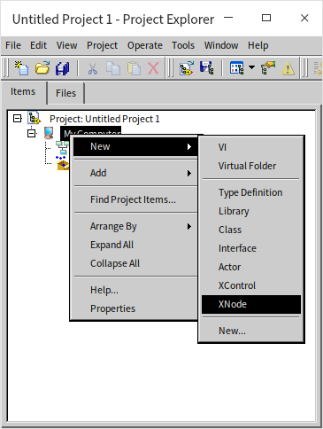
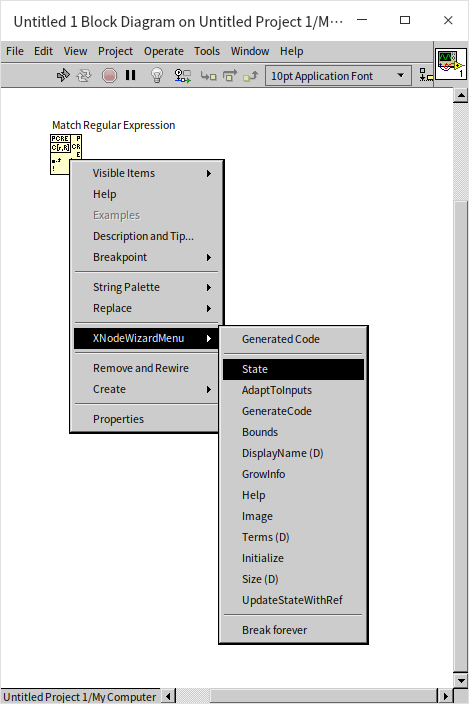
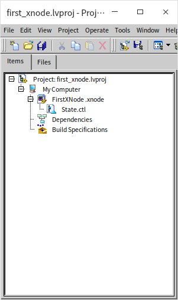
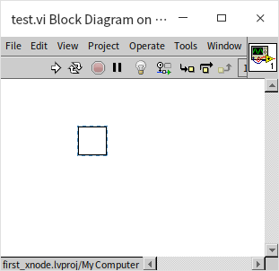
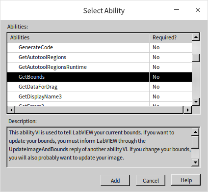
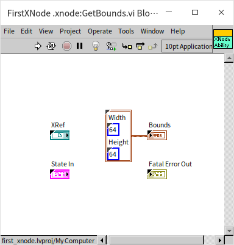
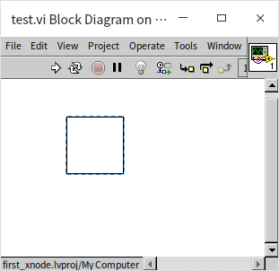

# XNode

读者们应该都已经非常熟悉如何创建子 VI 了，甚至创建一些能处理多种数据类型的子 VI。但是我们是否还能创建一些功能更强大的节点呢，就像 LabVIEW 自带的那些函数（比如簇捆绑），甚至是结构（比如循环结构）等等？

LabVIEW 确实也提供了相应的功能，XNode。XNode 看名字，就会联想到 [XControl](ui_xcontrol)。二者确实有一些相似之处。XNode 与 XControl 是差不多同时出现的技术。使用 XControl，用户可制作出有复杂行为的控件；而使用 XNode 则可以制作出有复杂功能和行为的节点。XControl 很早就已经开放给 NI 的外部用户使用了，而 XNode 至今也没有正式开放给外部用户。但是因为 LabVIEW 安装包已经包含了 XNode 的完整功能，用户还是通过一些设置来使用这个功能的，网上可以找到很多用户制作的 XNode 产品。

## 开启 XNode 相关功能

XNode 本质上就是一组有特定格式要求的库和 VI，XControl 本质上也是一组有特定格式要求的库和 VI，所以，理论上，用户不需要对 LabVIEW 做任何特殊设置，只要提供了符合要求的这样一组文件，就可以在程序里使用这个对应的 XNode 了。但在实际应用中，凭空创建这个些 VI 即繁琐又容易出错。如果激活了 LabVIEW 的 XNode 功能，LabVIEW 会提供一些模板以及文档来帮助搭建 XNode。

### Windows

在 Windows 系统下，用户如果想方便的创建 XNode，有两个途径可选。一是官方途径，从 NI 官方得到一个安装到 LabVIEW 上的启用 XNode 功能的证书。如果此路不通，也可以使用一些第三方的工具。利用这些第三方工具，同样可以方便快捷的创建 XNode。比如，XNode Editor （Google 这个工具名，可以搜索到详细信息）。

此外，最好可以在 LabVIEW 的配置文件中添加一下设置，它们可以激活 LabVIEW 中与 XNode 相关的一些工具，帮助进行 XNode 开发。

```ini
XnodeWizardMenu=True
XnodewizardMode=True
XTraceXnode=True
XNodeDebugWindow=True
SuperSecretPrivateSpecialStuff=True
```

在 Windows 系统下，LabVIEW 文件是与 labview.exe 同文件夹下的 labview.ini 文件。

### Linux

笔者主要在 Linux 系统下使用 LabVIEW。在 Linux 系统下启用 XNode 功能要方便的多，只需要将如下配置拷贝到 LabVIEW 的配置文件中即可：

```ini
XNodeDevelopment_LabVIEWInternalTag=True
XnodeWizardMenu=True
XnodewizardMode=True
XTraceXnode=True
XNodeDebugWindow=True
SuperSecretPrivateSpecialStuff=True
```

其中的 XNodeDevelopment_LabVIEWInternalTag=True 设置可以让 LabVIEW 的新建功能增加 XNode 选项。



在 Linux 系统下，LabVIEW 的配置文件的路径是：“/home/<username\>/natinst/.config/LabVIEW-x/labview.conf”。

## XNode 的调试菜单

LabVIEW 自带的一些节点也是使用 XNode 技术制作的。比如 Match Regular Expression，这个节点在函数选板“Programming -> String” 上。它看上去就是一个普通的 LabVIEW 自带的各种函数，但它其实是一个 XNode。当我们按照上文介绍的方法开启 XNode 调试工具之后，在用鼠标右键点击这个节点，会发现右键菜单，多了 XnodeWizardMenu 这一项。这个菜单列出了这个 XNode 所有的功能 VI。XNode 的功能 VI 与 [XControl](ui_xcontrol) 的功能 VI 概念相似，主要用来控制 XNode 的各种行为和功能，我们之后会详细介绍。



在这个调试菜单上选取一个功能 VI，就会打开相应功能 VI 的程序框图。如果将来编写 XNode 遇到困难，可以用此方法打开别人做好的 XNode 的功能 VI，进行参考借鉴。

我们在上图看到的程序框图上的 Match Regular Expression 节点只是这个 XNode 的图标，就好像是子 VI 在调用 VI 程序框图上显示的图标。当我们双击一个子 VI 的图标，会打开这个子 VI 的执行代码；相应的，如果我们想查看这个 XNode 的执行代码是什么，可以 XnodeWizardMenu 菜单中选取 “GeneratedCode”,LabVIEW 会把这个 XNode 的执行代码显示出来。比如下图是这个 Match Regular Expression 节点的执行代码：


上图中的运行代码似乎什么事都没做，其实这是因为这段代码不是某人手工编写的，而是程序程生成出来的（所以叫 GeneratedCode），代码并没有排列得当。点击一下“Cleanup Diagram”按钮，就会看到真正的程序代码了：


与子 VI 有一些不同：子 VI 的代码是固定的，写好的什么样，就一直是什么样；XNode 的运行代码是动态生成的，是会根据配置选项，连接的数据线等条件的改变而改变的。

XNode 功能强大，可以制作出很多不同类型的节点。比如，“Error Ring”是比较类似于数据接线端的节点；“定时循环结构(Timed Loop)”是一种结构节点。

## 功能 VI

XNode 与 [XControl](ui_xcontrol) 相似，通过一些特定的功能 VI 来控制 XNode 的行为和功能。不同之处在于数量， XNode 的功能 VI 的数量比 XControl 多了一个数量级。我们接下来会逐一介绍这其中一些最重要的功能 VI 的用法。

### State

首先，我们先创建一个新的 XNode：



这是会发现，新创建出来的 XNode，只有一个默认的“状态(State)”功能控件。它与 XControl 中的 State 功能控件功能完全相同。它是一个簇控件，簇中包含了用于定义 XNode 行为和功能的全部变量。如果哪个数据需要在不同的功能 VI 之间被使用，可以就把它们存放在 State 功能控件里。我们暂时还不需要什么数据，所以可以暂时不去改变默认的 State 功能控件，将来需要用到时，在做修改。

新建的 XNode 没有任何功能 VI，XNode 所有的功能 VI 都是可选的。那么这个空的 XNode 能运行吗？

我们在创建一个测试 VI，然后把新建的 XNode 拖到测试 VI 的程序框图上，可以看到新建 XNode 看上去就是一个空白方块，并且测试 VI 是可以运行的，没有语法错误。只是新建的 XNode 也是空的，运行起来不做任何事情。



### GetBounds

新建 XNode 在其它 VI 的程序框图上是上去是一个空白的方块，大小就是一个子 VI 图标的大小。这在高分辨率显示器上看上去显得太小,子 VI 的图标大小是没法调节的，最大就是 32*32 像素，但 XNode 的图标尺寸是可以调节的，下面我们就使用 GetBounds 功能 VI 把它改大。

首先，为新建的 XNode 添加个这个功能 VI。鼠标右键点击 XNode 项目，选择“Ability”：


LabVIEW 会弹出一个对话框，列出了 XNode 所有的功能 VI：



对话框还给出了每个功能 VI 的简单说明。我们找到 GetBounds，然后点击添加。
GetBounds 功能 VI 用于设定当前 XNode 图标的尺寸。打开这个功能 VI，可以看到他有一个名为“Bounds”的输出，这是我们唯一需要设置的，把尺寸设置大一点 64*64：



再次打开测试 VI 查看，会发现 XNode 的图标大了一倍：




。。。。。。。。。。。。。。
