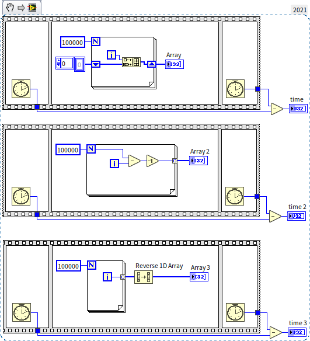
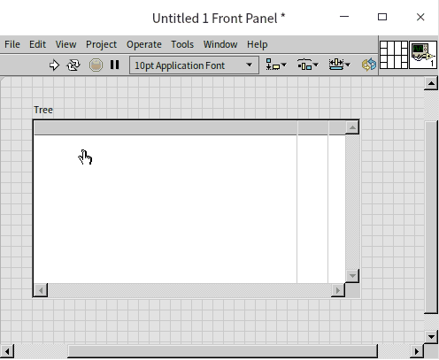
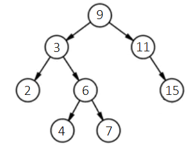
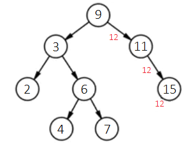
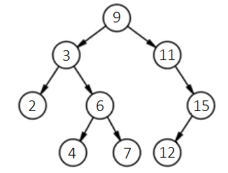

# 简单算法和数据结构

图灵奖获得者，Pascal 编程语言的发明人，Nicklaus Wirth，提出过一个公式：`程序 = 算法 + 数据结构`。数据结构研究的是如何针对特定问题，找到最适合的数据的组织方式；算法研究的是找到解决这个问题的最优化方法和步骤。这句话就算不全面，也基本上揭示了程序的核心本质。程序员找工作面试的时候，最常被问到的问题也是关于算法和数据结构的。

LabVIEW 程序的核心无非也是一些算法和数据结构，只不过，LabVIEW 长期被用来编写测试程序。所需的算法和数据结构就是固定的几种，所以不怎么强调算法与数据结构。不过，影响程序运行效率的最关键因素就是算法和数据结构了，其影响程度远超是使用 LabVIEW 还是使用 C 语言的差别。如果能够理解一些基本的算法和数据结构，就很可能会提高自己程序的效率。常听有人抱怨 LabVIEW 速度慢，实际上多数程序都还是有很大优化空间的。

算法和数据结构作为编程的两大基石，分别都可以开一门整学期的课来学的，我们这一节的篇幅只能讨论一些最初级的算法和数据结构。

## 时间复杂度

这一节和程序的运行效率高度相关，所以先要介绍一下衡量一个算法好坏的指标：算法复杂度。算法复杂度分为时间复杂度和空间复杂度。空间复杂度表示指执行这个算法需要多少内存空间。多数情况下，大家更关心的是时间复杂度，它表示执行一个算法所需工作量的多少，这直接决定了算法运行时间的多少。时间复杂度是一个函数，时间复杂度越高，往往表示输入数据稍微多一点，程序就要多运行很长的时间。时间复杂度跟要解决的问题有关：有的问题可以被非常高效的解决，而有的问题根本没有低时间复杂度的解决方法。所以，只有对比同一个问题的不同算法的时间复杂度才有意义。

时间复杂度函数用大写字母 O 表示；同时用一个小写字母，比如 n，表示算法要处理的数据量。

* 如果一个算法，不论输入数据量 n 有多大，都一定会在某个固定的时间内运行完，就表明这个算法的运行时间是常数级别的，记作 $O(1)$
* 如果一个算法的运行时间与输入的数据量呈线性关系，比如，输入数据个数是 n 运行时间是 c*n，c 是一个常数，那么就表明这个算法的时间复杂度是线性的，记作 $O(n)$
* 如果一个算法的运行时间与输入数据量的平方成正比，那么算法的时间复杂度就是 $O(n^2)$;同理，如果运行时间与输入数据量的三次方成正比，那么时间复杂度就是 $O(n^3)$ ……

上面这些被统称为多项式级别的时间复杂度。如果一个算法的时间复杂度是多项式级别的，基本上还可以用来解决实际问题。如果一个算法的时间复杂度超过这个级别，比如是阶乘级别的 $O(n!)$ 或者是指数级别的 $O(2^n)$，那么就基本上无法用来解决实际问题了。即便都是多项式级别的，我们也希望为需要解决的问题找到一个复杂度最低的算法。

下面我们先来研究一下：如果有一个数 n，我们知道它一定是两个素数（质数）的乘积，但不知道是哪两个素数，那么对 n 进行质因数分解的时间复杂度是多少？

用一些具体的数字来演示可能会更清楚： 假如有两个素数是 17 和 19，相乘可以得到 $17 * 19 = 323$。对于计算机来说，把两个值较大的数相乘和把两个值较小的数相乘所需时间几乎没有差别，可以被看作是一个常数，所以乘法运算的复杂度是常数级别的 $O(1)$。但是反过来，把 323 质因数分解，可就没那么容易了。他只能从最小的素数开始一个一个试。比如先试试 323 能不能被 2 整除，如果不行再试 3，一直试到 17，才可以找到结果。最差的情况是，n 是两个相同的素数的乘积，那么就要查找 $\sqrt{n}$ 次，假设乘法除法的运算量是一个级别的，那么因数分解 n 的时间复杂度就是 $O(\sqrt{n})$。分解两个素数乘积的程序如下：

这个程序还可以进一步优化一下，比如如果因数明显的不是素数（比如偶数等）就不用试了，等等。优化后的程序运行速度可以快一些，但它的复杂度依然比两个素数相乘的复杂度高得多。其实，$O(\sqrt{n})$ 在常见算法里算是非常低的时间复杂度了，但即便如此，它也无法处理太大的输入了。假如，两个素数都大于 $10^10$，那么，基本上就已经无法用普通计算机对他们的乘积做质因数分解了。一个运算和它的反运算的时间复杂度相差巨大，在计算机领域是有实际用途的。比如，被广泛实用的 RSA 加密算法就利用了把素数相乘远远快于把合数分解成质因数这一特性。简化的来说，过程是这样的：用户 A 和 B 需要通过互联网通信，所以它们之间传递的数据相当于是公开的，所有内容都会被监听者 C 截获。A 希望 B 发送给字节一些隐私消息，不能让 C 看懂。于是，A 先找到两个大的素数，然后把两个素数相乘的乘积作为密钥交给 B，B 使用这个密钥把消息加密后再传递给 A。如果要解密，必须使用原来的两个素数才行。A 当然知道原来的两个素数是什么，但 C 并不知道，如果 C 想要解密，必须对密钥进行质因数分解，而质因数分解是个相对较慢的过程，只要 A 找到的两个素数够大，C 就不可能在有效时间内算出两个素数，从而达到了加密的效果。

但是，这里还有个问题，A 去哪找两个这么大的素数？换句话说，A 拿到了一个很大的数，怎么确定它是素数？试试把它因数分解？那样一来，A 所需要的时间不就和 C 差不多了吗，肯定不行。幸运的是，还是有一些时间复杂度极低的判断一个数是否是素数的算法。比如，我们可以利用一些素数的性质来判断一个数是不是素数：假设 a 是一个比较小的素数（比如 2、3、5 等），p 是需要判断的一个比较大的数，如果 p 是一个素数，那么 $a^{p-1}-1$ 就可以被 p 整除。利用这个方法，我们可以编写如下的程序判断一个数是否是素数：

这个算法有一些需要注意的地方：首先，它需要多试几个不同的 a 的值，如果都满足条件，才能确定被测试的数是素数。对于 U64 类型能表示的整数，a 分别取 2、3、5、7、11 这 5 个最小的素数试一遍就足够了。其次，在程序里没有直接使用 LabVIEW 的乘方函数计算 $a^{p-1}$ 的值，这是因为被测数据 p 一般都比较大，$a^{p-1}$ 会是一个非常非常大的数，已经超出 U64 可表示的范围了。因为我们只关心 $a^{p-1}$ 除以 p 后的余数，所以，在这里可以把乘方计算拆成多个乘法，一遍算乘法，一遍只保留乘方结果中的会影响最终结果余数的部分，这样就可以在 U64 允许的范围内就行计算了。

利用上面的程序在一段连续的整数中挨个测试，很快就可以找到一些素数。比如，我们利用上面的程序，从 1,000,000,000 开始查找，很快就找到了一个素数： 1,000,000,007。

## 数组 （Array）

### 基本操作的效率

本书在[数组和循环](data_array#数组)一节已经介绍了 LabVIEW 中数组的基本操作。这一节主要讨论数组的各种操作的效率。这些操作的效率，很大程度上是由数组数据在内存中的存储方式决定的。数组用一组连续的内存空间，来存储一组具有相同类型的数据。下图演示了以个在内存中的整数数组：

数组中每个元素按顺序依次放置在一块内存上。这样有规律放置的一组数据非常有利于通过索引来查找或修改数组中的某个元素。因为数组每个元素所占内存都是相同的，所以，只要知道元素的索引就可以立刻得到： `元素在内存中的地址 = 数组的起始内存地址 + 索引 * 单个元素占用的内存`。也就是说查找数组元素的时间复杂度是 $O(1)$。但数组的这种数据组织方式也有缺陷，比如说，在数组中插入或删除一个元素就相对较慢。因为数组的每个元素都是按顺序放置在内存中的，如果在中间插入或删除一个元素，那么这个元素之后的所有元素都要向后或向前依次移动一个位置。最差的情况是在数组头插入一个元素，那么数组中每个元素都要后移一位，看上去是插入一个元素，其实改动了所有的元素。数组插入删除元素的时间复杂度是 $O(n)$。

假设我们需要在程序中构造一个长度为 100,000 数组，数组中总共有 0 ~ 99,000 总共 100,000 个整数元素，它们是倒序，从大至小排列的。因为正好是倒序排列的一组整数，所以，可以使用循环的索引作为数据，既然是倒序，那就每次迭代，把索引数据都放到数组最前面，这样就生成所需的数组了。程序是下图中最上面那个顺序结构中的程序：

我们已经了解了数组的每种操作的效率了，所以读者可能已经想到了，这种把数据插在数组头的操作是非常慢的。没插入一个数据的时间复杂度都是 $O(n)$，如果插入 n 个数据，总复杂度就达到 $O(n^2)$ 了。所以我们要在程序中避免数组的插入，LabVIEW 中构造数组最自然最高效的方法是使用[循环结构中带所有的输出隧道](data_array#输出隧道)。上图中，下面两个顺序结构都是比较好的构造数组的方法。在笔者的电脑上运行这个程序，time, time 2, time 3 的输出值分别为 750, 0 和 2。可见其效率差距之大。

这里请读者思考一个问题：把数据插入数组头的确非常慢，那么插入数组尾部是不是就没有效率问题了呢？新插入的元素是数组中的最后一个，那就不需要移动任何其它元素了。是这样吗？

### 多维数组

前文提到过，LabVIEW 不支持数组的数组。这是因为数组的每个元素必须占用相同的内存空间。这样才能根据一个元素的索引快速计算到它所在的内存空间。而数组的元素个数是不定的，每个数组的长度可能都不同，把它们作为元素再放到另一个数组里，那样新的数组就没法快速索引了。如果需要用到数组的数组，可以使用二维数组来代替。数组还可以是三维甚至更多维的。二维数组可以看做是按照行列顺序排列的数据：

二维数组在内存中存储顺序是先放置一行的数据，然后紧接着保存下一行。因为每一行的元素的个数都相同，所以通过元素的索引还是可以立刻计算到元素所在的内存地址。比如一个二维数组，共有 n 行 m 列，需要访问的元素的索引是第 i 行 j 列，那么就可以知道这个 `元素的内存地址 = 数组的起始内存地址 + (m * i + j) * 单个元素占用的内存`。

但是，LabVIEW 还是允许一些长度不定的类型的数据作为数组元素的啊，比如字符串数组中，每个元素字符串的长度可都是相同的。这是因为，当字符串、簇等数据长度不定的数据作为数组元素的时候，数组中的元素其实是那些数据的引用。字符串中的内容被保存在内存的另一处，不论这个字符串本身有多长，它的引用都只是一个 4 字节长的数据，所以数组依然可以通过元素的索引快速找到元素所在的内存地址。关于这方面的相机介绍，可以参考[数据平化至字符串](data_string#数据平化至字符串)一节。

### 排序

程序里经常需要对一组数据进行排序，labview 自带的排序

我们考虑一下这个排序算法底层是如何实现的。

先考虑一下，我们平时怎么给东西排序，比如有一堆苹果，需要我们按照个头从大到小排序。有几种方法：
* 我们通常会先把里面最大的一个跳出来，放在眼前；然后再从剩下苹果里面挑一个最大的，排在第二；再挑第三个……这种排序算法叫做**选择排序**。
* 也有的人喜欢用另一种方式排序：从那堆苹果里随便拿一个出来，摆在眼前；再随便拿一个苹果，跟眼前的比较一下，如果新拿的苹果更大，就排前面，否则排后面；再拿来一个苹果跟眼前所有苹果一一比较，把新苹果插在一个比前面小比后面大的位置上……这种排序算法叫做**插入排序**()。
* 还有一种类似的算法叫做**冒泡排序**（Bubble Sort）：假设我们面前有一排没有排序的苹果，我们先比较最右面两个苹果，如果左边一个大，就不动，如果右面的大，就调换两个苹果的位置；再比较右边数的第二第三个苹果，也是如果两个苹果中如果左边一个大，就不动，如果右面的大，就调换两个苹果的位置；在比较右边数第三第四个苹果……这样一轮下来，我们就可以保证最大的苹果被挪到了最左边了；如果同样的操作再来一轮，就能保证第二大的苹果被挪到了左边第二的位置；同样操作 n 轮后，n 个苹果就都被排序好了。

上面这三种算法都是比较简单直观的，如果说编写代码的话，笔者个人最喜欢冒泡排序，写出来的代码相对更简洁优美。下图就是实现了冒泡排序的程序框图，它首先产生了一个随机数数组，然后使用冒泡排序算法对数据进行了排序：

在这三种排序算法，每摆放好一个元素，其它的每一元素，都要么被计较，要么被挪动。为了把 n 个数据排序，需要运行 n 轮，每轮又要进行平均 n/2 个操作。总体来看，算法时间复杂度达到了平方级别，也就是 $O(n^2)$。如果读者比较一下的话，就会发现这些算法比 LabVIEW 自带的排序算法慢。慢在哪里呢？因为排序其实不需要把每一个元素都跟其它所有的元素进行比较。比如有 a, b, c 三个数，如果已经比较后发现 a > b，b > c，那么其实不需要再去比较 a 和 c 的，这多出来的比较拉低了上面几个算法的效率。

有一些算法针对上面问题做出了优化，去除了多余的比较。其中使用最广泛的是**快速排序**（Quick Sort）算法：还是以苹果排序为例，我们先从一堆苹果里随便拿出一个，用它跟所有其他苹果比较，比它大的所有苹果都放在它左边；比它小的所有苹果都放在它右边。这样桌面上中间一个苹果，左边一堆，右边一堆。我们能够确定，左边这堆任何一个苹果都可能大于右边一堆苹果中的任意一个。所以任何一个左边的苹果都不必再和右边的任何一个苹果去比较了。我们接下来再对左边一小堆苹果做同样的操作，之后再对右边那一小堆苹果也做同样的操作。一次递推，直到每一小堆都只剩一个苹果的时候排序就完成了。

这种排序算法的时间复杂度降低到了 $O(n\log_2 n)$。LabVIEW 自带的排序算法采用的就是这种排序算法。

那么，还能再快一些吗？如果通过比较数组中元素的大小来排序，n 个数据，至少也要比较 $n*\log_2 n$ 次才行，所以无法再快了。但是，上文提到过，数组最高效的操作是索引，那么能不能不通过比较大小，而是通过索引来排序呢？确实有这样的算法，比如我们需要给下面这样一组数据排序： 5, 4, 2, 8, 7。算法是：首先创建一个用于计数的数组（这也是计数排序名称的由来），这个计数用的数组长度一定要大于原来数组中最大的那个元素的数值。比如上面的例子中，需要排序的几个数中最大的是 8，那么我们就可以开辟一个长度为 10 的数组用来计数。接下来，挨个查看需要排序的数据，第一个数是 5，那么就把计数数组第 5 个元素加一；的元素里，第二个数是 4，就把计数数组第 4 个元素加一…… 计数完毕之后，按照计数数组记录的情况从前到后构造一个新的数据数组出来，就是排好序的数据数组了。这样的排序算法叫做**计数排序**（Counting Sort），下图是计数排序算法的程序框图：

计数排序的时间复杂度是 $O(n)$，比快速排序的复杂度又降低了一级。从上图的程序中也可以看出来，它没有嵌套的循环。说明计算次数与输入数据长度是呈线性关系的。比较一下计数排序和 LabVIEW 自带排序算法的效率：

在上图的测试程序中，首先生成了一个长度为 100,000,000 的随机数数组，然后分别传递给 LabVIEW 自带的排序算法（上面的顺序结构）和计数排序的算法（下面的顺序结构）。运行程序，在笔者的电脑上，time 和 time 2 的输出值分别是 17,156 和 93。可见如果使用得当，计数排序的效率提升十分可观。那么 LabVIEW 自带的排序算法为什么不用计数排序呢？

从上面对算法的描述和代码实现中可以看出来，基本的计数排序只适合用来给那些素数值分布区间不大的整数数组排序。对于其它类型的数组，也可做一些处理，实现时间复杂度为 $O(n)$ 的排序算法，
* 比如对于数值大小分布区间非常大的整数数组，可以按照整数的每一位分别排序，每一位就只是 0 ~ 9 十个数，这就好处理了：先按个位数字把所有数据排好序，再按照十位上的数字排序，再按照百位…… 这种排序算法叫做**基数排序**（Radix Sorting）；
* 或者也可以原始数据做预处理，让它们可以适应计数排序算法，比如可以把字符串数组中所有的字符串用某种公式映射到一个小范围整数区间在排序。

但，总之，基数排序也好，计数排序也好，通用性都比较差：程序员需要针对特定的问题，对算法进行改造才能使用。而一个编程语言自带的函数是希望具备一定的通用性的，可以应用到各种不同数据类型上的。基于比较大小的排序算法的通用性就非常好，不论实数还是字符串或其他常见类型，都不需要改造就能直接比较大小。因此，LabVIEW 自带的排序函数还是采用了快速排序算法，这样不管什么样的用户数据都可以处理。不过，当我们自己编写程序的时候，如果遇到对于效率要求极高的排序问题，还是可以考虑为其实现一个定制的 $O(n)$ 级别排序算法的。

### 搜索元素

数组另一个常见操作是从数组中找到一个特定值的元素。LabVIEW 也提供了相应的函数，读者可能已经发现了，LabVIEW 提供的搜索（Search）数组函数有两个，一个用于搜索未排序数组，另一个搜索已排序数组。搜索未排序数组没什么好办法，只能一个个元素的比较，直到遇到一个元素与搜索值相同。最差的情况下，比较到最后一个元素才能确定是否找到，所以算法复杂度是 $O(n)$。如果数组是排序的，那就好办了。比如一个从大到小排序的数组，我们可以直接把数组中间的一个元素拿出来与搜索数据比较，如果搜索的目标数据比拿出来的数组元素更大，就表示不需要在搜索数组右边一半了；在左边这一半继续刚才的过程知道找到目标数据。这个算法叫做**二分搜索算法**（Binary Search），因为它跳过了大部分的数组元素，值比较了少部分元素，所以时间复杂度大大降低，只有 $O(log_2 n)$。

LabVIEW 中用于搜索已排序数组的 VI “Search Sorted 1D Array.vim”是开源的，读者可以打开它的程序框图学习一下它是如何实现的。

和排序一样，如果搜索可以不基于数值比较，而是基于索引，是不是就可以更快了？确实是这样的，比如，数组中的数据总是与索引值相同，那么，要搜索数据 5，就直接读取索引为 5 的元素就可以了，这样就把搜索算法的复杂度降低到 $O(1})$ 了。这样数据结构是一种特殊的结合了链表的数组，叫做散列表或者哈希表，我们后面还会详细介绍。

## 链表 （Linked List）

链表以节点的方式来存储数据,每个节点包含两个区域，一个区域存储一个数据元素，另一区域用于指向下一个节点。它的结构可以用下图表示：

LabVIEW 中没有特别简单的实现链表的方法，比较优雅的实现方式需要用到面向对象的编程。因此，本书会在讨论了[面向对象的编程](oop__)之后，再来介绍如何[实现一个链表](/oop_use_cases#双向链表-doubly-linked-list-或-double-linked-list)。

链表的随机读取一个数据的效率比较低，而添加删除数据的效率却比较高，与数组的效率正相反。链表添加删除数据之所以高效是因为它不需要移动链表中的其它节点。添加一个数据，只要先添加一个节点，在插入数据的地方，让原本的前一个节点指向新节点，新节点又指向原本的后一个节点，其它数据都不需要变动，新数据就被插入链表了。删除的操作也类似，删除时，让被删除节点的前一个节点直接指向被删除节点的后一个节点就可以了。链表根据索引访问一个数据的时间复杂度是 $O(n)$，数组访问数据的时间复杂度是 $O(1)$；链表添加或删除一个数据的时间复杂度是 $O(1)$，数组添加或删除数据的时间复杂度是 $O(n)$。

由此可见，如果数据需要经常被随机访问，那么就适合用数组来存储。比如，硬件设备在一段连续时间内采集的信号数据，保存在数组中，可以快速的随机读取任意一个时间的信号数据。如果数据需要经常被增删，那么就可以考虑使用链表。比如一个程序用来调度工作任务，系统会随时产生新任务插入任务列表，以及把完成的任务从列表中去除，那么就可以采用链表来实现这个任务列表。

需要注意的是，如果数据量不大，比如管理一个部门的百十来号人，不论那种数据结构都不会耗用太多时间，在这种情况下，首先考虑的是开发的效率，就使用现成的数据结构或者已有的代码即可。

## 树

### 树形控件
链表数据结构中，每个节点会指向下一个节点。如果把这个结构稍微改一下，每个节点可以指向多个下一级节点，这就是树结构了。因为这个结构看上去就像是有很多分支的树。LabVIEW 中连链表数据结构都没有，就更别提树数据结构了。但幸运的是，LabVIEW 中有一个树形控件，它是用来显示有多个层级的树形的数据的，比如，显示多个层级的文件夹和文件。属性控件的操作方式与树形数据结构是非常类似的。所以我们可以利用这个属性控件提供的方法和属性来学习一下如果操作树形数据结构。树形控件的外观与[多列列表框](data_and_controls#列表表格和树形控件)非常类似。区别仅在于最左边一列，多列列表框只能显示出来的数据部分层次，但树形控件可以通过显示内容的缩进来表示它们所在的不同的层次：

### 构造排序二叉树

树形数据结构，如果用图表示出来的话，和树形控件显示出来的结构是非常像的。下面我们不通过界面操作，而是通过程序构造一棵树。我们将要构造一颗特殊类型的树，排序二叉树。所谓二叉树是指，树中每个节点最多指向两个下一级的两个节点，也就是任意一个树枝上最多能分两个叉。因为只有两个子节点，我们分别给它们命名为左子节点和右子节点。所谓排序是指，这棵树中每个父节点上的数据的数值必须大于它的左子节点，以及左子节点的所有子孙节点的数据的数值，也必须小于它的右子节点以及所有右子节点的子孙节点的数据的数值。比如下面这棵树就是一颗排序二叉树：

首先它的每个节点最多有两个子节点。其次，这上面任意一个节点，比如最上面这个节点（也被称为根节点），它的数值是 9，这大于它的左叉上的任何节点的数值，也小于它右叉上的任意一个节点的数值。当我们需要给这棵树添加一个新的数据时，比如需要添加一个新数据 12，为了保持确保添加的数据后，这棵树还是排序二叉树，我们需要这样操作：从树的根节点出发，先比较新数据与根节点数据的大小，如果新数据更小，那么就进入到这个节点的左子节点。因为新添加的数据 12 比当前节点数据 9 大，所以我们应当进入到它的右子节点。在这个节点中，新数据 12 任然大于节点的数据 11，所以继续进入 11 的右子节点。在这个节点中，新数据 12 小于节点的数据 15，所以应该进入左子节点。因为 15 这个节点没有左子节点，那么就在这里为数据 12 添加一个新的节点。过程图示如下：

添加了新节点之后的树如下：

根据上面的思路，我们可以编写一个程序，按顺序，使用下列数据创建一颗排序二叉树 `[9, 3, 2, 6, 4, 7, 11, 15, 12]`。

## 队列

## 栈

## 映射表

## 集合

