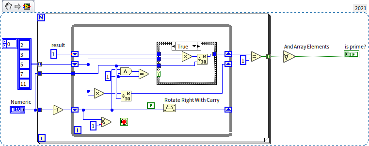

# 简单算法和数据结构

图灵奖获得者，Pascal 编程语言的发明人，Nicklaus Wirth，提出过一个公式：`程序 = 算法 + 数据结构`。数据结构研究的是如何针对特定问题，找到最适合的数据的组织方式；算法研究的是找到解决这个问题的最优化方法和步骤。这句话就算不全面，也基本上揭示了程序的核心本质。程序员找工作面试的时候，最常被问到的问题也是关于算法和数据结构的。

LabVIEW 程序的核心无非也是一些算法和数据结构，只不过，LabVIEW 长期被用来编写测试程序。所需的算法和数据结构就是固定的几种，所以不怎么强调算法与数据结构。不过，影响程序运行效率的最关键因素就是算法和数据结构了，其影响程度远超是使用 LabVIEW 还是使用 C 语言的差别。如果能够理解一些基本的算法和数据结构，就很可能会提高自己程序的效率。常听有人抱怨 LabVIEW 速度慢，实际上多数程序都还是有很大优化空间的。

算法和数据结构作为编程的两大基石，分别都可以开一门整学期的课来学的，我们这一节的篇幅只能讨论一些最初级的算法和数据结构。

## 时间复杂度

这一节和程序的运行效率高度相关，所以先要介绍一下衡量一个算法好坏的指标：算法复杂度。算法复杂度分为时间复杂度和空间复杂度。空间复杂度表示指执行这个算法需要多少内存空间。多数情况下，大家更关心的是时间复杂度，它表示执行一个算法所需工作量的多少，这直接决定了算法运行时间的多少。时间复杂度是一个函数，对于同样的输入参数，时间复杂度越高，表示程序运行时间越长。时间复杂度跟要解决的问题有关：有的问题可以被非常高效的解决，而有的问题根本没有低时间复杂度的解决方法。所以，只有对比同一个问题的不同算法的时间复杂度才有意义。

时间复杂度函数用大写字母 O 表示；同时用一个小写字母，比如 n，表示算法要处理的数据量。

* 如果一个算法，不论输入数据量 n 有多大，都一定会在某个固定的时间内运行完，就表明这个算法的运行时间是常数级别的，记作 $O(1)$
* 如果一个算法的运行时间与输入的数据量呈线性关系，比如，输入数据个数是 n 运行时间是 c*n，c 是一个常数，那么就表明这个算法的时间复杂度是线性的，记作 $O(n)$
* 如果一个算法的运行时间与输入数据量的平方成正比，那么算法的时间复杂度就是 $O(n^2)$;同理，如果运行时间与输入数据量的三次方成正比，那么时间复杂度就是 $O(n^3)$ ……

上面这些被统称为多项式级别的时间复杂度。如果一个算法的时间复杂度是多项式级别的，基本上还可以用来解决实际问题。如果一个算法的时间复杂度超过这个级别，比如是阶乘级别的 $O(n!)$ 或者是指数级别的 $O(2^n)$，那么就基本上无法用来解决实际问题了。即便都是多项式级别的，我们也希望为需要解决的问题找到一个复杂度最低的算法。

下面我们先来研究一下：如果有一个数 n，我们知道它一定是两个素数（质数）的乘积，但不知道是哪两个素数，那么对 n 进行质因数分解的时间复杂度是多少？

用一些具体的数字来演示可能会更清楚： 假如有两个素数是 17 和 19，相乘可以得到 $17 * 19 = 323$。对于计算机来说，把两个值较大的数相乘和把两个值较小的数相乘所需时间几乎没有差别，可以被看作是一个常数，所以乘法运算的复杂度是常数级别的 $O(1)$。但是反过来，把 323 质因数分解，可就没那么容易了。他只能从最小的素数开始一个一个试。比如先试试 323 能不能被 2 整除，如果不行再试 3，一直试到 17，才可以找到结果。最差的情况是，n 是两个相同的素数的乘积，那么就要查找 $\sqrt{n}$ 次，假设乘法除法的运算量是一个级别的，那么因数分解 n 的时间复杂度就是 $O(\sqrt{n})$。分解两个素数乘积的程序如下：

这个程序还可以进一步优化一下，比如如果因数明显的不是素数（比如偶数等）就不用试了，等等。优化后的程序运行速度可以快一些，但它的复杂度依然比两个素数相乘的复杂度高得多。其实，$O(\sqrt{n})$ 在常见算法里算是非常低的时间复杂度了，但即便如此，它也无法处理太大的输入了。假如，两个素数都大于 $10^10$，那么，基本上就已经无法用普通计算机对他们的乘积做质因数分解了。一个运算和它的反运算的时间复杂度相差巨大，在计算机领域是有实际用途的。比如，被广泛实用的 RSA 加密算法就利用了把素数相乘远远快于把合数分解成质因数这一特性。简化的来说，过程是这样的：用户 A 和 B 需要通过互联网通信，所以它们之间传递的数据相当于是公开的，所有内容都会被监听者 C 截获。A 希望 B 发送给字节一些隐私消息，不能让 C 看懂。于是，A 先找到两个大的素数，然后把两个素数相乘的乘积作为密钥交给 B，B 使用这个密钥把消息加密后再传递给 A。如果要解密，必须使用原来的两个素数才行。A 当然知道原来的两个素数是什么，但 C 并不知道，如果 C 想要解密，必须对密钥进行质因数分解，而质因数分解是个相对较慢的过程，只要 A 找到的两个素数够大，C 就不可能在有效时间内算出两个素数，从而达到了加密的效果。

但是，这里还有个问题，A 去哪找两个这么大的素数？换句话说，A 拿到了一个很大的数，怎么确定它是素数？试试把它因数分解？那样一来，A 所需要的时间不就和 C 差不多了吗，肯定不行。幸运的是，还是有一些时间复杂度极低的判断一个数是否是素数的算法。比如，我们可以利用一些素数的性质来判断一个数是不是素数：假设 a 是一个比较小的素数（比如 2、3、5 等），p 是需要判断的一个比较大的数，如果 p 是一个素数，那么 $a^{p-1}-1$ 就可以被 p 整除。利用这个方法，我们可以编写如下的判断一个数是否是素数的程序：

利用这个算法在一段连续的整数中挨个测试，很快就可以找到一些素数。比如，我们利用上面的程序，从 1,000,000,000 开始查找，很快就找到了一个素数： 1,000,000,007。

## 数组

### 基本操作的效率

本书在[数组和循环](data_array#数组)一节已经介绍了 LabVIEW 中数组的基本操作。这一节主要讨论数组的各种操作的效率。这些操作的效率，很大程度上是由数组数据在内存中的存储方式决定的。数组用一组连续的内存空间，来存储一组具有相同类型的数据。下图演示了以个在内存中的整数数组：

数组中每个元素按顺序依次放置在一块内存上。这样有规律放置的一组数据非常有利于通过索引来查找或修改数组中的某个元素。因为数组每个元素所占内存都是相同的，所以，只要知道元素的索引就可以立刻得到： `元素在内存中的地址 = 数组的起始内存地址 + 索引 * 单个元素占用的内存`。也就是说查找数组元素的时间复杂度是 $O(1)$。但数组的这种数据组织方式也有缺陷，比如说，在数组中插入或删除一个元素就相对较慢。因为数组的每个元素都是按顺序放置在内存中的，如果在中间插入或删除一个元素，那么这个元素之后的所有元素都要向后或向前依次移动一个位置。最差的情况是在数组头插入一个元素，那么数组中每个元素都要后移一位，看上去是插入一个元素，其实改动了所有的元素。数组插入删除元素的时间复杂度是 $O(n)$。

假设我们需要在程序中构造一个长度为 100,000 数组，数组中总共有 0 ~ 99,000 总共 100,000 个整数元素，它们是倒序，从大至小排列的。因为正好是倒序排列的一组整数，所以，可以使用循环的索引作为数据，既然是倒序，那就每次迭代，把索引数据都放到数组最前面，这样就生成所需的数组了。程序是下图中最上面那个顺序结构中的程序：

我们已经了解了数组的每种操作的效率了，所以读者可能已经想到了，这种把数据插在数组头的操作是非常慢的。没插入一个数据的时间复杂度都是 $O(n)$，如果插入 n 个数据，总复杂度就达到 $O(n^2)$ 了。所以我们要在程序中避免数组的插入，LabVIEW 中构造数组最自然最高效的方法是使用[循环结构中带所有的输出隧道](data_array#输出隧道)。上图中，下面两个顺序结构都是比较好的构造数组的方法。在笔者的电脑上运行这个程序，time, time 2, time 3 的输出值分别为 750, 0 和 2。可见其效率差距之大。

这里请读者思考一个问题：把数据插入数组头的确非常慢，那么插入数组尾部是不是就没有效率问题了呢？新插入的元素是数组中的最后一个，那就不需要移动任何其它元素了。是这样吗？

### 多维数组

之前提到过，LabVIEW 不支持数组的数组。这是因为数组的每个元素必须占用相同的内存空间。这样才能根据一个元素的索引快速计算到它所在的内存空间。而数组的元素个数是不定的。

### 排序

### 二分查找

## 链表

## 队列

## 栈

## 数

## 映射表

## 集合

