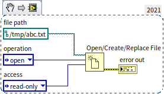
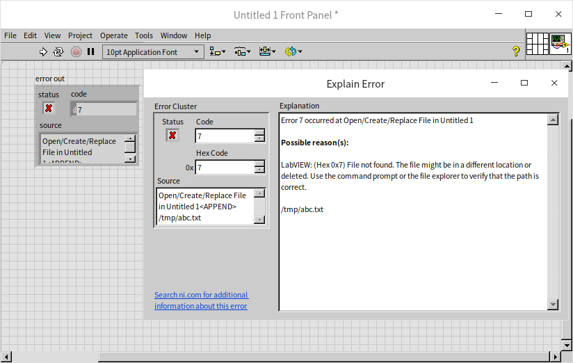

# 错误处理机制

我们编写的程序当然是越稳定，越安全越好。在后面的章节，我们会详细讨论如何避免程序中有可能发生的错误。在编写程序过程中就难免有考虑不周之处，遗留下某些潜在问题。在某个特殊条件下，这些潜在问题就可能导致程序出错。所以，我们在设计程序时，除了尽量考虑周全，力争减少甚至于避免各类错误外，还必须在程序中采取一定的预防措施。即使程序出现错误，也可以尽量降低错误带来的损害。这种预防措施就是错误处理机制。

在 [布尔类型条件选择结构](structure_cond_seq)  一节中，我们曾经简要地介绍过：“在 LabVIEW 中最为常见的布尔型条件结构是用来处理错误数据线的、这是一种使用最为普遍的错误处理机制。”它普遍到了，LabVIEW 中大多数的子 VI 都带有这种错误处理机制，因此，我们有必要尽早详细介绍一下这方面的内容。

此处所谓的错误是指程序运行时出现的错误。采用错误处理机制的目标有两个：第一是可以尽早的报告错误，最好还能够报告出错误发生的位置和发生的条件，以帮助程序员调试和修正错误；第二是降低错误带来的次级伤害，不要因为程序的错误而导致用户得到错误的结构。作为反例，这里列举一种非常糟糕的错误处理机制。比如，我们编写了一个硬件测试程序，在程序运行的过程中，数据采集设备的初始化出现了异常，但是程序选择忽略这个错误，继续运行。结果是用户在程序界面上看到每个产品的检测结果都是合格，实际上，这只是因为数据采集硬件无法读取到劣质产品发出的异常信号。

## 错误簇

LabVIEW 中很多函数和 VI 都会有一对错误输入/输出参数，参数的类型是“错误簇”。错误簇由一个布尔类型数据（值为真时表示有错误）、一个数值型数据（错误代码）和一个字符串数据（错误信息）组成的：

当一个带有错误输入/输出的函数或 VI 在执行中出现错误时，错误输出参数就会返回一个错误簇数据。比如，下图中的程序：

程序让“打开文件”函数打开一个不存在的文件，它返回的错误簇的值会变成“出错”。关于文件操作，本书会在[文件读写](pattern_file)一节详细介绍。在 VI 的“帮助”菜单中，或在错误簇控件的右键菜单中选择“解释错误”，会弹出一个错误解释对话框，列出了出错的位置，以及出错的原因，比如针对上面的程序，它告诉我们“文件没有找到。文件可能是在其它的路径下……”：

程序中的错误，有些是可以预期的，有些是不可预期的。这两种错误处理的方式是有所不同的。

## 不可预期的错误

不可预期的错误是指编程者不能确定某个函数或 VI 是否会在某些特殊情况下返回错误，更无法预料错误的代码。不可预期的错误也可以被称为“异常”，这是程序中错误处理机制主要需要预防的错误。如果发生了不可预期的错误，说明程序进入了非预期的状态，程序再运行下去，意义也不大了；更重要的是，程序继续运行下去很可能会导致更严重的后果，如程序死锁或崩溃，或者让使用者误以为程序的返回的结果是正常的。

对待这类问题的简单处理方法就是，一旦有错误出现，程序的后续代码全部忽略，让程序尽快停止运行，并提示用户发生了异常错误。因此，可以按照在[布尔类型条件选择结构](structure_cond_seq)一节中介绍过的方法，在需要预防出错的地方加一个条件结构，函数的错误输出连接在条件结构的分支选择器上，程序后续的代码全部放在条件结构的“无错误”分支中。这样，一旦函数出现错误，后续程序都不执行。比如下图中的程序，一旦打开文件出错，后面就无需在读取文件了：

这样的错误处理机制必须在每个函数后面都加一个条件结构，显然不适用于大型程序。在实际程序运行时，并非是一但错误出现，就必须立即退出程序的。有些简单的程序代码，任何情况下都不会给程序带来严重后果，也不会显著延误程序的退出时间。即便程序出错，也可以继续执行这些简单后再退出。

因此，在实际编程中，通常并不需要为每个函数的错误返回值都加一个错误处理条件结构，而是把判断对错的代码都放在较为底层的子 VI 中。由于上层程序没有判断程序出错的条件结构，所以，每个子 VI 在程序一开始，就首先判断一下，“错误输入”参数是否为“有错误”。如果是，说明程序已经发生异常，程序应该跳过所有完成正常工作的代码，并把这个错误值继续传递下去。后续的子 VI 也同样跳过所有的工作代码，直到程序退出为止。如下两图所示：

采用这种错误处理机制的子 VI 是一种极其常见的形式，LabVIEW 自带有此类 VI 的模板。需要创建这一类子 VI 时，可以在菜单中选择“文件 -\> 新建”，然后在新建对话框中选取相应的“带错误处理的子 VI”模板即可：

说实话，这个模板中的内容有点太简单了，使用模板比自己创建一个条件结构省不了多少事。

如果某个 VI 中所有的函数和子 VI 都已带有错误输入输出参数，那么这个 VI 可以不使用条件结构判断错误输入参数，而是把这个错误输入传递到更底层的函数和子 VI 中去处理。比如下图中的 VI：

它有时也会作为其它 VI 的子 VI，但是它所使用的函数都已具备了错误处理机制，所以它本身不必再写一套错误处理条件结构，只需把错误信息传递给子函数，由更底层的子函数去处理即可。LabVIEW 自带的函数、VI，凡是带有错误输出端的，都已带有错误处理机制。

程序中有些代码，是在无论是否出错的情况下都必须执行的。比如，程序打开了某些资源（文件、引用等），在程序退出前，不论是否有异常出现，都一定要把这些资源关闭。被打开的资源若不关闭，会一直驻留在内存中。但程序关闭后再无法访问这些资源，很可能就会造成内存泄漏。在上图程序中，首先打开了一个文件，然后读文件，读文件的过程中也许会有错误产生，比如读取的文件长度超出设定值等。但是，即便有这类错误产生，关闭函数也应当被执行。不论过程中是否有错，打开的文件都应当在程序结束前被关闭。

不过用户并不需要在这里对“关闭文件”做特殊的处理。“关闭文件”函数本身已经做了相应的处理了，无论它的错误输入参数得到什么值，它都会保证关闭输入的文件（“引用句柄”参数）。但是，在自己编写错误处理机制时，就必须考虑到哪些代码在出错时依旧需要运行。

## 可预期的错误

可预期的错误，即编程者已经知道在某种情况下函数会返回某个错误，并需要针对此错误进行预定的处理。

以下图中的程序为例：

运行这个程序，在执行到函数“打开/创建/替换文件”函数时，程序会弹出一个对话框，要求用户选择需要打开的文件。此时，用户也可能会不选择任何文件而是直接按下“Cancel”（“取消”）按钮。用户的这个操作将导致“打开/创建/替换文件”VI 返回一个代码为 43 的错误。

笔者个人觉得，打开文件函数这个行为并不合理。不过，我们可以在自己编写的程序中纠正这一不合理行为。既然按下“Cancel”按钮是允许用户使用的操作，编程人员就应当意识到这个代码为 43 的错误很可能会发生，但应该避免这个错误导致程序的非正常退出。所以，编程时需要对这个错误进行特殊处理。

上图的分支是针对用户点击“Cancel”按钮时可以采用的一种处理方式：不做读和关闭文件操作，但是判断一下，错误代码是否是 43，如果是，则忽略这个错误，不返回错误代码，以免影响后续程序（假设这是一个子 VI）。这种处理方式的“无错误”分支与中的代码与之前提到的普通错误处理方式相同：

LabVIEW 中已经自带了一些处理错误数据的函数和子 VI，比如“Clear Errors.vi”可用于清除某个或全部的错误。所以上面的处理程序可以简化为下图中的程序：

LabVIEW 中与错误处理相关的函数和 VI 在函数选板“编程 -> 对话框和用户界面”上。

## 自定义错误

前面介绍了如何处理从 LabVIEW 已有的函数或 VI 中得到错误信息。我们还可以给程序定义自己的错误。

让自己的 VI 传出一个错误，这非常简单，只需自己定义一个错误输出的簇就可以了。更加可靠的做法是借助“编程 -> 对话框与用户界面 -> 错误代码至错误转换”VI，提供给这个 VI 错误代码和错误信息，它就可以输出一个对应的错误簇：

错误代码可以选择 LabVIEW 中已定义的错误。比如，LabVIEW 的错误代码 50 表示“信息超出范围”，它与输入值越界性质类似。也可以使用 5000 ～ 9999 和 -8999 ～ -8000 之间的某个数值，这两段数值是专门留给用户自定义错误代码的。

如果想要查看一个 LabVIEW 中某个错误代码是什么含义可以搜索 LabVIEW 帮助文档，或选择菜单项“帮助 -> 解释错误”，在解释错误对话框中输入一个错误代码，它就会给出相应的错误信息。

## 显示错误信息

默认情况下，如果程序中某个函数或子 VI 的错误输出没有与其它函数、子 VI 或错误显示控件相连，而又确实有错误需要返回时，程序会自动弹出一个对话框，把错误信息显示给用户。比如下图中的程序，“关闭文件”函数的错误输出没有与任何其它接线端相连：

如果程序执行完“关闭文件”函数时错误输出参数有错误，程序就会自动弹出错误对话框了，是类似下图的这种对话框：

这就是 LabVIEW 的自动错误处理机制。但是，这个机制有时候也挺招人烦的。比如，有些错误本来是可以被忽略，不必理睬的。但是如果有对话框弹出，用户就不得不手动去关闭这个对话框。尤其是当程序发布给用户后，我们可能不希望最终用户运行程序运行过程中，时不时弹出个错误信息对话框来。

其实这个自动错误处理功能是可以在 VI 属性对话框中被禁止的：

在某些场合不希望弹出错误信息对话框，而另一些场合则正好相反：无论 VI 属性是如何设置的，都需要把错误显示出来。一般来说，程序运行过程中不应有错误对话框出现，但在程序退出前，可以提示用户所出现的错误。

LabVIEW 中有两个专门的子 VI 可以完成这个工作：“简易错误处理器”（Simple Error Handler.vi）和“通用错误处理器”（General Error Handler.vi）。如果输入的错误簇显示有错误，简易错误处理器可以有几种简单的错误处理方式供用户选择，比如弹出一个单按钮对话框，或者弹出带有停止程序按钮的对话框等。多数情况，简易错误处理器就已经够用了，如果还需要更复杂的操作，比如屏蔽某些错误，为用户自定义错误添加一些额外的信息等可以使用通用错误处理器。

下图中的程序，在最后调用了简易错误处理器，它可以弹出错误提示框，把错误信息显示出来。

## 调试时显示错误信息

上图中的程序之所以在程序的最后才调用“简易错误处理器”VI，是为了防止程序运行过程中不断弹出的错误信息对话框干扰用户的操作。

但在程序调试过程中，编程者可能会希望在程序运行过程中就弹出某些错误信息，这样有利于帮助编程者定位和排除程序中的错误。在所有需要监视错误信息的地方都连接一个“简易错误处理器”，就能达到这一目标。然而，这样虽然方便了调试，但是程序在用户那里运行时也可能会出现不停蹦出错误信息的情况。

借助条件禁用结构可以两全其美地解决这一问题。本书将在 [禁用结构](debug_disable) 一节详细介绍相关的用法，这里先做一简要说明：

在程序的项目中自己设置一个专用的条件禁用符号，用于判别程序是在调试阶段还是在发布阶段。比如，用“DEBUG”作为条件禁用符号，把它添加到项目设置中（参考），当它的值为“True”时，程序可以随时弹出错误对话框。

再新建一个 VI，用于包装“简易错误处理器”，这个 VI 在“DEBUG==True”时，允许弹出错误信息对话框，否则禁止：

程序发布给用户时，通常会把项目文件 (.lvproj) 移走，这样就不会把恼人的错误信息显示给用户了。如果项目文件也需一同提供给用户，那么可以在程序发布给用户之前修改一下“DEBUG”的值，把它改为“False”则可禁止错误信息框的弹出。

## 错误合并

如果程序中有些代码要求并行运行，就不可以使用错误数据线把它们串联在一起了。但是，在这几段并行代码分别运行结束后，它们中间的任何一个或几个出了错，都应当把错误传递给后续程序。此种情况下可以使用函数“编程 -\> 对话框与用户界面 -\> 合并错误”（Merge Error），把多个错误合并起来再传递给后续的代码：

如果输入“合并错误”函数的多个输入数据中，其中只有一个数据是“有错误”，其它都是“无错误”，那么“合并错误”的输出就是这个“有错误”的错误数据；如果所有输入的数据都是“无错误”，那么输出也是“无错误”；如果输入的错误数据中，有多个数据的都是“有错误”，“合并错误”输出的是第一个“有错误”（最上面一个有错误的接线端）合并错误 VI 最靠上方的接线端）的数据。

多数情况下，程序不需要记录多个错误信息，所以“合并错误”只保留第一个错误信息。如果一定需要记录所有的程序运行中的错误信息，那就要自己编程来实现了。比如，可以使用一个数组来记录错误信息，一旦有错误出现，就把它的信息插入这个数组中。

对于那些位于循环结构中的函数或者子 VI 来说，处理它们的错误数据要视情况分别对待。但无论是哪一种情况，都不能仅仅使用简单的隧道传递错误数据。

第一种情况，一个单循环的某一次迭代出了错，之后的迭代就都不需要继续进行了。这种情况可以使用移位寄存器来传递错误数据：

在上图的程序中，“初始化测试.vi”完成的是一些打开被测设备之类的初始化工作，然后告诉循环结构需要调用多少个测试项目。“运行测试.vi”根据当前所处的是第几次迭代来决定调用哪一个测试，它内部采用了上文介绍的 LabVIEW 中最常用的异常错误处理机制。如果在某一次迭代时，程序出现异常，“运行测试.vi”的错误输出端将传出一个错误。这个错误又会通过移位寄存器传递给后续的每一次迭代，这样 “运行测试.vi”实际上将不再调用任何测试。最后，把这个错误数据传递给“关闭测试.vi”。

另外一种情况，若某个测试出现异常，并不希望它耽误后续的测试。此时，每次迭代中调用“运行测试.vi”时，就不能把上一次的错误信息传递给它。在这种情况下，就不能使用移位寄存器，以免把“初始化测试.vi”的错误信息传入循环结构。这里可以使用隧道，把错误值输出循环框。为了能够把每一次迭代产生的错误信息合并起来，以免丢失任何一次迭代的错误，可以使用索引输出隧道，把每次迭代的错误输出组成一个数组传递出循环，再使用“合并错误”把错误信息合并起来：

这个程序还需要考虑，在循环次数为 0 时，也不能丢弃错误信息。所以“初始化测试.vi”产生的错误信息也要连接到“合并错误”函数。

## 练习

* 考虑一下如何处理一下的情况。我们编写了一个用户界面程序，用户会在界面上设置一台信号发生器发出的信号的频率，假设这台信号发生器只支持生成两个频段的信号，分别是 5Hz~50Hz，以及 100Hz~1000Hz。如果发送给仪器的频率超出了这个范围，信号发生器的驱动程序子 VI 会返回错误，我们应当如何处理这个错误才能最大程度为我们的用户提供便利：让用户了解发生了什么，以及如何解决错误。