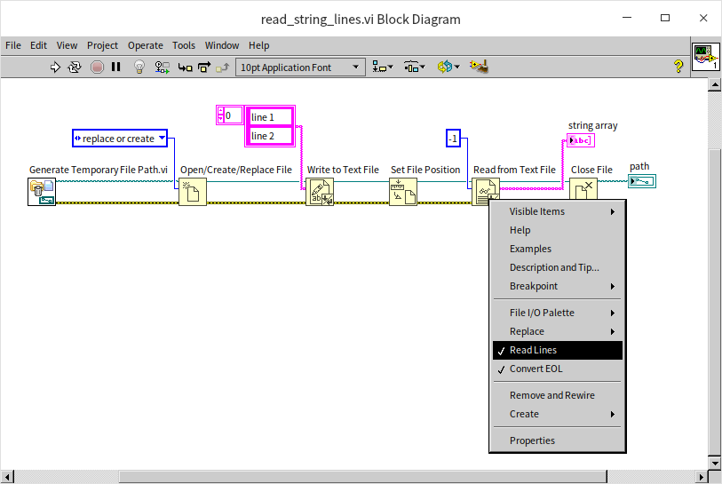
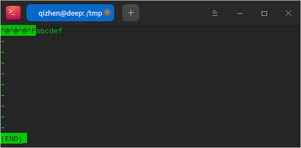
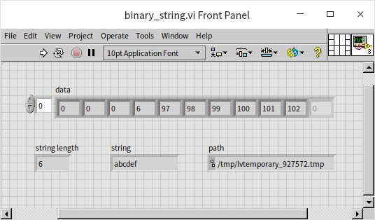
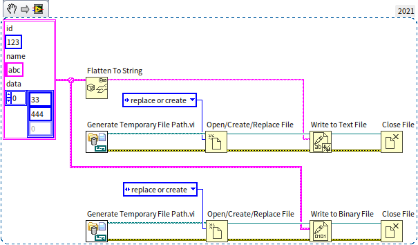
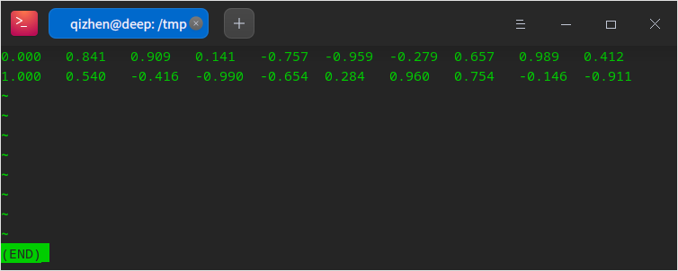
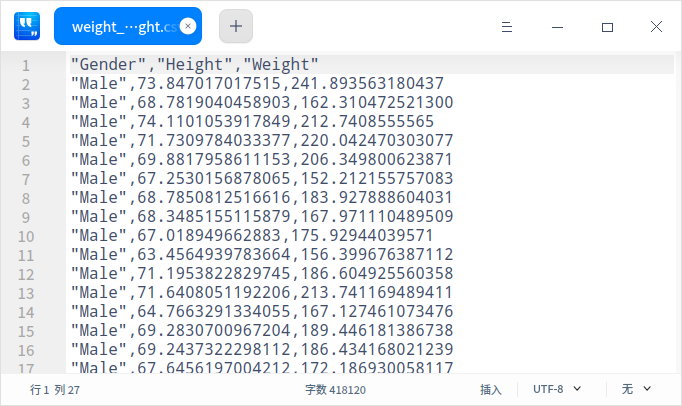
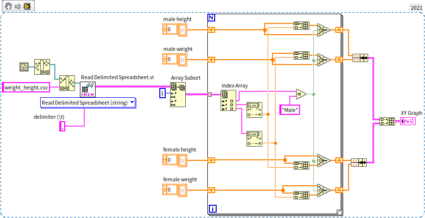

# 文件读写

## 二进制文件和文本文件

LabVIEW 文件读写相关的函数和 VI 主要在“编程 -\> 文件 I/O”函数选板上：

在这个函数选板上可以看到读写多种不同类型的文件的函数。这些不同类型的划分主要是按照数据在文件中的组织格式来区分的。如果我们先不考虑数据的组织格式，只考虑文件中的数据的内容，可以把文件分为两大基础类别：二进制文件和文本文件。二进制文件中，每个字节的数据用 U8 整数表示的话，可以是 0~255 之间的任何一个数，当然在文件中，这个字节并不一定是用来表示整数的，它可能是用来表示其它数据类型的。文本文件中的每个字节则不会是任何数值，它们只会是某些人眼可读的字符所对应的二进制数值。比如，文件中会有大小写字母、数字、标点、空格、换行符等。如果用文本编辑器打开，文本文件是可以被直接阅读的，而二进制文件里通常只能看到一堆乱码。

严谨的说，文本文件也是一种广义上的二进制文件，它在存储上也是一串二进制数。但我们这里比较的是狭义上的二进制文件（非文本）与文本文件的区别。

二进制文件直接把数据的原始格式写入硬盘，优点是数据占用空间小。但是二进制文件中可能包含各种长度的不同类型的数据，如果不知道一个二进制文件的格式，是无法知道里面存储的都是哪些数据的。二进制文件只能使用约定好的的程序或函数来读写；文本文件里面的数据都是人眼可以识别的字符串，优点是可以直接使用文本编辑器打开这类文件进行查看和编辑。

比如说，一个小数“38749.928398387799”，按照二进制格式保存一般需要占用 8 个字节（双精度浮点数），如果不要求那么精确 4 个字节（单精度浮点数）也行；而使用文本格式保存则至少需要 18 个字节，也就是这个字符串的长度，考虑到文本文件通常还要加入数据间的分隔符，以及很多辅助信息，存储同样的数据，文本文件占用的空间可能比二进制文件大几倍。

二进制文件不仅空间效率高，时间效率也高。本身文件小，读写时间就短。尤其是很多程序中，数据在内存中本来就是以二进制格式保存的，它们可以被直接写入二进制文件。如果保存成文本文件，还需要先把它们转换成字符串才能保存，非常影响速度。

综上所述，如果需要高速度，就使用二进制文件；如果需要操作方便就是用文本文件。如果追求极致的存储效率，不介意运行速度，还可以使用文件压缩函数，对存储的文件进行压缩。有些文件类型，采用了折中方案，单个文件内既包含二进制部分，也包含文本部分，比如采集到的数据使用二进制存储，而可能被直接查看的内容，如通道名、用户名等则使用文本格式存储。

我们先来看一下 LabVIEW 中最基本的文件读写如何使用。

### 二进制文件读写

二进制文件可以用于存储任何类型的数据，比如数组、簇等。但是我们在写入数据的时候，一定要记得数据类型都有哪些，是按照什么顺序写入的，在读取数据是必须按照同样的数据类型、同样的顺序把每一个写入的数据读出。如果我们拿到的是别人保存的一段二进制文件，不知道其中数据的格式，那么我们将无法从中读出正确的数据。

下图是一段典型的写二进制文件的程序，它在一个循环中保存了 10 个整数。

程序首先调用“打开文件”函数，打开指定路径的文件。如果不给这个函数指定文件路径，程序运行时，它会弹出一个选择文件对话框，要求用户选择一个文件。这个对话框可供设置的选项非常有限，后文会介绍一个功能更强大的选择文件对话框。其实，“写入二进制文件”和“读取二进制文件”如果没有指定文件路径或句柄，也可以弹出选择文件对话框，但一般不会在程序里这样用。

“打开文件”可以设置新建、替换等操作。一般来说，如果需要读取或者修改目标文件，也就说目标文件必须存在，则应该选择“打开”操作，这样，“打开文件”若找不到目标文件会报错；如果需要写一个新文件，则应该选择“新建”操作，这样，“打开文件”若发现目标文件已存在则报错；如果确定目标文件存在，但是要完全替换目标文件中的内容，则应该选择“替换”操作。示例程序使用了“替换或新建”操作，表示如果文件不存在则新建一个，若已存在则替换其内容。

“打开文件”还可以设置文件的访问权限：只读、只写、读写。对于不需要进行修改的文件，可以把打开权限设置为只读，以确保后续程序不会无意间修改文件内容。

“打开文件”函数会输出一个文件句柄，这个句柄就代表了目标文件，后续程序需要用它来指定对哪个文件进行读、写或关闭。

程序中的“写入二进制文件”函数会把输入“数据”参数的数据都存入文件。“数据”参数默认是变体类型，但它可以接收几乎所有的数据类型，任何数据都可以被以二进制形式存入文件。程序中按次序从 0 至 9 写入了 10 个整数。“写入二进制文件”另一个参数是“字节顺序”，可以指定按照什么顺序保存一个数据的每个字节。比如一个 I32 整数有 4 个字节，那么这 4 个字节按什么顺序摆放呢？是高位在前还是低位在前？目前，主流 CPU 在处理数据的时候，都是按照“小端”顺序处理数据的，也就是高位数据保存在内存的高地址中；但是网络传输协议却大多是采用的“大端”，也就是高位数据保存在内存的低地址中。这两种设置没有明显的优劣之分，只要保证读写时采用一致的设置即可。

存入数据后，一定要记得关闭文件。出于效率考虑，文件写入函数通常不会把数据直接写入硬盘，而是会先把数据放在缓存中，只有关闭文件才能确保所有缓存中的数据被写入硬盘。

我们可以试着用文本编辑器（比如 notepad）查看一下写入文件的数据是什么样的。笔者直接在命令行终端打显示了刚刚生成的 test.data 文件的内容，但是只能看到一些乱码：

要还原文件中的数据，只能再编写一段程序，把数据读出来。读取二进制文件的过程与写入十分类似：

在这个程序里我们使用了一个“文件对话框” [Express VI](measurement_express_vi) 来选取目标文件。Express VI 与普通 VI 不太一样，它除了输入输出参数，通常还有一些配置参数。把“文件对话框”拖到程序框图上的时候，或者在程序框图上双击这个 Express VI，就会弹出它的配置对话框：

在“配置文件对话框”上，我们选择了只需要单个文件，并且必须是一个已存在的文件。除了这几个基础的配置信息，我们还需要通过输入参数的方式，告诉这个 VI 我们需要选择的文件后缀名是 ".data"，初始路径在 "/tmp"，并且选择文件的对话矿上还需要有一句提示：“Select the data file”。配置好这些参数，运行程序，它就会弹出选择文件对话框：

在这里选则目标文件，点击确定按钮，所选择的文件的路径会从“文件对话框” VI 的“所选路径”参数输出。如果用户在选择文件对话框中点击了“取消”按钮，程序应该避免运行后续的读文件程序，以免程序出错。因此，示例程序检查了“文件对话框” VI 的“取消”输出，如果其值为真，则什么都不做。

“读取二进制文件”函数必须设置读取数据的类型。二进制文件本身没有数据的类型信息，这里指定的数据类型必须与写文件时写入的数据类型一致。读数据时，我们可以像写数据程序一样用一个循环来读取数据。不过“读取二进制文件”中直接就可以设置读取数据的数量。如果我们设置数量为 10，“读取二进制文件”函数就会一次读取 10 个数据出来。如果把这个参数设置为 -1，函数会一次读出后续所有的数据。

虽然在演示程序中，只保存了 10 个同样为整数类型的数据，但实际上，我们也可以把不同类型的数据都存放在同一个文件中的。比如先写入两个整数，再写入三个布尔型数据，最后放入一个簇类型数据。只要读取文件时保证数据类型和顺序与写入时一模一样就可以读出正确的数据。

:::info

这里请读者思考一个问题。上文写二进制文件的示例中，连续写入了 10 个整数。如果程序换一种做法：一次写入一个长度为 10 的整数数组。假设对应的整数数值都是相同的，这两种方法写入二进制文件的数据是不是相同的呢？

:::

### 文本文件读写

与操作二进制文件极其类似，LabVIEW 还提供了“写入文本文件”和“读取文本文件”函数。在使用“写入文本文件”函数把字符串写入文件时，它会把字符串的内容写入文件。比如下面的程序：

示例程序首先调用“生成临时文件路径” VI 生成了一个临时文件的路径。需要注意的是，它只是生成了一个路径，这个路径对应的文件还不存在。在做测试的时候，我们经常需要把数据参数保存在一个临时文件中，一段时间之后，就可以将其丢弃了。这种情况使用“生成临时文件路径” VI 就特别方便，因为它不用自己费脑筋去给临时文件起名。并且，它生成的临时文件是在系统的临时文件夹中的，操作系统会定时清理临时文件夹中的文件，我们也不用担心生成的临时文件会占用太多系统空间。

查看生成的文件，里面只有可读的文本文字：

上面示例程序的后半部分又把数据从文件中读取出来了。因为这里没有关闭文件后再打开的过程，在读文件之前需要调用“设置文件位置”函数，把文件当前位置设置到文件的起始位置。程序每读或写一个数据，文件的当前位置都会向后移动一个数据的长度，如果在写完数据之后，需要把数据再读回来，则需要把文件当前位置重置到文件开头。对于一个大文件，如果我们只需要读取其中的某一部分内容，也可以使用“设置文件位置”函数把当前位置移动到所需要的地方，再读取数据。

文本通常会被分成一行一行的，所以“写入文本文件”除了支持字符串数据类型的输入，还支持字符串数组作为输入，数组中的每个元素会被作为一行写入文件。“读取文本文件”函数也可把读取的文本按照字符串数组方式输出。在“读取文本文件函数”的右键菜单上选中“读取行”，这时候，这个函数就会按照行来读取文件，默认每次读一行。再把读取数量设置为 -1,函数就会读出文件中所有的行：

如果已经按照字符串格式读出了数据，也可以调用 LabVIEW 中的字符串处理函数（Delimited String to 1D String Array.vi）把它按照行转换为字符串数组。下图中的程序与上图中的程序是等效的：

读者可能已经注意到了，“写入文本文件”和“读取文本文件”函数的右键菜单都有一项叫做“Convert EOL”（转换换行符），这个设置只在 Windows 系统上有效。在 Windows 操作系统的文本文件中，每行结尾默认是两个字符“回车+换行(CR+LF)”，即 "\r\n"；Unix 和 Linux 系统的文本里，每行结尾默认是“换行 LF（\n）”；苹果电脑系统的文本里，每行结尾默认是“回车 CR 即'\r'”。目前，网上下载的文本文件，尤其是各种文本编程语言的源代码，多是采用 Linux 系统的换行方式。如果设置了“转换换行符”，“写入文本文件”和“读取文本文件”函数在 Windows 系统下会自动把源文档中每行之间的分隔符都替换成 "\r\n"。

### 相通的两种格式

既然文本文件只是一种特殊的二进制文件，那么是不是直接使用二进制文件函数也可以操作文本文件？只要把字符串数据传递给“写入二进制文件”就可以生成文本文件了？我们用下面的程序验证一下：

程序调用“写入二进制文件”把字符串 "abcdef" 写入了临时文件中。如果使用文本编辑器打开这个生成的文件，会发现 "abcdef" 确实被写入了文件，但是在这几个字符之前还有一些乱码：

为了更清楚的查看这几个乱码是什么，上图中的示例程序在保存了字符串之后，又按照 U8 整数的格式把整个文件中所有的数据读了出来。使用 U8 类型是因为它占用的空间恰好是一个字节，这样我们可以把文件中所有的字节按照顺序读取，并显示出每个字节的数据。程序运行结果如下：

原来，“写入二进制文件”在写入字符串数据时，不但把字符串的内容写入了文件，还在字符串内容之前写入了一个 U32 类型整数，表示字符串的长度。也只有这样，“读取二进制文件”函数在读取字符串数据时才知道应该读取多少个字节。文本文件应当只包含字符串的内容，所以，我们可以先把字符串转换成 U8 数组，在把数组的每个元素写入文件，这样生成的文件就是一个文本文件了：

采用同样的原理，我们也可以调用“写入文本文件”函数来生成一个二进制文件。在[“字符串”](data_string)一节中，我们介绍了“平化”的概念，当数据被写入二进制文件时，就是一个平化的过程。所以，如果我们先把某个数据平化成字符串，再调用“写入文本文件”函数写入文件，其结果与直接调用“写入二进制文件”函数把数据写入文件是完全相同的，比如下图中的两种写书数据方式是完全等效的：

## LabVIEW 中常用的文件格式

使用最基本的二进制和文本文件，用户可以任意组织其中的数据的结构。这样固然灵活，但是不利于交流，其他人未必了解你的文件格式，想要正确读写你的文件可能不那么便利。好在人们已经定义了数不清的各种文件格式，每种文件格式都定义好了其内部数据的组织方式。很多文件的格式规范都是公开的，如果按照已某个规范创建出一个文件，就不必担心其它人无法正确理解这个文件了。

在“文件 I/O”函数选板上就可以直观的看到 LabVIEW 支持的一些文件类型，比如电子表格格式文件、测量文件、配置文件、TDM/TDMS 文件、XML 文件、波形文件等。操作这些类型的文件与操作最基本的二进制和文本文件是类似的，它们都会有打开、读、写、关闭几个基本操作。有些类型文件只保留了读和写函数，把打开、关闭的操作合并到读、写函数里了。所以，最关键的问题可能还是应该如何选择适合项目类型的文件。

### 电子表格文件

电子表格文件是一种文本格式的文件，专用于二维数组数据的读写。二维数组数据（表格）是一种非常常见的数据格式，比如，一个班级的考试成绩就可以被做成一个表格，表格中每个单元是一个成绩数据；每行代表一名学生；每列代表一门功课。电子表格文件根据分隔符的不同，有两种最常见的格式，一种是用逗号 "," 分隔一行中的每个数据，通常用 ".csv" 作为文件名后缀；一种是用制表符 "\t" 分隔一行中的每个数据，通常用 ".tsv" 作为文件名后缀。用户也可以任意自定义分隔符和文件名后缀名，但是使用已有的规范通用性会更好，容易被其它软件识别。

微软的 Excel 是最常用的一款处理表格数据的软件。Excel 以及其它类似软件，比如 Google Sheets、WPS 办公软件等都可以读写 .csv 或 .tsv 文件。如果需要在这些软件和 LabVIEW 之间共享数据，使用电子表格文件是一个非常好的方案。

电子表格文件的读写都比较简单，下图是一个写电子表格的示例：

不论输入的数组元素是那种类型，最终都是以文本格式存入文件，所以写入时可能需要设置数据写入时的格式，使得文件中的数据更容易阅读。可以参考 [字符串数据](data_string) 一节中关于字符串格式化的设置。

程序写入文件的数据如下：

下图是一个在网上找到的开源数据文件，weight_height.csv

可以很明显的看出，这个文件中的数据有 3 列，分别表示性别、身高和体重。使用下图中的程序可以把文件中的数据读出并显示：

“读取电子表格文件”是一个 [多态 VI](oop_generic)，点击它下面的数据类型选择菜单，可以看到它能够读入的三种数据类型：实数 DBL，整数 I64 和字符串 String。需要读取的文件中既有字符串数据（第一列，性别），也有实数数据（第二三列，身高和体重）。如果选择按照实数数据类型读入，那么输出的结果会是一个二维实数数组，它会忽略源文件中的所有字符串数据。所以我们这里只能按照字符串读出所有的数据，再自己把身高体重转换成实数。

这个 csv 文件是使用逗号做分隔符的，所以在读取的时候必须设置使用 "," 分隔数据，否则这个 VI 会默认用制表符去分隔数据。

很多电子表格文件的第一行都不是数据，而是每列数据的名称。只要在读取文件后，保留所需要的数据即可。

程序运行结果如下图所示：

关于数据的显示部分，可以参考 [图形化显示数据](data_graph) 一节。

###

* LabVIEW 测量文件不是一种文件类型，而是一套 [Express VI](measurement_express_vi)。它可以把测量数据读写到几种不同类型的文件中。如果编写的是一个数据采集，或者测试程序，并且程序的数据采集部分也是使用 Express VI 编写的，那么使用这一套 Express VI 读写文件再合适不过了。
* 配置文件也被称为 INI 文件。它是一种文本格式的文件，专用于保存程序的配置信息。LabVIEW 本身也有一些需要记录下来的配置信息，比如，最近都打开了哪些项目和 VI。打开 LabVIEW.exe 同目录下的 LabVIEW.ini 文件就可以看到这些记录。INI 适合保存键值（key value pair）类型数据,但是它的读写效率不高，不适合存储大量数据。
* TDM 和 TDMS 两种数据格式非常类似。TDM （technical data management） 只能用在 Windows 操作系统下，它可以把硬件采集到的数据以二进制格式保存在后缀名为 .tdx 的文件中，同时在同名的 .tdm 文件中以文本格式记录一些相关信息，比如通道名、用户名等。TDMS （TDM streaming） 则是把所有的二进制和文本数据都合并进了一个 .tdms 文件。当直接记录设备采集的数据时，可以采用 TDMS 文件存储。
* XML，和 JSON 都是文本格式的文件，它们为保存的数据添加了标签，用于为数据添加说明信息。如果需要保存的数据有比较复杂的结构，并且希望可以直接在文本编辑器中查看数据，那么采用 XML 或者 JSON 文件格式。
* 波形文件顾名思义，专用于保存波形类型的数据。波形文件是一种特殊的 LabVIEW “数据记录文件”。数据记录文件可以以二进制数据根式保存任何 LabVIEW 程序中的数据。如果仅仅是想把某个数据记录下来，一遍下次打开程序时继续使用，那么就可以采用数据记录文件。数据记录文件虽然使用方便，但由于它的格式时二进制的，我们无法直接在文本编辑器中直接查看。

## 练习

* 
