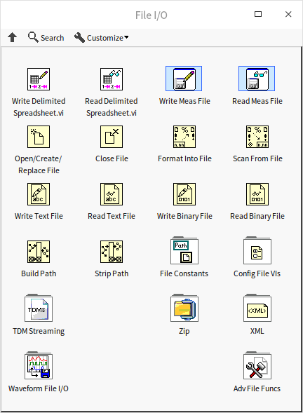
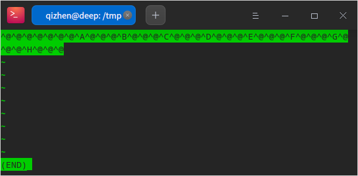
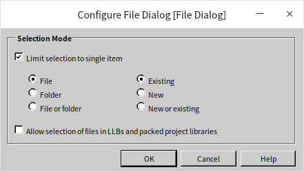
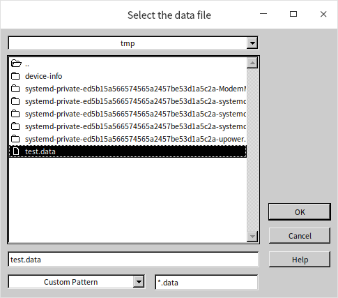

# 文件读写

## 文件

### 二进制文件和文本文件

LabVIEW 文件读写相关的函数和 VI 主要在“编程 -\> 文件 I/O”函数选板上：

从这个选板上就可以直观的看到 LabVIEW 支持的一些文件类型，比如电子表格格式文件、测量文件、配置文件、TDM/TDMS 文件、XML 文件、波形文件等。

所有文件保存在存储介质上都是一串二进制的数据。不同类型的文件，对于文件内的数据的组织排布方式有所不同，使得它们适用于不同的场合。这些不同的文件又可以划分成两个大的类别：二进制文件和文本文件。严谨的说，文本文件也是一种广义上的二进制文件，它在存储上也是一串二进制数。但我们这里比较的是狭义上的二进制文件（非文本）与文本文件。

二进制文件直接把数据的原始格式写入硬盘，优点是数据占用空间小。但是二进制文件中可能包含各种长度的不同类型的数据，如果不知道一个二进制文件的格式，是无法知道里面存储的都是哪些数据的。二进制文件只能使用特定的程序或函数来读写；文本文件是用人眼可以识别的字符来存储数据，里面的数据都是字符串，优点是可以直接使用文本编辑器打开这类文件进行查看和编辑。

比如说，一个小数“38749.928398387799”，按照二进制格式保存一般需要占用 8 个字节，如果不要求那么精确 4 个字节也行；而使用文本格式保存则至少需要 19 个字节，也就是这个字符串的长度，考虑到文本文件通常还要加入数据间的分隔符，以及很多辅助信息，存储同样的数据，文本格式的文件可能比二进制文件大几倍。

二进制文件不仅空间效率高，时间效率也高。本身文件小，读写时间就短。尤其是很多时候，数据在内存中使用二进制格式存在的，可以直接写入二进制文件。如果保存成文本文件，还需要转换成字符串才能保存，非常影响速度。

综上所述，如果需要高速度，就使用二进制文件；如果需要操作方便就是用文本文件。如果追求极致的存储效率，不介意运行速度，可以使用 Zip 函数，对存储的文件进行压缩。有些文件类型，采用了折中方案，既包含二进制部分，也包含文本部分，比如采集到的数据使用二进制存储，而经常需要查看的内容比如通道名、用户名等使用文本存储。

在介绍这些预定义文件格式的读写之前，我们先来看一下 LabVIEW 最基本的文件读写如何使用。

### 二进制文件读写

二进制文件可以用于任何类型的数据，比如数组、簇等。但是我们在写入数据的时候，一定要记得数据是按照什么顺序写入的，在读取数据是必须按照同样的数据类型，同样的顺序把每一个写入的数据读出。如果我们拿到的是别人保存的一段二进制文件，我们不知道其中数据的格式，那么我们将无法从中读出正确的数据。

下图是一段典型的写二进制文件的程序，它在一个循环中保存了 10 个整数。

程序首先调用“打开文件”，打开指定路径的文件。如果不给这个函数指定文件路径，程序运行时，它会弹出一个选择文件对话框，要求用户选择一个文件。这个对话框可供设置的选项非常有限，接下来还会介绍一个功能更强大的选择文件对话框。

“打开文件”可以设置新建、替换等操作。一般来说，如果需要读或者修改目标文件，也就说目标文件必须存在，则应该选择“打开”操作，这样，“打开文件”若找不到目标文件会报错；如果需要写一个新文件，则应该选择“新建”操作，这样，“打开文件”若发现目标文件已存在则报错；如果确定目标文件存在，但是要完全替换目标文件中的内容，则应该选择“替换”操作。程序这里使用了“替换或新建”操作，表示如果文件不存在则新建一个，若已存在则替换其内容。

“打开文件”还可以设置文件的权限：只读、只写、读写。对于不需要进行修改的文件，可以把打开权限设置为只读，以确保后续程序不会无意间修改文件内容。

“打开文件”函数会输出一个文件句柄，这个句柄就代表了目标文件，后续程序需要用它来指定对哪个文件进行读、写或关闭。

程序中的“写入二进制文件”函数会把输入“数据”参数的数据都存入文件。“数据”参数默认是变体类型，但它可以接收几乎所有的数据类型，任何数据都可以被以二进制形式存入文件。程序中按次序从 0 至 9 写入了 10 个整数。“写入二进制文件”还有一个参数是“字节顺序”，用于指定按照什么顺序保存一个数据的每个字节。比如一个 I32 整数有 4 个字节，那么这 4 个字节按什么顺序摆放呢？是高位在前还是低位在前？目前，主流 CPU 在处理数据的时候，都是按照“小端”顺序处理数据的，也就是高位数据保存在内存的高地址中；但是网络传输协议却大多是采用的“大端”，也就是高位数据保存在内存的低地址中。这两种设置没有明显的优劣之分，只要保证读写时采用一致的设置即可。

存入数据后，一定要记得关闭文件。处于效率考虑，文件写入函数通常不会把数据直接写入硬盘，而是会先把数据放在缓存中，只有关闭文件才能确保所有缓存中的数据被写入硬盘。

我们可以试着用文本编辑（比如 notepad）器查看一下写入文件的数据是什么样的。笔者直接在命令行终端打开了刚刚生成的 test.data 文件，但是只能看到一些乱码：

读取二进制文件的过程与写入十分类似：

在这个程序里我们使用了一个“文件对话框” [Express VI](measurement_express_vi) 来选取目标文件。Express VI 与普通 VI 不太一样，它除了输入输出参数，通常还有一些配置参数。把“文件对话框”拖到程序框图上的时候，或者在程序框图上双击这个 Express VI，就会弹出它的配置对话框：

在这个程序中，我们只需要选择单个文件，并且必须是一个已存在的文件。除了这几个基础的配置信息，我们还需要已输入参数的方式，告诉它我们需要选择的文件后缀名是 ".data"，初始路径在 "/tmp"，并且选择文件的对话矿上还需要有一句提示：“Select the data file”。配置好这些参数，运行程序，就会弹出选择文件对话框：

在这里选则目标文件，点击确定按钮，所选择的文件的路径会从“文件对话框” VI 的“所选路径”参数输出。如果用户在选择文件对话框中点击“取消”按钮，程序应该避免运行后续的程序，以免程序出现错误。因此，程序检查了“文件对话框”的“取消”输出，如果其值为真，则什么都不做。

“读取二进制文件”函数必须设置读取数据的类型。二进制文件本身没有数据的类型信息，这里指定的数据类型必须与写文件时写入的数据类型一致。读数据时，我们可以像写数据程序一样用一个循环来读取数据。不过“读取二进制文件”中可以设置读取数据的数量。如果我们设置数量为 10，“读取二进制文件”函数就会一次读取 10 个数据出来。如果把这个参数设置为 -1，函数会一次读出后续所有的数据。

:::info

这里请读者思考一个问题。上文写二进制文件的示例中，连续写入了 10 个整数。如果程序换一种做法：一次写入一个长度为 10 的整数数组。假设对应整数的数值都是相同的，这两种方法写入文件的数据是不是相同的呢？

:::

### 文本文件读写

### 不同类型的文件

一旦确定了使用哪种类型的文件，调用对应的函数读写文件还是相对比较容易的。多数文件类型的函数都会包含打开、读、写、关闭几个基本操作。有些类型文件只保留了读和写函数，把打开、关闭的操作合并到读、写函数里了。
下面我们看一下这些文件类型各自适合哪些应用场景。

* 电子表格文件是一种文本格式的文件，专用于二维数组数据的读写。二维数组数据（表格）是一种非常常见的数据格式，比如，一个班级的考试成绩就可以被做成一个表格，表格中每个单元是一个成绩数据；每行代表一名学生；每列代表一门功课。
* LabVIEW 测量文件不是一种文件类型，而是一套 [Express VI](measurement_express_vi)。它可以把测量数据读写到几种不同类型的文件中。如果编写的是一个数据采集，或者测试程序，并且程序的数据采集部分也是使用 Express VI 编写的，那么使用这一套 Express VI 读写文件再合适不过了。
* 配置文件也被称为 INI 文件。它是一种文本格式的文件，专用于保存程序的配置信息。LabVIEW 本身也有一些需要记录下来的配置信息，比如，最近都打开了哪些项目和 VI。打开 LabVIEW.exe 同目录下的 LabVIEW.ini 文件就可以看到这些记录。INI 适合保存键值（key value pair）类型数据,但是它的读写效率不高，不适合存储大量数据。
* TDM 和 TDMS 两种数据格式非常类似。TDM （technical data management） 只能用在 Windows 操作系统下，它可以把硬件采集到的数据以二进制格式保存在后缀名为 .tdx 的文件中，同时在同名的 .tdm 文件中以文本格式记录一些相关信息，比如通道名、用户名等。TDMS （TDM streaming） 则是把所有的二进制和文本数据都合并进了一个 .tdms 文件。当直接记录设备采集的数据时，可以采用 TDMS 文件存储。
* XML，和 JSON 都是文本格式的文件，它们为保存的数据添加了标签，用于为数据添加说明信息。如果需要保存的数据有比较复杂的结构，并且希望可以直接在文本编辑器中查看数据，那么采用 XML 或者 JSON 文件格式。
* 波形文件顾名思义，专用于保存波形类型的数据。波形文件是一种特殊的 LabVIEW “数据记录文件”。数据记录文件可以以二进制数据根式保存任何 LabVIEW 程序中的数据。如果仅仅是想把某个数据记录下来，一遍下次打开程序时继续使用，那么就可以采用数据记录文件。数据记录文件虽然使用方便，但由于它的格式时二进制的，我们无法直接在文本编辑器中直接查看。

## 练习

* 
