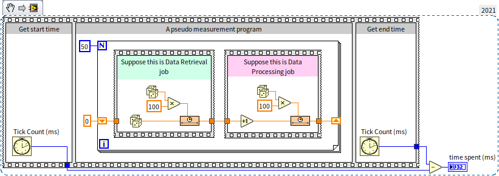
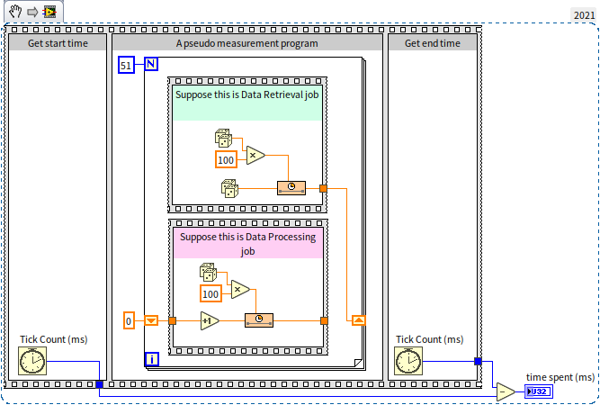
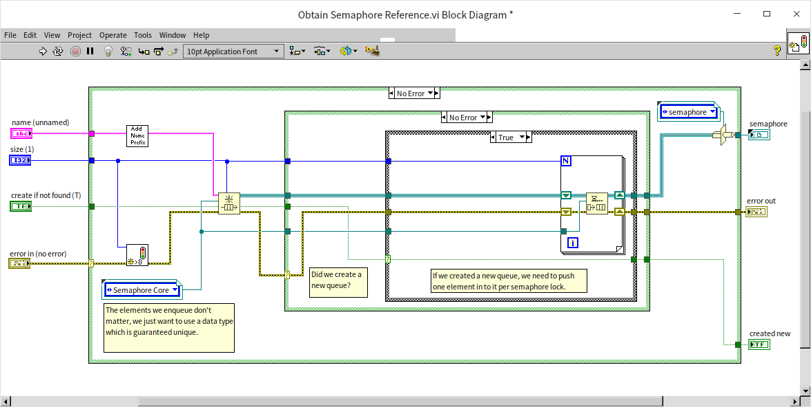
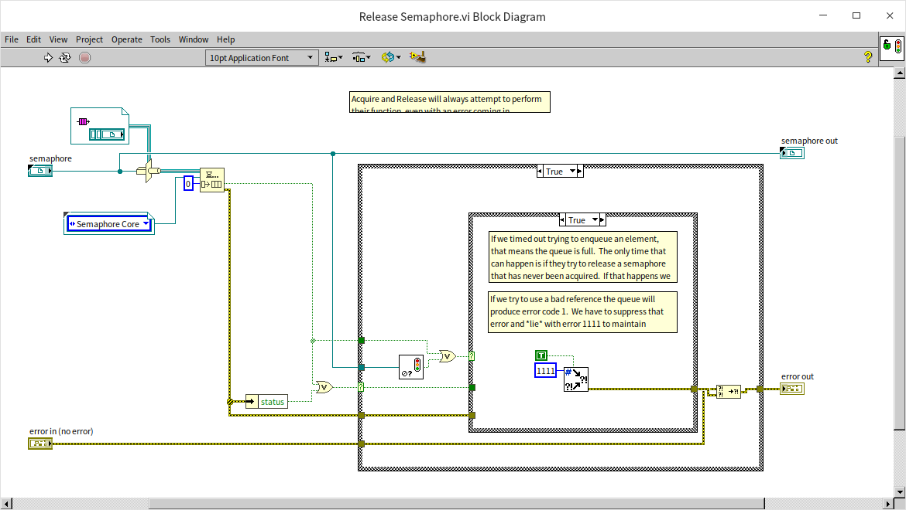
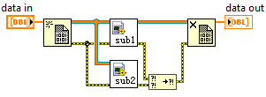

# 传引用

传值是符合数据流驱动程序的传参方式，在 LabVIEW 中应该尽量使用这种方式。但是传引用在某些情况下是不可避免的。假如程序要在不同的线程中对同一数据进行操作，就不得不用到传引用。

在 C++ 中，引用是用一个 4 字节（在 32 位操作系统下）或 8 字节（在 64 位操作系统下）的数据来表示一块数据的地址，数据本身则被保存在某个可以被多个资源同时访问到的内存控件中。在 LabVIEW 中，传引用的形式更加丰富。

## LabVIEW 自带的传引用数据类型

在 C、 Java 等常见文本编程语言中，一个数据传入子函数的时候，可以被指定是传值还是传引用。但 LabVIEW 不同，LabVIEW 不能指定一个数据是传值还是传引用。但是 LabVIEW 的数据类型被区分为传值型的和传引用型的。LabVIEW 中大部分数据类型是值传递的，而另有一部分数据类型专门用于传引用。

控件选板的“引用句柄”栏上的控件就都是传引用数据类型的控件：


在程序框图上，用深绿色细线表示这类传引用的数据类型。比如我们在[全局变量](pattern_global_data#使用信号量避免数据竞争状态)一节介绍过的信号量的引用，就是一种典型的引用数据类型。下图程序中在各个子 VI 间，绿色细线上传递的数据就是信号量的引用：


除了控件选板上的各种“引用句柄”外，LabVIEW 还有其它一些数据类型，尽管其数据线的颜色不同，但其实也属于传引用的数据类型。其中包括了硬件设备的句柄（如 VISA 资源名称、IVI 逻辑名等）、通知、事件、队列等等。

LabVIEW 中还有相当多的引用数据类型，它们的控件并没有列在控件选板上。比如我们[事件结构](pattern_ui#动态事件)一节介绍了为窗格和布尔控件等对象创建引用的方法，它们的引用控件是无法在控件选板中找到的。只能通过先为某个对象创建引用，再从引用的接线端创建控件，通过这样一种间接的方法来得到这些引用类型的控件。比如下面这些引用控件：


引用数据类型本身是一个 4 字节的数据，用这个 4 字节的数据再指向一个其它的对象，程序中真正需要使用的是它所指向的对象。各种不同引用类型的区别在于它们所指向的对象种类是不同的。比如有的引用指向一个文件，有的指向仪器设备，有的指向某个 VI 或控件。

在使用了这些传引用数据类型的程序框图上，数据线上流动的是引用类型本身的 4 字节数据，而他们所指向的对象是不动的。如果引用所指向的是一大块数据，那么，在节点间传递 4 字节的效率当然比传递这一大块数据要高很多。在数据线分叉的地方，LabVIEW 只需要把引用本身的 4 字节数据生成一个副本，引用所指向的对象并不需要被复制。引用副本指向的还是原来的对象，这样，程序可以在不同的代码分支中都访问同一个对象，同一块数据。

## 全局变量

除了 LabVIEW 自带的传引用数据类型，能够传递特定数据的引用之外，我们也可以通过其它手段，把任意一块数据以引用的方式传递。

全局变量（和局部变量）是一种最简便的传引用的方法。全局变量的数据实际上是被保存在某一固定的内存空间的，在不同的 VI 或线程中，都可以通过全局变量访问数据。

在使用全局变量时，直接把表示全局变量的 VI 或节点放在程序中就可以访问它的数据了。这种方式尽管有优点，但缺点更明显。我们在阅读 LabVIEW 程序的时候，数据线是非常重要的线索。它为我们指明了程序执行的顺序，数据传递和加工的过程。失去数据线这一重要线索，就不容易搞清楚某个数据是从哪里来的，何时被改动，因而大大降低了程序的可读性和可维护性。

所以，很多时候，数据线是非常必要的。在传引用时，还是希望能够有一根数据线用来传递这个引用。

## 队列

### 队列用作数据结构

我们在[状态机](pattern_state_machine#多状态传递的状态机)一节中曾经简要的介绍过队列这种数据结构。队列是一种数据结构，队列中可存放多个类型相同的数据。队列的行为就像是排队买票，数据进入队列，就好像顾客进入排队，先排进去的顾客一定会被先处理，先出队伍。队列中的数据必须是先进先出，即每次从队列中取出一个数据时，只能取队列中最先被放进去的那个。

队列（Queue）在 LabVIEW 中是一种非常特殊的数据结构：其它的数据结构，比如数组（Array）、映射表（Map）、集合（Set）等都和常见的简单数据类型一样采用值传递的，而队列却是传引用的。这是因为在“队列”被添加到 LabVIEW 的时候，LabVIEW 的应用还比较局限，主要用于编写基础的测试程序。LabVIEW 处理的数据类型主要也是硬件返回的测试结果等，比较直观和单一，并不需要复杂的数据结构来表示。反而，因为 LabVIEW 是自动多线程的，用户不自觉的就会编写出多线程程序出来，它更需要不是如何优化数据的组织结构，而是一种方便高效的方法让程序在不同线程间传递数据。这一方法就是使用队列，把队列做成引用类型，以方便的在不同线程之间的数据间共享数据。

至今，队列相关的函数都还在“编程 -> 同步”函数选板上，而不是跟别的数据结构一起被放置在“数据容器”选板上。


队列一般指的就是单向队列，是简单的先进先出，数据元素只能从队列尾入队，从队列头出队。经常拿来与队列进行比较的数据结构是“栈”（在[状态机](pattern_state_machine#数据结构设计)一节也简要介绍过）。栈这种数据结构，有点像手枪的弹夹，数据放入栈，就好像子弹压入弹夹，先压入的子弹一定是后出来的。栈中的数据元素必须是后进先出。

还有一种双向队列，除了常规的入队出队顺序，也同时允许数据元素从队列头入队，从队列尾出队。双向队列既可以被当做队列使用，也可以被当做栈使用。LabVIEW 提供的队列是半双向的，它虽然不允许数据从队列尾出队，但是允许我们把数据从队列头入队。这样，LabVIEW 的队列其实也可以在需要的时候被当做栈来使用。


### 队列用作不同线程间数据传递

在 LabVIEW 中，队列除了用于存储数据，提供数据先进先出之类的操作外，还有一个非常重要的用途：在不同的线程间交换数据。LabVIEW 测试程序常用的模式之一是：程序有多个线程同时运行，一个线程用于采集数据，另一线程处理及显示这些数据。这就需要 LabVIEW 提供一个便捷的方法可以把采集线程得到的数据存在某处，再由处理线程把数据从保存它的地方读出。

我们需要用一个程序来演示如何在这类程序中使用队列，下图就是一个极度简化了的“假装的”数据采集和分析处理程序：



这个程序的主体框架大家应该已经在[平铺式顺序结构](structure_cond_seq#平铺式顺序结构)一节见到过了，这是一个典型的用于测量程序运行时间的框架。程序最外层的顺序结构有三帧：第一帧记录下系统当前的时间，也就是测试代码运行前的时间；第二帧中的代码是需要被测试运行时间的代码；第三帧再次读取系统当前时间，这个时间减去第一帧读到的时间，就是第二针测试代码运行的时间。

这第二帧中的代码是一个迭代了 50 次的循环。每次迭代，首先运行一个“虚拟的”数据采集模块，就是底色为绿色的这个顺序结构框内的代码。我们用它来假装数据采集工作，实际上，它每次只是生成一个随机数传递出去。数据采集是要花费一些时间的，为了让这个虚拟的“数据采集”过程更逼真，我们在它里面设置了一个延时，它可能会延时 0~100 毫秒中的任一时间。数据采集之后，是数据处理模块，就是底色为红色的这个顺序结构框内的代码。当然它也只是假装的处理了一下，处理过程也需要花费 0~100 毫秒内的一个随机时间。

如果运行这个程序，程序的总运行时间每次都不同，因为其中有随机成分，但大体上需要 5 秒左右：循环运行了 50 次，每次迭代所花的时间在 0~200 毫秒间，平均大约 100 毫秒，所以总时间 5 秒左右。这个程序的运行效率显然是可以改进一下的，因为程序中的数据采集和分析是顺序依次进行的，程序每个时刻只能做一件事。如果数据采集和分析可以同时在不同的线程内运行，那么应该可以节省将近一半的时间了。当然，一个数据必须要在采集后才能进行分析处理。在设置并行运行时，需要在采集下一个数据的时候，同时处理上一次采集到的数据。改进后的程序代码如下：



改进后的程序，数据采集模块和数据处理模块都和之前一模一样，但是他们从之前的左右放置变成现在的上下放置了。当然，更重要的是，现在的两个模块之间是没有数据线直接相连的，这也就是说这两个模块可以并行运行了。数据处理模块是从移位寄存器中读取的数据，而这个数据是上一次迭代中，数据采集模块存入到移位寄存器的。这样一来，数据模块在采集新数据的同时，数据处理模块也在处理上一次采集到的数据。因为现在数据处理模块要拖后一次迭代再处理数据，如果同样还要采集处理 50 个数据，就需要 51 次循环迭代了。如果程序更严谨一些，我们还需要考虑在循环第一次迭代时，跳过数据处理模块；最后一次迭代时忽略数据采集模块。不过，在这个演示程序中我们省略了这些检查步骤。

这种程序模型也被称为管道流水线模型。它处理数据的方式非常像流水线上的工人们生产一个产品，一个产品具备多个需要顺序处理的工序，每个工人负责一个工序。当一个产品在处在第一个工序的时候，处理第二个工序的工人也不会闲着，他应该正在处理上一个产品的第二道工序。

现在再运行程序，程序速度果然会提高不少，每次运行时间大约在 3.5 秒左右，虽然没有达到用时减半的目标，但也有 30% 左右的提高了。不过，这个程序仍然还有优化的空间：在这个管道流水线模型中，只有同一次迭代内的数据采集工作和分析工作可以并行执行。假如数据采集模块很快就完成工作了，但是数据处理模块还没运行完，那么数据采集模块就只能空等在那里。改进方法是：如果采集工作很快完成了，那么不必等，直接去做下一个数据采集。这样一来，就有可能程序已经采集到多个数据，但还都没来得及分析处理，那么就需要把这些采集到的数据都暂时存放起来，等数据处理模块空闲的时候逐一处理。这也就是队列的用处，每采集到一个数据，就把它放入队列；另一线程内，数据处理模块不断从队列里读取数据进行处理。改进后的程序如下：


在程序中首先调用“Obtain Queue”（获取队列引用）新建一个队列，然后把队列的引用分别传给数据采集模块和数据处理模块。数据采集模块每产生一个数据就调用“Enqueue Element”把它加入队列；而数据处理模块则调用“Dequeue Element”取出队列里的数据，如果队列是空的，“Dequeue Element”会等在这里，一直等到数据采集模块在队里中加入了新数据，然后继续取出数据处理。程序最后调用“Release Queue”把创建的队列销毁。改进后的程序运行时间基本在 3 秒以内。

这种程序模型也被称为生产者消费者模型：程序中的两个主要线程，一个负责生产，产生数据；另一个负责消费，处理数据。

### 队列的名字

使用“Obtain Queue”函数创建新队列的时候可以给新建队列起一个名字。如果队列有名字，那么它的名字在整个项目用到的所有队列中必须是唯一的。在同一项目里任何子 VI 中创建新的队列时，如果发现已经存在同名的队列了，那么“Obtain Queue”并不会创建一个新的队列，而是直接拿到已存在的那个同名的队列。比如下图种的程序，上下两个线程虽然没有任何数据线相连，但他们使用的却是同一个队列：


程序中的“Preview Queue Element”（预览队列元素）可以得到队列头元素的值，但并不会把它从队列中拿掉。运行程序，输出控件“element”和“element 2”的值是相同的，都是 23，因为它们预览的是同一个队列。程序中有一个空的顺序结构，它在这里起到同步的作用，让上下两个线程在此处同步，确保下面一个线程的预览队列元素操作一定运行在上面一个线程的元素入队操作之后。


### 生产者消费者模型需要考虑的事项

在设计生产者消费者模式中使用到的队列的时候，需要考虑程序可能会出现的异常的情况，比如程序的某个线程出错卡住了。

如果，消费者线程出现异常，无法处理数据，或处理速度太慢，生产者线程产生的数据就会堆积在队列中。如果积累的数据太多，可能占用过多内存，拖垮整个系统。因此，设计程序时，可能需要考虑限制队列的长度，如果队列中元素数量超过正常限度，很可能是哪里出错了。这时应该停下程序，排查错误了。“Get Queue Status”（获取队列状态）函数可以返回队列的长度。

我们也可以在“Obtain Queue”函数中设置“max queue size”（最大队列长度）参数来限制队列的长度。这个参数默认为 -1 也就是不限制最大长度。如果设置了一个正整数为最大长度，当队列中元素数量超过设置的最大值时，队列入队操作就会等在那里，直到队列中元素被其它线程取出一些后，再继续。如果队列一直没有空，程序恐怕不应该永远等下去，所以最好给元素入队操作添加一个超时参数。下面的程序，设置了队列长度为 2，当程序插入第三个数据时，元素不会被加入队列，返回元素入队函数的“超时”参数输出“真”值。


同样的，程序也要考虑生产者线程出现异常的情况。在这种情况下，消费者线程可能永远也等不到所需的数据，所以应该给消费者线程的元素出队函数也设置一个超时参数，确保它不会无止境的等下去。

### 队列用作数据引用

我们可以借助队列，让自己定义的数据类型也按照传引用的方式传递。其思路是，创建一个新的，最多只允许放置一个元素的队列，把被引用的数据作为这个队列的元素。平时在 VI 间传递参数时，传递的是这个队列，需要时，再把数据从队列中取出使用。

下图中的程序，用于初始化一个这样的传引用数据：


被引用的数据类型是一个簇，它由三个元素组成。最后生成的“data out”，它本是指向队列的引用，但是由于这个队列中存放的是我们自己定义的数据，所以“data out”也可被用作是指向我们定义的簇数据的引用。

传引用通常用于在不同线程里访问同一份数据，所以在访问数据时要防止出现竞争状态。也就是说，某一线程正在访问被引用的数据时，其它线程不应同时访问这个数据，而是应该等待，直到第一个线程访问数据结束后，再来访问这个数据。我们在[全局变量](pattern_global_data#使用信号量避免数据竞争状态)已经介绍了如何使用信号量来避免全局变量的数据竞争状态。对于又队列构建的引用数据来说，我们可以利用队列的一些特性，非常简单地解决竞争状态问题。思路如下：

需要访问被引用数据时（假设我们用一个名为“甲”的 VI 来访问和处理被引用数据），程序首先应当调用“元素出队列”函数把队列中唯一的元素取出。在完成读写数据的工作后，再让新的数据重新入队。这样一来，程序执行到 VI 甲时，队列立即被清空。其它线程内若有采用相同机制的 VI（假设名为“乙”）准备同时处理这个数据时，它已经无法从空队列中取出所需的数据。它只能暂时等待，直到 VI 甲完成所有工作，再次把数据放回队列，VI 乙才能继续执行。这样就避免了同一数据被同时访问而引发的竞争状态。下图是一段处理数据的示例代码：


下图是使用队列传引用方式的一个例子，其中“Set Name.vi”和“Set Number.vi”子 VI 使用的都是上图所示的带有防止竞争状态的代码。虽然它们之间没有先后依赖关系，LabVIEW 会同时运行它们，但在防竞争状态代码的保护下，它们不会同时访问被引用的数据，只能依次设置被引用数据中的 Name 和 Number 元素：


使用了传引用，就必须自己管理内存了。比如在我们这个例子中，程序为了传引用而创建了一个队列。在程序结束前，需要销毁这个队列，以避免可能出现的内存泄漏。

## 数据记录文件引用句柄

使用队列是一个非常高效的传引用方式，而且可读性也不错。但它始终是一种非常规的解决方案。队列的控件和数据线始终是一个“队列”，不了解队列这一用法的编程者读到上例中的代码会感到迷惑。若能使用 LabVIEW 中专门用于传引用的深绿色细线来表示传引用，程序的可读性会更好。

“引用句柄”控件选板中的“数据记录文件引用句柄”常常被用于表示用户自定义的引用数据类型。把一个新的“数据记录文件引用句柄”控件放置在 VI 的前面板上，它的外观是一个空的矩形方框；再把其它不同类型的控件放置到这个矩形方框之内，它就会转化成为一种特殊的引用数据类型。

用于用户自定义的引用数据类型时，通常是把一个枚举类型的控件放入“数据记录文件引用句柄”控件的方框内：


这样，它就组成了一个新的引用数据类型控件：


其中的枚举类型只有一个数据项，用于显示一些相关的提示文字。之所以采用枚举类型，一是因为它可以显示提示文字，二是 LabVIEW 会把数据项中文字不同的枚举类型当作不同的数据类型。数据记录文件引用句柄控件方框内的枚举类型不同，其表示的引用数据类型也不同。把每一种不同的用户自定义引用数据定义为一个特殊的类型，可以提高程序的安全性。比如，我们不能把不同类型的引用数据相互赋值或比较：


假如在某个应用程序中，有两个字符串数组分别保存实验员姓名和仪器设备编号。程序要求使用传引用的方式访问这两组数据。在这个程序中，它们是两组完全不同的数据，有各自的一组 VI 来处理这些数据，不允许出现 VI 与数据交叉混用。如果使用相同引用数据类型来表示这两组数据，把实验员姓名的数据传递给处理设备编号的子 VI，程序不会立刻检验到错误，仍然允许运行，但在运行时则可能出错。若分别使用不同的引用数据类型，当把实验员姓名的数据传递给处理设备编号的子 VI 时，数据线会断开，程序不允许运行，编程人员会立刻意识到错误。

使用自定义的数据记录文件引用句柄表示引用数据类型，比使用队列表示引用数据类型多出了一个步骤：为被引用数据生成的队列需要通过强制类型转换函数，转换成自定义的引用句柄数据类型，再传出子 VI。这样，在应用程序中，子 VI 间就是通过引用句柄的深绿色线来传递数据了。子 VI 在得到这个引用后，同样需要把它转换为队列，再进行使用：


## LabVIEW 中的信号量是如何实现的

LabVIEW 中几个信号量相关的 VI 是开源的，我们可以看一下它们是如何实现的，学习一下。

首先是创建信号量的 VI，“Obtain Semaphore Reference.vi”：



我们对这个程序的主结构应该不那么陌生了，它的主体部分是：创建了一个队列，在队列里添加了元素，然后把队列的引用强制转换成了一个自定义的数据记录文件引用句柄作为信号量的引用句柄。这正是上文介绍的经典的利用队列传递数据传引的用法。在这个程序里，队列的长度没有被限定为固定的 1，而是由用户来指定。这是因为有些被信号量保护的词源允许有多个并发访问，比如说一个仪器，最多允许两个线程同时进行访问。在这种使用场景下，就需要把队列的长度设为 2。

再来看一下锁住信号量的 VI “Acquire Semaphore.vi”：


这依然是一个经典的利用队列传递数据传引的用法。它只做了一件事，从队里中取出一个元素，如果队列是空的，它就会等在这里。

下图是解锁信号量的 VI “Relase Semaphore.vi”：



它做的事情是在队里中添加一个元素，元素的值本身并不重要。

看完这些代码，我们会发现，LabVIEW 的信号量的实现还是比较简单的：它本质上是使用队列作为信号量，如果队列为空，表示信号量锁住，如果非空，就是没锁住。


## 借助 C 语言

借助 C 语言比借助队列实现传引用要麻烦一些，编写程序时尽量不要采用这种方法。但是，如果应用程序中，已经有部分模块是用 C 语言编写的，并且所传递的数据在 C 代码中和在 LabVIEW 代码中都会使用到，也可以考虑把数据存放在 C 语言实现的模块中。

这种做法的思路是，数据存放在 C 语言开辟的内存空间里，C 语言把数据的内存地址传给 LabVIEW。平时在 VI 间传递参数时，传递的是这个地址的数值；需要时，再把数据从内存中读到 LabVIEW 里使用。

下列代码是一个在 C++ 语言中开辟内存空间，保存 LabVIEW 中数据的一个范例函数：

```cpp
int stdcall CreateBuffer ( // 为数据开辟空间并传出指针
  const char data [],       // 数据内容
  int size,                // 数据大小
  char* bufPointer         // 用于返回新开辟空间的指针
) {char buffer = new char [size+4];  // 开辟一块内存空间保存数据和数据的大小信息
  ((int) buffer) = size;            // 新开辟空间的头 4 字节，保存数据的大小信息
  memcpy (buffer+4, data, size);   // 其余部分用于保存数据
  *bufPointer = buffer;            // 把新开辟内存空间传给 bufPointer 参数
  return 0;                        // 函数返回
}

int stdcall GetBufferData (   // 从数据的地址得到数据内容
  char bufPointer,            // 数据地址
  char data                   // 用于返回数据内容
) {int size = ((int) bufPointer);        // 得到数据的大小
  memcpy (data, bufPointer+4, size);   // 把数据内容拷贝给调用函数提供的地址
  return 0;                            // 函数返回
}
```

在 LabVIEW 语言中，需要为某段被引用数据创建一个引用时，就利用上述函数，把这段数据保存到 C 语言中开辟的内存空间里。LabVIEW 代码中传递的只是这个数据空间的地址值。后续程序若需要用到被引用数据，可以通过地址值得到数据的内容。

用一个 U32 的数值表示引用，或者用队列表示引用，同样都会有数据不安全的问题。因此，在程序中，同样也可以把这个地址值，强制转换为一个自定义的引用句柄，用自定义的引用句柄来表示这一数据引用：


这段程序涉及到了 LabVIEW 调用 C/C++ 程序，本书将在[动态链接库](external_call_dll)对此做详细介绍。


## 数据引用节点

数据传引用的节点是在 LabVIEW 2009 中添加的。相关的两个节点位于函数选板“编程 -\> 应用程序控制 -\> 内存控制”上中，分别是“新数据值引用”和“删除数据值引用”。


“新数据值引用”用于创建一个数据的引用，“删除数据值引用”可以从引用中取回原来的数据。这两个函数可以用来替代上文介绍过的使用队列和自定义数据记录文件引用句柄的传引用方式。比如下图所示程序，程序输入了一个数组，然后需要在两个并行的子 VI 中同时对这个数组中的数据进行修改。每个子 VI 可能修改了数组不同的元素，程序运行结束后输出的数组应当把这两个子 VI 中的修改都包含进来。因此，程序一开始需要为数组数据生成一个引用，然后把引用分别传递到两个子 VI 中去。两个子 VI 都运行结束后，再从引用中取回数据。



LabVIEW 中绝大多数的函数和子 VI 都是值传递的。当它们需要使用到被引用的数据时，必须把引用转为数据，处理过的数据还需要再转为引用，如下图所示：


在此过程中，往往又会产生数据拷贝，如果数据量很大，则程序运行效率就会比较差。为此，应该使用“元素同址操作结构”（在函数选板“编程 -\> 结构”上），来处理从引用中取出、放回数据的过程。如下图所示：


使用“元素同址操作结构”，LabVIEW 会尽量使用数组原地址，而不再复制从引用中取出的数据，这样就提高了传引用的效率。本书会在[内存优化](optimization_memory)更细致的讨论内存效率问题。

## 传引用引起的死锁

为了保证多线程安全，“元素同址操作结构”对一个引用的数据进行处理时，会锁住引用指向的数据。若其它线程需对同一数据进行操作，必须等到“元素同址操作结构”中所有代码执行完毕方可。这样就避免了多线程读写同一内存数据所产生的数据竞争状态。这与我们自己处理数据时[使用信号量保护临界区](pattern_global_data#使用信号量避免数据竞争状态)是同样的原理。

比如下图中的程序的执行时间是 1 秒，


而下图中的程序运行需要 2 秒，因为上图两个“元素同址操作结构”处理的是不同的数据，可以同时运行；而下图中的两个“元素同址操作结构”是对同一数据进行处理，它们不能同时执行。


有了“锁住”这个操作，就有不小心造成死锁的可能。比如对于同一数据的引用，千万不能嵌套使用“元素同址操作结构”，否则就会死锁。比如下图中的程序：


程序运行至内层的“元素同址操作结构”，就会停在这里等外层“元素同址操作结构”运行结束，释放它锁住的数据；而对于外层“元素同址操作结构”来说，要等待它内部的全部代码运行结束，它才可以结束。结果它们相互等待，造成了死锁。


