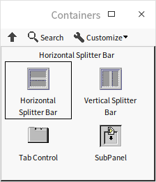
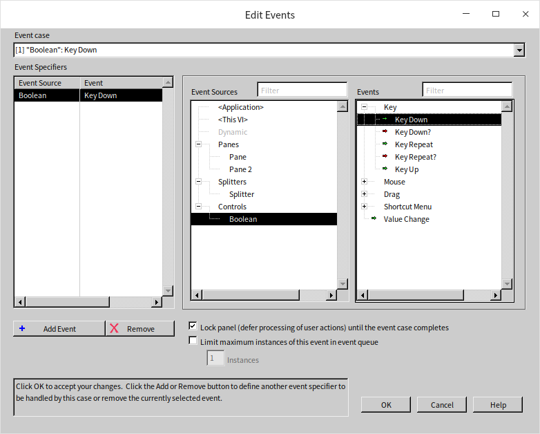
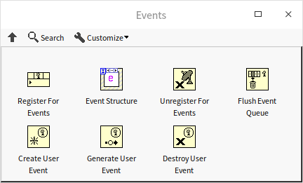
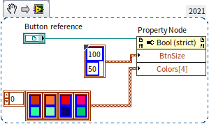

# 事件结构和程序界面

## 事件结构

事件结构是与[条件结构](structure_cond_seq)类似的一种结构。它们的区别在于：事件结构是根据发生的事件决定执行哪一个分支中的代码的。

当有事件发生时，事件结构会自动感知，并不需要用数据线把事件传递至事件结构。事件结构上方的事件标签显示当前分支所对应的事件。当有事件发生时，事件结构除了会得知是何事件发生，还能得到一些相关数据，比如事件发生的时间，发生在哪一个控件上等。这些数据可以从事件结构左边内侧的事件数据节点得到。

## 按照产生源来区分事件的种类

按照事件的产生源来区分，LabVIEW 程序中的事件可以分为六大类。这六类事件显示在“编辑事件”对话框的“事件源”一栏中，每一个类别下包含具体的产生事件 VI 或控件等事件源，每一个事件源的具体事件则显示在右侧的“事件”栏中。
新建一个 VI，在其前面板上放置一些控件，再在 VI 的程序框图上放置一个事件结构，然后鼠标右键点击事件结构的边框，选择“添加事件分支”，或“编辑本分支所处理的事件”等会弹出编辑事件对话框。

LabVIEW 8.6 中的编辑事件对话框：

这六大类事件分别是：

### <应用程序>

应用程序事件，这类事件主要反映整个应用程序状态的变化，例如程序是否关闭，帮助窗口的状态是否有变化，是否超时等。

事件结构中的默认事件“超时”就属于应用程序事件。如果不连接任何数据给它，它的默认值是 “永不超时”，也就是说，程序永远都不会执行到这个默认的超时事件分支；如果在程序中传入一个表示毫秒的数值（n）给超时接线端（事件结构边框左上角沙漏图案的接线端），则每隔 n 毫秒，事件结构会自动运行超时处理分支中的代码。比如下图中的程序：

### <本 VI>

本 VI 事件，这类事件反映当前 VI 状态的改变。例如，当前 VI 前面板的大小是否被调整，是否选择了菜单中的某一项等。

### 动态

动态事件，用于处理用户自己定义的或在程序中临时注册的事件。后文将会详细介绍动态事件。

### 窗格

窗格事件，包括与某一窗格有关的事件，比如鼠标进入离开窗格等。

默认情况下，一个 VI 前面板就是一个窗格。如果在控件选板上选择“新式 -\> 布局 -\> 横向（纵向）分隔栏”：

把分隔栏拖到 VI 的前面板上，就可以把面板分割成多个窗格，比如下图中的前面板，被中间的纵向分隔栏划分成了左右两个窗格，每个窗格就好像是一个独立的前面板，可以分别放置不同的控件。

鼠标右键点击窗格内部，不会出现用于配置窗格的相关菜单，因为这时出现的是控件选板。只有在滚动条或分隔栏上右击鼠标才能得到与窗格相关的菜单选项，比如更改显示方式，创建属性节点等。

### 分隔栏

分隔栏事件，包括与分隔栏相关的事件，比如鼠标拖动分隔栏等。

### 控件

控件事件，包括与界面上控件相关的所有事件，比如控件的值被改变等。这是最常被处理的一类事件。

## 编辑事件

条件结构中的条件标签是直接写入的，而事件结构中的事件标签则必须通过编辑事件对话框来编辑。

在事件结构的右键菜单中选择“添加事件分支”、“复制事件分支”或“编辑本分支所处理的事件”，即可调出如下图所示的编辑事件对话框。

LabVIEW 2021 中的编辑事件对话框：

编辑事件时，首先要在“事件源”栏中选择一个事件源，比如某一控件；再在“事件”栏中选择该事件源所产生的需要被处理的事件，比如选择事件源“开关”中的“值改变”事件。选中的事件会出现在“事件说明符”一栏中。

一个事件处理分支可以处理多个事件，只要把不同的事件加入这一分支的事件标签即可。在编辑事件对话框中，点击“事件说明符”一栏下侧（有的版本在左侧）的加号，可以为这一分支添加其它可处理的事件。

有时候，用户的一个操作，会使得多个事件产生源都发出某一事件。比如，在前面板上的名为“开关”的控件上点击鼠标，“开关”控件和“开关”控件所在的窗格都会发出一个“鼠标按下”事件。

不过 LabVIEW 发出这些事件的顺序是有一定规律的：

与键盘相关的事件，如键按下、键释放等，只在当前被选中（当前相应键盘操作的控件）的控件上产生。

与鼠标相关的事件，如鼠标按下，鼠标释放等，按照从外向里的顺序发出。在刚才提到的例子中，在一窗格内的“开关”控件上点击鼠标，窗格的“鼠标按下”事件先于 “开关”控件的“鼠标按下”事件产生。举一个更复杂一点的例子：在一窗格内，放置一个选项卡控件，选项卡控件上放置一个簇类型控件，簇中包含一个布尔型控件。在布尔控件上点击鼠标，按先后次序发出的事件分别是：窗格中的“鼠标按下”事件，选项卡控件的“鼠标按下”事件，簇控件的“鼠标按下”事件，布尔控件的“鼠标按下”事件。

值改变事件按照从内向外的顺序发出。若簇中包含一布尔控件，当布尔控件的值改变时，按顺序发出以下事件：布尔控件的“值改变”事件，簇控件的“值改变”事件。

下图是一个非常简单的程序，它的前面板上只有一个 "停止" 按钮，程序框图上也只有一个事件结构。这个事件结构中只有一个分支用于处理 "停止" 按钮的 "值改变" 事件。

开始运行这个 VI。当程序运行到事件结构时，就会暂时停止下来，等待事件的发生。而这个事件结构只接受“停止”按钮的“值改变”事件。其它操作，比如点鼠标、按键等都不会影响到这个程序的执行。

当用户点击“停止”按钮时，“停止”布尔控件的值发生变化，它会发出一个“值改变”事件。事件结构捕获到这一事件后，立刻运行事件结构中处理“停止”控件值改变事件的分支。执行完这一分支，整个程序也就运行结束了。

## 按照发出时间区分事件的种类

按照事件的发出时间来区分的话，LabVIEW 的事件可分为通知型事件和过滤型事件。

通知型事件是在 LabVIEW 处理完用户操作之后发出的。例如，用户利用键盘操作改变了一个字符串控件的值，LabVIEW 在改变了该控件的值之后，发出一个“值改变”通知型事件。用户可以在事件结构中添加处理该事件的代码，在“值改变”发生后完成相应的工作。

过滤型事件是在 LabVIEW 处理用户操作之前发出的。如果事件结构中有对该过滤事件处理的分支，那么 LabVIEW 先执行处理该事件的分支，再根据事件结构分支内返回的命令决定是否对该事件做默认的处理。

从标签上，可以明显地区分出一个事件是过滤事型件还是通知型事件。过滤型事件的名称之后都有一个问号，比如“鼠标按下？”事件。

从两种事件的含义就可以看出，过滤型事件比相应的通知型事件要先发出。其顺序大致如下：用户动作引发 LabVIEW 发出一个过滤型事件；执行过滤型事件框内的代码；然后根据返回的命令决定是否执行 LabVIEW 默认的处理；最后发出通知事件。

比如，当前界面上选中的是一个字符串控件。用户敲击键盘，LabVIEW 立即发出一个“键按下？”事件。如果程序中的事件结构有处理该事件的分支，则 LabVIEW 运行该分支。用户可以在这个分支中添加代码，改变按键的值，或者让 LabVIEW 忽略该操作。如果没有设置让 LabVIEW 忽略该操作，在该事件分支运行结束后，LabVIEW 执行对“键按下”的默认处理过程，即把按键所代表的字符在字符串控件中显示出来。LabVIEW 完成默认的操作后，会再产生一个“键按下”事件。

举一个实例来说明：编写一个程序，主界面有一个字符串控件，用于输入电话号码。电话号码仅由数字和横线组成，控件对其他按键无反应。

在这个程序中，我们可以利用“键按下？”这个事件。在“键按下？”发生时，首先判断按下的是什么类型的按键，如果是数字或者横线，则让 LabVIEW 继续显示按键表示的字符，否则要求 LabVIEW 放弃对这个操作的默认响应。程序如下图所示：

在程序里，从事件处理分支的数据节点中可以得到被按下键所代表的字符，字符以 ASCII 码格式表示。程序代码则用于判断按键是否属于数字或横线，并将判断结果取 "否" 后传给 "放弃？" 返回节点，程序将据此决定是否放弃对这一操作的默认处理。这样，当用户键入非数字字符时，让 LabVIEW 放弃处理这些按键，"输入电话号码" 控件就只接收数字或横线了。

若同一 VI 的程序框图上有多个事件结构，当有通知型事件发生时，它会被同时发往所有的事件结构。与处理这个事件有关的所有事件结构分支，将会按照前面讲过的默认的先后顺序，同时处理这一事件。而过滤型事件发生时，它只被发送到某一个事件结构分支，待该事件结构运行处理完成后，再把该事件发往另一事件结构。

可以看出，这种一个 VI 中有多个事件处理结构的形式，其运行逻辑将会是相当复杂和混乱的，因而其可读性与维护性极低。所以，应该尽量避免在同一 VI 上使用多个事件结构。实际上每个 VI 中只需有一个事件结构就可以处理所有的事件了。

## 事件结构的使用

通常情况下，程序极少会只需要处理一个事件。程序总是需要处理运行过程中不断放出的各种事件，所以事件结构通常会被放在一个 while 循环结构内。我们把这种一个事件结构外套一个 while 循环结构的程序模式成为“循环事件结构”。比如上图中的程序就是用了一个循环事件结构

只有在极个别的特殊情况下，才可能单独使用事件结构。例如一个简单的对话框，当对话框被弹出时，只需等待用户点击“确定”按钮，然后退出。程序不需要响应任何其他事件。这时可仅使用一个事件结构完成程序功能。

现在，我们回过头，重新审视一下先前章节编写过的一个程序：

这个程序还有个小缺陷。程序设定了每隔 200 毫秒做一次加法运算，并更新 "量表" 显示控件的值。但在软件运行的绝大部分时间里，两个输入控件的值是不变的。也就是说，在这绝大部分时间里，程序所作的加法运算和更新显示控件工作都是无效的。但是，我们又不能够把每次计算的时间间隔调整得过长，否则在控制控件更新后，会明显地感觉到显示控件的更新滞后。

理想的解决方案应当是，让程序一直处于空闲状态，而一旦任何一个控制控件的值更新了，就立即进行运算并刷新显示控件。循环事件结构恰好可以满足这一需求。下图是使用循环事件结构改写后的程序：

它的主要事件分支是“旋钮，转盘：值改变”事件。程序的执行顺序如下：首先执行 while 循环，while 循环开始第一次迭代，程序执行 while 循环内部的代码，即事件结构。由于这个事件结构中还没有任何需要处理的事件发生，程序一直处于等待事件的状态。程序处于等待状态时，并不占用系统资源。一旦 “旋钮”或“转盘”的值发生改变，程序就会立即运行并执行“旋钮，转盘：值改变”事件处理分支。于是，程序运行加法计算并及时更新显示控件。

程序执行完这一事件处理分支后，跳出事件结构。此时，传递给 while 循环条件接线端的是默认值 "假"。于是 while 循环继续运行，开始下一次迭代，重新进入等待事件状态。

这个事件结构还需要有另一分支，用于处理“停止”按钮的“值改变”事件。当“停止”按钮值改变时，按钮的值“真”传递给了 while 循环条件接线端，于是 while 循环停止运行，程序结束：

需要注意的是，程序这里必须把“停止”按钮的接线端放置在事件结构对应的分支内。如果把“停止”按钮放在循环结构之外，在事件结构内处理“停止”按钮的“值改变”事件的分支内只用一个“真”值常量，如下图的程序，程序是否还能正常运行呢？

按钮被按了一下之后，应该再自动恢复到原来来的状态，但是，当按钮的机械动作（参看[布尔控件](data_number)一节）被设置为发出脉冲信号时，按钮的数据必须被读出之后，它才会恢复到原来的状态。所以“停止”按钮被放在循环结构之外问题并不大，毕竟这个按钮按下之后，程序就结束了，是否恢复原来状态并不重要。但是如果，程序里还有别的按钮，那么就要注意了，如果这个按钮若不放在事件分支中读出数据，它的状态就不会被恢复。比如下面这个段程序：

这个程序中的“OK Button”本来是被设置成按钮，但是因为它被放置在循环之外了，它的状态无法被自动恢复，行为反而像是开关了：

像这种机械动作被设置为发送脉冲信号（机械动作菜单上第二排的前两种机械动作）的按钮，每次按下只会发出一个“值改变”事件，自动回复的过程，虽然它的值改变了，但却不会发出相应的“值改变”事件，所以在下图中这个程序里，控件“NewVal”的值永远是真。

那么，能不能在循环事件结构内，直接用“停止”控件去控制 while 循环结构的条件接线端呢？比如下图中的程序：

分析一下这个程序的运行流程：当程序处于等待事件状态时，程序会一直等在这里，直到有一个可以处理的事件发生。如果这时按下停止按钮，按钮的值改变了，但由于没有事件结构可处理的事件发生，程序还是会继续处于等待状态。程序就卡在事件结构这里了，并不会像预期的那样结束循环。所以，退出这一循环事件结构唯一有效的处理方法是使用“停止”按钮的“值改变”事件。

循环事件结构非常适合应用于界面编程，所以它是 LabVIEW 中最常见的程序模式之一。

## 动态事件

在初始状态下，打开编辑事件对话框，动态事件下的一栏是空的。这是因为动态事件只有在注册过之后才能使用。与动态事件相关的节点位于 "编程 -\> 对话框与用户界面 -\> 事件" 子函数选板。

用于注册事件的节点是“注册事件”（Register For Events）节点。注册事件节点可以注册两种事件，一是 LabVIEW 自产的事件，包括我们前面介绍过的所有的应用程序事件、VI 事件、窗格、分隔栏和控件事件；二是用户自定义事件。

我们首先讨论 LabVIEW 自产的事件。这些事件均可在编辑事件对话框中直接选择。除“动态”这一项以外，可以直接在编辑事件对话框中选择的事件都属于静态事件。静态事件只能是本 VI 的对象发出的事件。比如，VI 前面板有一布尔控件，在它的程序框图的事件结构中就可以直接添加处理这个控件事件的分支。但是，在编写一些比较复杂的程序时，会使用大量的子 VI，或动态调用其它 VI（有关动态调用的详细内容，在本书后面相关的章节再做阐述）。有时候可能会遇到这种情况：在某个 VI 的事件结构中必须处理另外一个 VI 的控件发生的事件。比如，布尔控件在某程序的界面上，而处理它的事件的代码却在某一个子 VI 中。很显然，子 VI 中并没有这个控件，那么它的编辑事件对话框肯定也是找不到这个控件的，也就无法设置这个控件的事件分支。在 LabVIEW 中，为处理这一类情况设置了动态事件。要使用动态事件，首先这个控件需要在其子 VI 的事件结构中注册。

需要注册某一事件时，首先要为产生这个事件的控件生成一个引用节点，将引用节点与 "注册事件" 节点下方标志了 "事件" 字样的事件源相连，鼠标点击事件源，在弹出的菜单中选择所需的事件。然后，把注册事件节点生成的 "注册事件引用句柄" 传递给事件结构的 "动态事件接线端"，即可完成事件的注册。

用文字讲述这一过程比较复杂，不妨使用一个例子详细解释这一过程，就容易理解多了。

编写一个 VI，在 VI 的面板上点击鼠标时，显示出鼠标所在的坐标，并且在子 VI 中处理所有的事件。

程序主 VI 的界面如下图所示：

要求是：当用户在 VI 面板上点击鼠标时，"坐标" 控件显示出鼠标的位置；当用户点击 "停止" 按钮，程序结束运行。

由于这个程序处理事件的主要代码部分，都要求在一个子 VI 内完成，所以主 VI 的程序框图是非常简单：它只要把子程序所需的数据传递给子程序就可以了：

程序既然需要一个 VI（子 VI）监视和控制另一个 VI（主 VI）的控件，那就必须提供一种机制，让子 VI 可以找到并控制主 VI 上的控件。在 LabVIEW 中，可以为控件产生一个“引用”。使用过文本编程语言的用户，也许对“引用”这个概念比较熟悉。“引用”本身保存的不是指向某块数据的内存的地址。在 LabVIEW 中，“引用”是一个 4 字节的数据，程序可以通过它得到其指向的复杂数据对象。

控件是一个比较复杂的对象，由数据以及各种属性组成。要是在 VI 间直接传递所有这些内容，效率肯定不高。但如果使用一个 4 字节的简短数据来表示它，只传递这 4 个字节，效率就高多了。

在控件或控件的接线端上点击鼠标右键，选择“创建 -\> 引用”，即可为控件创建一个引用。把某个控件的引用传递给子 VI，子 VI 就知道了存储这个控件所有信息的内存地址，也就可以对这个控件进行控制操作了。

在这个例子中，我们要检测鼠标在前面板上的点击动作。这个前面板只有一个窗格，所以需要把窗格的引用也传递给子 VI。在前面板的滚动条上右击鼠标，可以为窗格创建出一个引用。

子 VI 有三个参数，分别接收主 VI 传递来的三个引用，它们的参数类型应当分别是这三个引用类型。“引用” 虽然是用来指向某一数据的，但引用本身也是一个数据。引用数据本身在 LabVIEW 中的传递方式与其它数据是相同的。

唯一的麻烦是，在 LabVIEW 的控件选板中，无法找到针对某一特定对象的引用控件。因为某个控件的“引用”只与这个特定控件相关联，所以不可能在控件选板中列出无数个控件引用来。需要使用这种“引用”控件时，最简单的办法是从“引用”直接创建出同数据类型的控件。分别在上图程序框图中的三个“引用”上点击鼠标右键，选择 "创建 -\> 输入控件"，即可产生与这三个引用数据类型想对应的“引用”控件。在把产生的控件拷贝至子 VI 主面板中即可：

在子 VI 中处理主 VI 控件的事件，首先要注册需要处理的事件。

把 "窗格" 和 "停止" 的引用分别传递给 "注册事件" 节点的事件源输入端，鼠标单击事件源输入端，选择需要注册的事件类型。

注册事件节点生成的 "注册事件引用句柄" 需要传递给事件结构的 "动态事件接线端"。在事件结构的右键菜单中选择 "显示动态事件接线端"，事件结构的框架上会多出一个如同卫星天线图案的小矩形，这就是动态事件接线端。把 "注册事件引用句柄" 数据引入这里，即可允许事件结构使用已注册的事件。再次调出编辑事件对话框，会发现
"动态" 一栏下，已经多出了刚才注册过的那两个事件。

:::note

需要注意的是，动态事件是指引用控件所指向的内容（另一个控件）的事件，千万不要把它与引用控件本身的事件混淆。

:::

"<窗格\>：鼠标按下" 事件处理分支中的代码是将事件结构所得到的事件发生的位置（即点击鼠标的坐标），传递给主 VI 上的 "坐标" 控件，显示出来。我们可以通过把数据传递给控件的 "值" 属性来完成这一功能。

前文曾经介绍过如何为控件创建属性节点。但是，从控件直接创建出来的控件属性节点只能在控件所在的 VI 上使用。如果需要读写其它 VI 上的控件的属性，也必须通过控件的引用完成。把某控件的引用传递给 "编程 -\> 应用程序控制 -\> 属性节点" 的 "引用" 输入端，即可在属性节点下方的属性数据接线端选择该对象的属性了。它与从控件直接创建出来的属性节点的功能是完全相同的。如下图所示：

## 用户自定义的事件

LabVIEW 自产的事件主要是指那些由用户对界面对象进行操作的事件，比如在某处点击鼠标，改变某个控件的值，以及程序自身状态变化（如“超时”）的事件。如果需要在程序中，在满足其它某种条件时也产生一个事件，就只能使用用户自定义事件了。

用户自定义的事件被归纳在动态事件中，在用户自定义事件被注册后，即可在“编辑事件”对话框的“动态”栏下找到它。用户自定义事件是使用“创建用户事件”函数创建出来的事件。当需要抛出（指产生一个已经定义好的事件）一个用户自定义事件时，可以使用“产生用户事件”函数发出一个事件。程序抛出的用户自定义事件还可以携带自定义的某些数据。

还是举一段例程来说明。程序有两个输入控件：一是数值型控件 A，二是字符串控件 B。当 A 的值大于 10，或者 B 的长度大于 10 个字符时，程序抛出一个用户自定义事件“警告”。

要实现这个功能其实可以有多个方式。使用用户自定义事件是一种较为简便的方案：

首先，创建一个用户自定义事件。创建用户自定义事件时，需要连接一个常量数据给“创建用户事件”函数的“用户事件数据类型”参数。常量的数据类型，就是抛出事件的事件数据类型，常量的标签则是创建出来的事件的名称。

此处，我们需要一个字符串类型的事件数据，用以在抛出“警告”事件时，传递警告信息。为此，我们为“创建用户事件”函数的“用户事件数据类型”参数指定了一个标签为“警告”的空字符串常量。

在事件“B：值改变”事件的处理分支中，程序检测字符串 B 的长度，如果长度超过 10，则程序抛出“警告”事件。同时把字符串“B 长度超过范围”作为这个事件的数据。

在用户自定义的处理分支中，可以从事件结构左侧的数据节点中得到事件的数据：

自定义用户事件可以作为一种规范的格式，用在 VI 的初始化、终止等场合，处理 VI 被调用或开始运行时首先需要处理的事情，以及 VI 终止前必须处理的事情。

## 界面程序的程序框图设计

下图是一个最基本的用户界面应用程序：

实际应用中的程序往往要比它复杂得多。程序在开始处理用户界面操作之前，可能有一些初始化的工作需要做；程序结束前又有一些收尾工作。所以一般的界面 VI 的程序框图会更接近下图所示。

这种程序框图最大的问题在于，程序几乎所有的事件都在循环事件结构中运行，而框图上却又有大量处理初始化和收尾工作的代码。程序没有突出循环事件结构这个主体。程序框图的结构应该是越简单、越单一，越容易被人理解。

对于界面 VI 的程序框图而言，在循环事件结构外，应该只保留极少量必不可少的节点，其它的代码，统统移至循环事件结构内。其实，初始化和收尾完全可以被看作是两个自定义事件。需要时，发出事件，然后跳至事件结构中相应的分支去处理即可。

改进后的程序如下：

改进后的程序只有一个 VI 游离在循环事件结构之外，程序的主体一目了然。而原本在循环事件结构之外的初始化、收尾工作，作为新的用户事件，被移至结构内。

结构之外的唯一 VI 用于创建程序所需的自定义事件，比如 "初始化"，"结束" 这样的事件。它的程序框图如下：

在这个初始化事件 VI 中，除了注册两个用户自定义事件之外，程序还抛出了一个“初始化”事件。这样，在界面 VI 运行到循环事件结构时，首先会进入“初始化”分支，执行初始化相关的代码。

程序把新创建的两个用户自定义事件，赋予了全局变量，这是为了将来在程序中使用方便。程序有可能在任何地方抛出某个自定义事件，为了不使程序框图上的连线过于凌乱，可以使用全局变量输出新创建出的用户自定义事件。因为记录用户自定义事件的全局变量，唯有在此处是写入数据的，在程序其它地方都是只读的。因此，这里使用全局变量来记录用户自定义事件不会导致程序的可读性下降。当然，如果界面程序比较简单，数据连线较少，也可以直接用连线将用户事件接入事件框内。

下图是抛出“停止”用户自定义事件的例子。用户在界面上点击“停止”按钮，表示要求退出程序。但是，在停止 while 循环之前，还有一些收尾工作要做。这些收尾工作是在“结束”事件分支中实现的。程序对“停止”按钮按下的处理仅仅是抛出一个“结束”事件。

实际界面程序中，往往不仅是“停止”按钮按下需要抛出“结束”事件。当用户点击了界面右上方的关闭窗口按钮，也需要按正常途径退出程序。也就是说，当“前面板关闭”事件发生后，程序也需要抛出一个“结束”事件。

“结束”事件的处理分支中，包括了所有收尾工作的代码。主要是释放程序曾经创建或打开的各种资源，如销毁被创建的用户自定义事件、关闭打开的文件等等。最后，传 "真" 值给 while 循环的停止条件接线端，退出整个程序：

## 通用用户自定义事件的设计

大型的程序中往往需要多个用户自定义事件，并且有可能随着程序的开发，发现需要增加一些新的事件。当需要增加新的用户自定义事件数量时，如果采用上文提到的方案，就很不方便：需要为每个用户自定义事件创建一个全局变量来保存它，添加一个事件就要创建相应的全局变量；每多一个用户自定义事件，“注册事件”节点返回的“事件注册引用句柄”的类型就会发生变化，要更换新的“事件注册引用句柄”控件，并更新相应的连线。

一种扩展性更好的方案是，在程序中仅使用一个用户自定义事件，利用它的事件数据参数来区分事件的不同用途。自定义事件数据类型为一个簇，簇中包含两个元素：“事件名”和“事件数据”。“事件名”用于标明事件的用途，比如在抛出事件时，可以将其定名为“初始化”或“结束”等。“事件数据”用于携带事件相关的一些数据，因为不同用途的事件需要携带的数据类型可能各不相同，所以这个“事件数据”的类型可以使用变体（或者是我们将在[面向对象编程](oop__)一章介绍到的 LabVIEW 对象），以存放各种数据。

下图是一个通用的用户自定义事件示例，利用事件数据区分其用途：

LabVIEW 也自带有实现了类似功能的 VI，程序中也可直接使用 LabVIEW 自带的 VI。比如在路径“\[LabVIEW\]\\resource\\importtools\\Common\\Event\\Method”下可以找到一些与上图程序类似的 VI。

下图中的 VI 就是一个应用了 LabVIEW 自带的事件管理 VI 的单用户事件的程序。

图中与“Create Event.vi”（发生事件 VI）输入参数相连的“Event in”是一个“类”的对象常量。在这里，我们只要点击“Create Event.vi”的“Event in”输入接线端，为它创建一个常量即可。有关“类”的详细内容将在[面向对象编程](oop)一章中做介绍，这里只需要直到它包含了注册好的用户自定义事件即可。

用户在抛出“用户事件”时，需要给这个事件指定一个“事件名”。循环事件结构捕获到这个事件后，跳入“用户事件”处理分支。在处理这个事件之前，首先查看一下“事件名”，然后再根据“事件名”对事件做不同的处理。

## 对耗时代码的处理

编写界面程序时，需要注意不要把耗时较长的代码放在循环事件结构内。每个事件处理分支内的代码的执行时间尽量不要超过 200 毫秒。否则，当程序停留在某一事件处理分支内，长时间执行这段耗时代码时，程序是无法立即响应其他事件的。此时，用户会觉得程序界面对操作毫无反应，可能会误认为是程序已经崩溃或死锁，并且极可能会在界面上胡乱地点击鼠标，导致更严重的问题。

在默认情况下，当执行某一事件时，用户界面是被锁住的。回看一下编辑事件对话框，它的下方有一个“锁定前面板直至本事件分支完成”选项，默认是被选中的。程序在处理某事件时不应该再对用户的界面操作产生新的事件，这一点是十分必要的。否则，当程序正忙于执行耗时代码时，用户在界面上的胡乱操作所触发的事件虽然不能被立即执行，但却会被程序记录下来。之后程序再处理这些随意产生的事件，不但毫无用处，还很可能引发意想不到的错误。

但是仅仅锁住用户界面是不够的，用户还是会对界面无反应产生疑惑。其实，还有一些更好的方法可以用来解决某些分支耗时过长的情况。

最简单的方法就是提示用户：程序并没有出现问题，只是暂时忙于处理某事件，无法处理用户的界面操作。最基本的做法就是把光标设为沙漏状。这是操作系统上比较常见的，当我们在运行某些程序时，发现光标变为沙漏状，就会意识到当前程序正忙，需要等一会儿再继续操作电脑。

LabVIEW 对光标进行操作的 VI 在“编程 -\> 对话框与用户界面 -\> 光标”中。其中有两个专门的 VI，用于设置和取消光标的忙碌状态。在事件结构的分支中，执行一段耗时较长的程序前，先把光标设置为忙碌。这样，用户看到沙漏状的光标，就会意识到程序正忙，无法反应自己的操作。耗时任务完成后，再把光标恢复为正常状态：

如果耗时任务所需的时间特别长，比如几秒甚至几分钟，那么最好在任务开始前提示用户。比如，在界面上显示一段文字，或弹出对话框显示："本操作需要耗时数秒钟，请耐心等待" 等类似的提示信息。

给用户足够的提示信息是一个简单的方法，但却不是最完美的解决方案。某些用户操作应当可以打断一个任务，比如用户打算中断或取消这个任务等。若要程序在执行任务的同时又对界面操作及时反应，就必须把任务放到界面线程之外的其它线程去执行。不过这个实现方法比较麻烦，我们将留到[动态装载运行子 VI](vi_server_for_subvi) 一节再来讨论这个问题。

## 其他注意事项

事件结构给 LabVIEW 编程带来了很大的灵活性，但是滥用事件结构也可能给程序带来很大的问题。以下是一些使用事件结构的经验，供读者参考。

* 检测界面的按钮是否被按下，应当使用“值改变”事件。“鼠标按下”和“鼠标释放”有时会起到同样的效果，但有时（比如鼠标在按下后又移动）往往就不能真实反映按钮的状态了。此外，用作按钮的布尔控件应当选择“释放时触发”机械动作。
* 应尽量避免在一个分支内处理多个事件。在程序较为复杂时，它会降低程序的可读性以及可维护性。
* 在一个 VI 内，最多只能有一个事件结构。虽然 LabVIEW 并不禁止在一个 VI 内使用多个事件结构，但是多事件结构极易造成程序逻辑错误，而且也没有任何必要。在一个 VI 内，完全可以把所有的事件都放到一个事件结构中去处理。
* 通常只有当用户在界面上改变了一个控件的值，LabVIEW 才会产生值改变事件。在程序中，直接赋值给控件的接线端或局部变量是不会产生值改变事件的。如果希望在程序中改变控件的值的同时也让它发出值改变事件，可以把值赋给控件的 "值 (信号)" 属性。如下图所示，该数值控件会产生一个值改变事件。

## 回调 VI

LabVIEW 界面程序最常用的结构就是循环事件结构。用事件结构截获用户在界面上对控件的操作，然后做出相应处理。而在文本语言中，常用的事件处理方法与 LabVIEW 是不同的。文本语言常常使用回调函数来处理界面事件。比如，某个按钮按下时，需要进行一个 FFT 运算。那么就写一段函数来完成 FFT 运算，再把这个函数与按钮按下事件关联起来。开发语言通常已经做好了对事件的监控，一旦发现发生了按钮按下事件，就去调用与它关联的 FFT 运算函数。这个由程序员自己编写，被系统调用的函数就叫做回调函数。

LabVIEW 也可以采用与文本语言相类似的方法来处理事件：不是在事件结构内处理事件，而是在程序开始时，就为某事件注册一个回调 VI。在回调 VI 内编写相应代码，一旦事件发生，就会执行这段代码。

与事件结构相比，回调 VI 编写起来稍微麻烦一点。但回调 VI 与主 VI 是并行运行的。如果某个事件处理过程比较耗时，把它放在事件结构中就会阻塞整个程序，使得程序界面暂时失去响应；而把它放在回调 VI 中，则不会影响程序其它部分的运行。[动态调用](vi_server_for_subvi)也可以达到这一效果，但回调 VI 编写起来少许简便一点。

比如我们要实现这样一个程序：程序界面上有两个仪表盘，左表始终在运转，每 10 秒钟旋转一圈；右表由按钮控制，按下按钮才旋转一圈。若把旋转右表这段程序作为子 VI 放到事件结构的按钮值改变事件处理分支中，它势必会打断左表的旋转。因此，考虑把它放到回调 VI 中。（本书后文还会介绍到这类问题的另一种解决方案：在事件处理分支中采用动态调用子程序的方式处理）。

主程序界面：

主程序的代码并不复杂：

先看代码的右半部份：这是一个典型的循环事件结构，用来控制左表的旋转。每 100 毫秒，程序会产生一个“超时”事件，在“超时”事件的处理分支中，让表针向前走一步，也就是值加 1。需要注意，右表的控制并不是在这个结构中实现的。

再看程序左半部分：它为按钮“右表旋转一圈”的值改变事件注册了一个回调 VI。

注册回调 VI 用的是“事件回调注册”节点，它位于函数选板“互联接口 -> ActiveX" 上。这个节点主要是为了给 ActiveX 和.NET 控件的事件注册回调 VI。因为 LabVIEW 的事件结构无法截获 ActiveX 与.NET 控件的事件，只能通过回调 VI 的方式来处理这些控件的事件。但是，这个节点也可以用于给 LabVIEW 自带的控件注册回调 VI。

注册回调 VI 节点，有三个输入参数。从上至下分别是：事件源、回调 VI 引用、用户参数。

在这个例子中，需要截获的是按钮 "右表旋转一圈" 的值改变事件，因此需要把该按钮的引用作为第一个参数传递给事件回调注册节点。接下来需要选择事件的类型。鼠标右击该参数右侧的向下箭头，可以看到 "右表旋转一圈" 按钮的所有事件都已经列在其中了。选择 "值改变" 事件。

第三个参数是用户自定义数据，它可以是任意类型的数据，在回调 VI 中需要用到的数据都可以通过它来传递。该示例是在回调 VI 中旋转控件 "右表"，因此把 "右表" 的引用作为数据传递给回调 VI。

第二个参数是回调 VI 的引用，如果已经编写好了回调 VI，把引用传进去就行了。如果还没有编写回调 VI，则可以在参数的接线端上点击鼠标右键，选择 "创建回调 VI"，创建一个空白的回调 VI。

在回调 VI 中编写一小段代码，让右表旋转一圈，整个程序就完成了。运行该程序，左右表可以各自运行，互不影响。

当读者运行这个程序时，也许会发现一个问题：若右表尚在旋转中，就按下停止按钮，VI 虽然停止了运行，但右表仍然会继续旋转到底才停止。这是因为回调 VI 是被系统调用的，main.vi 停止后，回调 VI 并不会同时停止运行，它只有等待自身运行结束才会停止。加入一定需要在按下停止按钮后，右表也同时停止转动，那么修需要通过回调 VI 的第三个参数，用户自定义数据，把停止按钮的引用传递给回调 VI，在回调中使用事件结构，注册并监视停止按钮的值改变事件。一旦事件发生，则停止回调 VI 的运行。

## 两种实现界面程序方法的对比

在主程序中，避免不了对用户界面操作的处理，因此事件结构是必不可少的。此外，为了处理一些非界面上的任务，程序还必须有一个选择结构以应对其它工作。这样一来，就有两种程序结构可供选择了：1. 选择结构在外，事件结构在内，在 Labview 中称之为 "队列消息驱动" 结构；2. 事件结构在外，选择结构在内，本书称之为 "事件驱动" 结构。下表是对这两种结构的原理、性能等多方面的比较，供读者参考。

| 名称 | 队列消息驱动 | 事件驱动 |
| ---- | ----------- | ----------- |
| 示意图 |  |  |
| 工作原理 | 这是一种典型的状态机结构。使用队列记录消息，控制状态的跳转。 选择结构根据每次发来的不同消息，选择一个分支进行处理。这里有一个特殊的状态 “No Action”，在没有其它消息的时候，选择结构进入此分支。这个分支内嵌一个事件结构，用于接收用户的界面操作。 | 使用事件（包括 LabVIEW 自带的和用户自定义的事件）来控制程序的运行，使其在不同分支之间跳转。事件结构有一个特殊分支 “用户事件”，用于处理所有的非界面事件。其内部嵌套一个选择结构，以处理不同的事件。实际上，也可以为程序的每一个处理分支都定义一个用户事件，程序就不需要选择结构了。但定义太多的用户事件，比较麻烦，程序显得凌乱。而定义一个统一的用户事件，在其事件处理分支中再根据事件传来的数据区分具体是哪一个事件，这种方法使得程序更加简明易读易懂。 |
| 发展历史 | 早期的 LabVIEW 版本还没有事件结构，因此状态机结构是最强大的界面程序模式。图中的程序结构是在状态机的基础上一步步改进演化而来的。类似的程序结构相当多，上图所示的这个版本取自 NI 官方的 LabVIEW 社区，是 NI 系统工程师所开发的。 | 这是笔者在编程过程中不断改进演化而来的。笔者开始编写界面程序时，LabVIEW 已经具有了事件结构。因此，没有按照状态机的惯例，而是采用了自己认为最简洁的方式来设计编写界面程序。 |
| 封装性 | 这个架构比较复杂，架构中包含多个子 VI，用于管理消息队列（队列的创建、销毁、消息的入队、出队等）。网络上可以找到一些已经编写好的子 VI 和模板，但是用起来还是稍显复杂。 | LabVIEW 自带的事件处理函数比较简单，不必对其封装就可直接使用。但是为了让程序更简洁，笔者还是对其作了进一步的封装，把主要功能放在几个子 VI 中。LabVIEW 中某些对话框就是采用此架构编写的，因此，图 4.40 程序中用到的事件相关的子 VI 都是随 LabVIEW 一起发布的。无需下载就可以直接使用。 |
| 代码可读性、可维护性、扩展性 | 连线和子 VI 较多一些，程序复杂度高，使得这几项指标较差。此外，界面程序最主要的工作是应对界面事件的响应，其它任务居次要地位。而这个架构中把主要对象放在次要对象中的某一分支内，主次颠倒，看起来比较别扭。 | 连线和子 VI 较少，程序复杂度低，这几项指标更好。 |
| 调整未被处理的任务 | 由于程序中用于控制程序流程的消息是由用户自己管理的，所以比较灵活。用户可以在任何时候对还没有处理到的消息进行调整，比如删除某些消息、改变其顺序等。但实际上，这种应用比较罕见。 | 对事件的管理是在 LabVIEW 内部进行的。用户不能对其做调整。 |
| 其它 VI 对程序流程的控制 | 其它 VI 也可插入新的消息到队列中来，从而控制主 VI 的运行。队列有个优点，就是可以通过队列的名字来得到一个队列，而不需要连接队列的数据线。这个优势使得有些程序编写稍许简化。 | 其它 VI 也可抛出一个事件，来控制主 VI 的运行。与队列中的消息相比，事件有个额外的优势：事件被抛出后，任何 VI 都可以接收到。这样，其它 VI 不但可以控制主 VI 的运行，也可以监视主 VI 发出了哪些事件。与队列相比，事件的缺陷在于它不能通过名字来获取，一定要连接数据线（或使用全局变量）。 |
| 使用事件结构定时 | 这种模式中的事件结构的延时设置具有特殊用途：必须设定一个 100～300ms 的超时事件，超时事件发生后，程序继续向下执行。没有这个超时事件，程序可能会被阻塞在事件结构里，而失去了对其它状态跳转的响应。所以，不能再把超时事件用来作定时用。 | 任何用户自定义事件都会触发事件结构，因此它不存在阻塞的问题。程序中如有定时需求（比如每 1 秒采集一个数据），可以把超时事件当作定时器用。 |
| 状态跳转时的滞后 | 程序每次运行至事件结构时，都需要等待 100～300ms，等超时事件产生后才能继续运行下去，如果这时有新的消息加入到队列中，程序不会立刻响应。 | 没有响应滞后的问题。 |
| 适用场合 | 适用各种场合，尤其是需要灵活改变消息的顺序时。 | 各种场合皆可。 |
