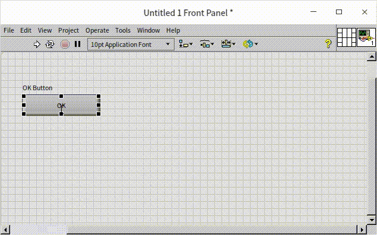
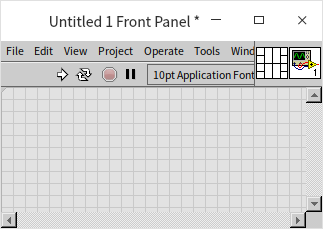

# 编写更复杂的程序

我们在 “[Hello，World! 程序](ramp_up_hello_world)” 一节中创建了自己的第一个 VI，但是它过于简陋。接下来，我们将对它做一点改进，同时介绍 LabVIEW 的其它一些基本用法。了解了这些用法，才算是 LabVIEW 入门了。

## 美化 VI

### 添加图标

首先，要养成一个好习惯，就是要为每个编写好的 VI 都设置一个漂亮的、有意义的图标。

图标是 VI 前面板或程序框图窗口右上方的那个正方形图案，它是一个 32×32 像素点的 256 色图片，如下图箭头所指为 VI 的图标:

图标是 LabVIEW 特有的一个优势。与 LabVIEW 相比，文本编程语言不需要，也不可能为每一个编写出来的函数设置图标。人脑对图像的处理速度要比处理同样信息量的文字快得多。因此，阅读一个编写风格良好的 LabVIEW 代码要比阅读一个文本程序的代码更容易、更快速。比下图这个 VI 图标，一看就知道它和生成波形有关。

VI 的图标虽然会给这个 VI 的使用者带来方便，但却需要它的编写者花费一定的时间与心思来设计绘制它。LabVIEW 2009 版对图标编辑器做了较大的改进：旧版本 LabVIEW 的图标编辑器非常简洁，但功能有限；新的图标编辑器增添了绘图工具中常用的功能，来帮助开发人员快速制作精美的 VI 图标。下文着重介绍一下新图标编辑器。

在 VI 的前面板或程序框图窗口上，用鼠标双击图标，即可打开图标编辑器：

在打开的图标编辑器上可以看到，它拥有多个选项卡页面。每个页面从不同的角度帮助开发者对图标进行加工制作。

第一个页面是模板页。开发者在设计 VI 的图标时，往往会预先考虑让功能相关的一批 VI 具有有共同的风格，比如说共同形式的边框、底色、标签、装饰图案等。很多公司和部门也会为自己开发的 VI 制定规范，采用统一的图标风格。这些共同的部分，可以作为模板保存起来。编辑新图标时，先从模板中选取一个模板图标，然后再在其基础上修改，可以提高工作效率。

在图标编辑器的菜单中选择“文件 -> 保存 -> 模板”就可以把当前的图标保存成一个模板。模板实际上就是一个 32*32 像素的 png 格式图片文件，用户也可以使用其它专业的绘图工具来制作修改这个图片文件。

对于一个新创建的 VI，清空 LabVIEW 默认设置的图标，点击一下已有的模板，这个模板就被复制到新 VI 的图标上了。

图标编辑器的第二页是懒人福音页，可以让用户直接在图标上输入文字。在这一页面提供的文本框中，直接输入想要写的文字即可。图标编辑器提供了四行文字输入框，每行文字可以使用不同的颜色，选择不同的字体与大小。若新图标编辑器写出的文字在图标上模糊不清，那是因为字体不够大引起的。调整一下这个页面上的字号选项，就可以让文字变清晰了。但总体来说，LabVIEW 作为图形化的编程语言，我们应该最大限度利用它的图形优势，尽量使用图形而不是文字作为 VI 的图标。

既然是本书介绍的第一个 VI，就用一个数字 "1" 来作为它的图标吧：

对于很多人来说，图标编辑器的第三页，选取图形大概是图标编辑器中最有用的部分了。VI 开发者最头疼的就是如何绘制即能体现程序功能、又简明好看的图标。如果能从现成的库里选取几个图形，组成一个合适的图标，那肯定是开发者的心愿。“符号” 选项页就提供了大量候选的小图片元素，可以直接把它们拖到右侧图标框上。

如果这些符号还是不够用，用户可以选择直接在右侧的编辑区域绘制图标。图标编辑器提供了基本编辑工具，与 Windows “画图”应用程序中的基本工具相类似，比如画笔、橡皮擦等。用户也可在图标编辑器的菜单中选择“编辑 -> 从文件中导入图片”，导入一个已经绘制好的图片。需要注意控制导入图片的尺寸，VI 的图标只有 32*32 个像素。

图标编辑器的第四页用于管理图层。图标中的模板背景、文字、图形元素等，都被保存在了独立的图层中。有了图层，就可以只针对图标中某一图层进行修改，而不影响其它图层上的内容。比如将这一图层上的图形挪动一下位置、设置为半透明等：

新建的 VI 总会有一个默认图层，存放着一个默认的图标。笔者一般会直接删除这个默认图层，在添加一个新图层来绘制自己的图标。

图标编辑器本身也是使用 LabVIEW 代码开发编写的，是一个很好的学习 LabVIEW 的范例程序。它的主 VI 位于“\[labview]\\resource\\plugins\\lv_icon.vi”。

尽管这个新的图标编辑器在功能上改进了不少，但旧版本的图标编辑器也具有一定的优点。尤其是它运行稳定、启动速度快。在极个别的情况下，新图标编辑器可能会运行出错，这时候，LabVIEW 就会自动打开旧的图标编辑器：

如果我们把新图标编辑器，也就是文件“\[labview]\\resource\\plugins\\lv_icon.vi”改个名字，再打开图标编辑器时，LabVIEW 找不到新的编辑器，就会自动打开旧版本的那个。

在设计图标时，只在图标上写几个字，虽然可以不必费劲心思去设计图形了，但也丧失了其图形化的优势。虽然上文的示例中只在图标上写了一个 "1" 字，但读者在编写正规的程序时，还是应当尽量为每个 VI 设计一个简单明了，又有意义的图标。

### 设置字体

我们这个 VI 的前面板上只有一个字符串显示控件，而且仅仅显示几个文字，我们可以把显示出来的文字字体调大，使它看起来更清楚。用鼠标选中字符串显示控件中的文字，然后点击窗口工具条上的文本设置按钮 ，可以把文字的字号改大。读者还可以试着做些其它改动（如字体、字型、色彩等），使界面看起来更加赏心悦目。

实际上不仅是字符串控件，LabVIEW 中任何控件上的文字部分都可以使用这个文本设置按钮对外观做调整：

本书会在 [界面设计](ui) 一章更加细致的讨论如何为程序选择合适的字体、颜色等。

### 设置标题

为了让 VI 界面显示得更为专业，还可以改变 VI 窗口上默认的标题。选择菜单中的 "文件 -\>VI 属性"，或者鼠标右击 VI 图标，选择 "VI 属性"，调出 VI 属性对话框：

在对话框中选择“窗口外观”类别，然后就可以修改窗口标题了。VI 属性对话框中有很多设置，读者可以自行尝试一下其用途，在本书后面的章节中也将会陆续其中一些主要的设置。

经过我们修改的 VI 运行后，外观看起来舒服多了：

"您吃了吗？" 这个程序还有其它的实现方法。比如，可以让这段文字显示在一个弹出对话框窗口上。使用“单按钮对话框”函数即可达到这个效果。

单按钮对话框位于 "编程 -\> 对话框与用户界面" 函数子选板上。

## 让 VI 持续运行

我们前面编写的程序属于那种一按运行按钮，程序马上运行，得到所需的结果后立即停止的。但是，我们还经常需要编写那些要求能够持续运行一段时间的程序。例如，编写一个检测程序，要求程序一直监视被测对象，若测量值发生变化，程序立即处理新的数据并显示出来。

下面以一个简单的程序为例，介绍让程序持续运行的方法。下图是一个简单的加法程序：

它的前面板如下：

它的功能是用“量表”控件来显示“旋钮”和“转盘”数据的和。程序运行一次，就会立即得到结果。但是，我们还希望它能够持续运行，这样用户就可以随时调整“旋钮”和“转盘”数值，而“量表”也可以立即显示出新的计算结果。

实现此功能最简单的办法，就是点击工具条上的“连续运行”按钮 。点击此按钮后，程序在得到运算结果后不会停止，而是立刻重新运行，直到点击“终止运行”按钮  为止。此时，调整“旋钮”和“转盘”的数值，“量表”中的数值会立刻随之变化。

但是，这个连续运行的方案有其不足之处，它只在临时调试时使用。因为通常提供给最终用户的是 VI 生成的可执行文件，它是没有“连续运行”按钮的。并且，使用“连续运行”按钮，程序内所有的代码都会反复运行，没办法将程序中只需运行一次的代码和需要重复运行的代码区分开来。

持续运行的真正有效方案是使用循环结构。在函数选板中选择“编程 -\> 结构 -\> While 循环”，把循环结构拖到 VI 的程序框图上，再把加法运算的整个代码都置于循环体内。while 循环结构看上去是一个深色的矩形方块，方块包围的区域称为循环体。while 循环的含义是：若不满足循环停止条件（或者满足循环继续运行条件），程序将持续重复执行循环体内的代码。本书会在 [循环结构](data_array) 一节中对 while 循环结构做详细阐述。

while 循环结构的矩形框内，右下角的红色小块用来输入循环条件。鼠标右键点击在循环条件上，在右键菜单中选择“创建输入控件”，就可以为循环条件创建一个控制按钮，名为“停止”。当点击这个按钮的时候，循环就停止运行。

现在再点击工具条上的“运行”按钮，程序将持续运行，与前文提到的点击“连续运行”按钮起到的效果是相同的。点击 VI 前面板上的“停止”控件，可以使 VI 运行停止。

但是，这个程序还需要再改进一下。因为这个程序在运行时，短时间内循环就可以达到非常高的迭代次数：每秒钟循环迭代可达一千万次以上（与电脑硬件配置有关），它占用了大量 CPU 资源。实际上，运算的更新速度不需要那么快。“转盘”数值的更新速度如果超过每秒三、四次，人眼就已经跟不上其变化了。因此，我们可以通过延时来降低循环的迭代频率。把函数选板中的“编程 -\> 定时 -\> 等待”函数添加到循环体内，并设置等待时间为 200 毫秒。这样，循环体内的加法计算结束后，需要等待大约 200 毫秒，才能结束本次循环，进入下一轮循环。如此改进后，程序对 CPU 的占用率只有原来的几百万分之一，可以有效降低程序对 CPU 资源的浪费。改进后的程序框图如下：

实际应用中，可能有时用户会非常频繁的调整输入“旋钮”的值，而有时候又会长时间不改变任何输入，所以这种固定 200 毫秒刷新一次的方案仍然不够完美。本书会在 [事件结构和程序界面](pattern_ui) 一节介绍一个更加优化的界面程序设计方案。

## 保持整洁的程序框图

所有编程语言都强调代码整洁，LabVIEW 也不例外。布局合理，连线清晰的 LabVIEW 程序可读性要比不整洁的代码好得多。理想状况是程序员手动把每个节点，每条数据线都摆放在最合理，最美观的位置上。当然，这样做要花费一些时间和精力。对于不那么重要的程序，比如学习时编写的练习程序，这样的要求也许太苛刻了，不过我们应该做到在编写或改动程序时，经常的点击一下 VI 程序框图窗口工具栏上的按钮“整理程序框图”，让它自动把 LabVIEW 的代码排列整齐：

## 使用子 VI

若一个 VI 应用于其它 VI 中，就称其为子 VI。子 VI 相当于文本编程语言中的子函数。

一个功能十分复杂的 VI，其程序框图上会有大量节点和连线，甚至于电脑屏幕都无法一次完整地显示出其全部代码。这种复杂的框图，难以阅读和理解。为此，通常需要把复杂的程序划分成若干小的程序模块，每个模块只完成简单功能。每个程序模块由一个 VI 来实现，这个 VI 的程序框图上只需少量节点和连线，读者可以很容易、快速地读懂这个简单功能的 VI。最终由一个主 VI 调用这些简单功能的子 VI，以实现其所有的复杂功能。由于主 VI 的程序框图仅由数个子 VI 组成，也是比较容易理解的。这样整个程序的可读性都得到了提高。

下图是一个比较复杂的程序的主 VI 的程序框图：

尽管没有什么注释，但仅从子 VI 的图标也可以大致了解到这个程序完成的是：打开一个硬件设备，对其进行一定的设置，然后读取数据，再关闭该硬件设备。可以想象，这个程序如果不是用子 VI 表示，而是把所有的代码都罗列在一个 VI 的程序框图上，那肯定会变得非常难以读懂。

下图是作者故意编写的一个作为反例的 VI：

它的程序框图没有合理划分和使用子VI，以至于程序框图极为庞大复杂，恐怕任何一个人都不太容易弄懂这一段程序的含义。而屏幕上显示出来的代码只是这个 VI 程序框图很小的一个角落。遇到这种大型的程序框图，可以选择菜单中的“查看 -\> 导航窗口”，在导航窗口中查看整个代码框图的缩略图。上图右下方的灰色浮动窗口就是导航窗口。

有过文本编程语言经验的读者，可能会倾向于只有在需要重用某一段代码时，才把这段代码做成子函数。在 LabVIEW 中却并非如此。LabVIEW 程序中的大多数子 VI 的存在并不是为了代码重用，而是为了提高代码的可读性和可维护性。一个理想的项目的 VI 层次结构应当是金字塔型的：打开 VI 层次结构窗口（在项目主 VI 的菜单中选择“查看 -\>VI 层次结构”），可以看到，主 VI 调用了数个子 VI，第二层的每个子 VI 又分别调用第三层的数个子 VI，依次层层调用。这样层次分明、又没有交叉调用的程序结构是最容易阅读和理解的，比如下图所示的一个复杂程序的 VI 层次结构：

## 创建子 VI

创建子 VI 与创建普通 VI 的起始过程是相同的：设计 VI 的前面板，编写程序框图，编辑图标，保存。但是，子 VI 要被其它 VI 调用，所以还需要特别设置子 VI 的输入输出参数。

子 VI 前面板上的控制控件均可以作为输入参数，而显示控件则可以作为输出参数。但是要注意，控件只有在与 VI 的连线板相连后，才能作为输入输出参数。

例如，我们编写一个简单的子 VI，用于把输入的以华氏度为单位的温度值转换为以摄氏度为单位的温度值。这个 VI 的输入和输出分别是一个实数类型的数值。先编写好它的前面板和程序框图：

然后，就要把 "华氏温度" 设为 VI 的输入参数，而把 "摄氏温度" 设为 VI 的输出参数。新版本的 LabVIEW VI 前面板上都会直接显示出连线板和图标：

老版本的 LabVIEW，默认是把接线板隐藏的。需要在 VI 前面板的图标处，单击鼠标右键，选择菜单中的“显示连线板”，才能显示出连线板。这时原来显示图标的位置，就变成了由小矩形组成的正方型图案：。这些小矩形被称为“接线端”。默认的连线板从左到右均分成四列，每一列矩形的数量分别是 4，2，2，4。我们按照每一列矩形的数量来命名连线板模式，例如，默认的连线板模式是 4224 模式。在连线板右键菜单的 "模式" 栏中，还可以选择其它的模式，但是大家可以记住一个简单的原则：为了让自己编写的代码更美观，凡是能用 4224 模式的子 VI 连线板，尽量使用 4224 模式。

连线板中每一个接线端可以和一个控件相连。LabVIEW 程序中数据的流动方向通常都是从左到右，习惯上输入在左边，输出在右边。因此，连接连线板的时候也要遵循这个原则，尽量保持连线板左侧的接线端与控制控件相连，而右侧的接线端与显示控件相连。

连接连线板时，首先用鼠标点击一下连线板的某个接线端，然后再在与其相对应的控件上点击一下，控件与连线板就关联好了。与控件相连后的接线端颜色会发生变化，以提示编程者注意，避免错误的连接。接线端显示的颜色与连接该控件的连线的颜色是一致的，以方便编程者区分。连接好的连线板如下图所示：

在主 VI 中，调用子 VI 的方式与调用函数类似，可以有多种途径。最简单的方式是将鼠标移动到子 VI 的图标处，按住鼠标左键直接将图标拖拽到上层 VI 程序框图上即可。在子 VI 已经保存关闭后，也可以在主 VI 的程序框图中打开函数选板，选择“选择一个 VI”项，在弹出的选择框中选择相应的子 VI，将其放置到主 VI 的程序框图上。下图是使用了子 VI 的主 VI 的程序框图：

在主 VI 的程序框图中，鼠标移到某个子 VI 的图标上，该子 VI 的接线端就会显示出来，帮助对其进行连线。

## 从程序框图创建子 VI

在编写 VI 时，经常是 VI 的程序框图越写越大，这才意识到，需要把它拆分成子 VI 以降低单个程序框图的复杂度。这种情况下，也可以直接在 VI 程序框图上选出其中的一部分，直接创建成子 VI。

下图是一个较大程序框图的一部分。用鼠标在程序框图上拖拽出一个矩形，松开鼠标，矩形内部的代码就会被选中，被选中的部分会被虚线包络。演示程序中，被选中的代码相对比较独立，适合被创建成子 VI。选中这部分代码后，在菜单中选择“编辑 -\> 创建子 VI”，这部分代码就会被一个新创建的子 VI 代替，子 VI 中的代码就是刚才用鼠标选中的那部分。

从程序框图创建子 VI 时，需要注意以下两点。首先，只有相对比较独立的代码部分（与程序框图的其它部分连线较少）才适合分离出来做成子 VI。其次，生成的子 VI 使用的是默认的图标和连线板模式，此时需要立即打开新创建的子 VI，编辑图标和连线板，然后再保存。

## 项目

复杂的项目，通常不是单个 VI 能够完成的。实际应用中的程序大都由多个 VI 组成，大型的应用程序可能会有成千上万个 VI。对于数量众多的 VI 而言，需要一个行之有效的方法进行管理。从 8.0 版本开始，LabVIEW 增加了一个名为“项目浏览器”的功能。LabVIEW 项目浏览器是一个可以方便地查看、调整程序系统结构的工作区，它与 VC、VB 等语言中的 project、workspace 类似。

项目浏览器的出现使得 LabVIEW 对于项目的管理更加方便，所以我们以后再创建新的程序时，都应该从建立新的项目开始。在 LabVIEW 起始界面中选择“新建 -\> 项目”，可以创建一个新的项目：

项目浏览器用一个树形的结构来表示项目中所有的 VI 和其他文件、设置信息等。

树形结构的最顶层是项目的名称。

第二层是项目运行的目标机器。假如计算机上只安装了一份普通台式机版的 LabVIEW，在这一层就只能看到一个目标机器：“我的电脑”；如果计算机上还安装了 LabVIEW RT、FPGA 等其它硬件环境下运行的 LabVIEW，那么在这一层就能够看到那些已经安装了的其余的目标设备。

第三层以下就是项目中所有使用到的文件了。用户可以添加虚拟文件夹，按自己的喜好组织文件结构。在这里不仅可以添加 VI、[用户自定义控件](data_custome_control)，还可以放置和管理 [Library](manage_library)、[Class](oop_class)、[XControl](ui_xcontrol) 等众多类型的文件。如果安装了某些 LabVIEW 工具包，文件种类还会更多一些。右击树状结构中的每个条目，可看到针对他们的更多设置。

鼠标右键点击“我的电脑”，在菜单中选择添加，可以把我们之前编写的 VI 都添加到项目中来。本书会在 [项目浏览器](manage_project) 一节详细介绍项目浏览器的更多功能。

## 练习

* 创建一个新的 VI，再为 VI 画一个漂亮的图标。
