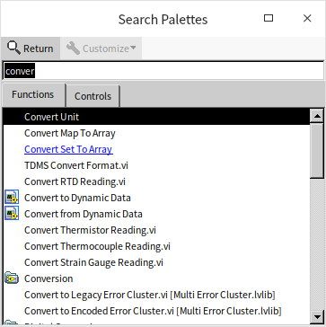
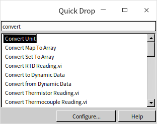
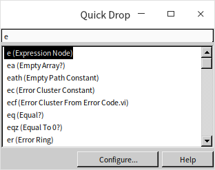

# 按自己的喜好设置编程环境

LabVIEW 编程环境的默认设置，也许对你并不适合。那么可以对编程环境做一些自定义的设置，以提高编程效率。

## LabVIEW 的设置选项

在 LabVIEW 的菜单中选择 "工具 -\> 选项"，就会弹出 LabVIEW 的选项对话框（图
1.39），上面有数目众多的选项。想要查看了解每一个选项的含义，可以点击该对话框的 "帮助" 按钮。

这些选项既然是可选的，就没有绝对优劣之分。LabVIEW 编程者可以在尝试一段时间过后，再根据自己的喜好和习惯，选择最适合自己编程的配置。比如，笔者通常会修改控件接线端在程序框图上的显示方式。控件在程序框图上有两种显示方式：按图标方式，和不按图标方式（图 1.40）。按图标方式显示的接线端更加直观漂亮一些，但是占用面积也大一些；不按图标方式则减小了接线端在程序框图中的显示面积。笔者个人喜欢显示面积小的方式。

图 .39 LabVIEW 的选项

图 .40 以图标显示的控件接线端

## 函数和控件选板的设置

函数和控件选板在编程时使用频率非常高，所以它的设置将直接影响编程效率。两个选板的设置方法相同，所以在下文中仅以函数选板为例说明如何改动它。

默认情况下，函数选板始终是以浮动窗口的形式显示的，它往往会遮挡住部分程序代码。如果本来显示屏的面积就不大，编程者会希望在不使用函数选板时将其隐藏，留出更多的空间显示程序框图。仅在需要使用它的时候，才用鼠标右键点击程序框图的空白处，弹出函数选板。

图 .41 默认的函数选板布局

默认的函数选板上只有 4 项（图
1.41），也许平时编程最常用的函数都不在其中。要想找到平时常用的函数，譬如 "数组索引"、"字符串长度" 等，就不得不先点击选板最下方的双箭头，显示出选板所有条目，再到 "编程 -\> 数组" 等选板中去寻找。既麻烦，又费时间。

其实，选板默认显示的条目是可以修改的，点击函数选板浮动窗口上的 "查看" 按钮，选择 "更改可见类别"。（如果是鼠标右键弹出的函数选板，则先要点击它左上方的图钉按钮，把它钉成浮动窗口。）在 "更改可见类别" 对话框中选择常用的条目，被选中的条目就会出现在函数选板首选项里；也可选择全部类别，反正总共也不过十来项（图
1.42）。

图 .42 需改函数选板默认显示的条目

默认情况下，函数选板总是展开排在最上面的那个条目，所以应该把最常用的条目排在最上面。

将鼠标放到 "收藏" 这个条目左侧的两个竖线上，鼠标就会变成带箭头的十字花，这时按下鼠标可以拖动这个条目。把 "收藏" 拖到函数选板的最上方，然后点击鼠标，首先看到的就是展开了的 "收藏" 选板（图
1.43）。

图 .43 调整条目的位置

之所以要把收藏挪到第一项，是因为我们可以方便地调整 "收藏" 选板中的内容，把那些最常用的函数都放到 "收藏" 里。例如，想把 "编程 -\> 结构" 选板添加到 "收藏" 中去，可以点击 "编程" 条目，将其展开，再点击其中的 "结构"（左上第一个条目），展开 "结构选板"，在 "结构" 这两个字上单击鼠标右键，选择 "添加子选板至收藏夹"（图
1.44）。这样 "结构" 子选板以后就会出现在 "收藏" 之中了。

图 .44 添加子选板到 "收藏"

添加了几个常用函数选板后，函数选板的布置如图
1.45。以后只要一打开函数选板，常用的函数子选板都已经展现，编程方便多了。

图 .45 自定义的函数选板

### 搜索函数和控件

LabVIEW 中的函数和控件毕竟太多了，有时候，需要一个功能，可是就是不知道该去哪找。这时，可以利用函数或控件选板的搜索功能，点击函数或控件选板上方的“搜索”按钮（图标为放大镜的按钮），就可以进入选板搜索功能：

在搜索界面上输入关键词，然后选中一个搜索结果，拖放到 VI 的程序框图或前面板上即可。如果双击一个搜索结果，会跳转到这个结果所在的选板位置，这样我们就能够知道这个节点放置在哪个选板上，以后可以直接到这个选板下选择该节点。

LabVIEW 中还有一个与选板搜索类似的工具叫做 Quick Drop。Quick Drop 的启动快捷键是“Ctrl+Space”，这个快捷键与系统切换中文输入法的快捷键有冲突，所以可能在某些系统下会失效。如果读者在电脑上无法使用这个快捷键启动，还可以试一下“Ctrl+Shift+Space”或“Alt+Space”。在笔者的电脑上，Quick Drop 的启动快捷键是“Ctrl+Alt+Space”。

Quick Drop 也可以用来搜索函数或控件：

更重要的是，在 Quick Drop 中可以为函数或控件添加快捷方式，快捷方式是用几个简短的字母来代表一个函数。点击 Quick Drop 界面上的 Configure 按钮，可以查看 LabVIEW 默认的快捷方式配置：

用户可以在此添加自定义的快捷方式，比如，某为读者总是要使用到“表达式节点”（Expression Node），那么就可以添加一个快捷方式：把字母“e”作为快捷字母，把“Expression Node”作为指向的目标。之后，在 Quick Drop 中输入字母“e”，回车，就会直接得到一个表达式节点：

## 工具选板

LabVIEW 是图形化编程语言，相对于文本编程语言而言，鼠标在 LabVIEW 中的作用远远超过键盘。鼠标要负责选择对象、拖动对象、调整对象的大小，还要负责连线、插入断点和探针等等。总之，一个鼠标身兼数职。

默认情况下，鼠标的功能是 LabVIEW 自动选定的。例如，把鼠标挪到函数体上时，它可以拖动这个函数；而鼠标移动到函数接线端上，则可用作连线。自动选择固然方便，也有其不利的一面：每次都要小心翼翼找准鼠标的位置，才能使其具有期望的功能。所以有些编程者还是倾向于手工变换鼠标的功能，这样就不必再为精确的地找准鼠标的位置而耗费时间了。

这一设置是在 "工具选板" 中完成的。在菜单中选择 "查看 -\> 工具选板"，或者在前面板和程序框图的空白处按住 Shift 键点击鼠标右键，即可弹出工具选板（图
1.46）。

图 .46 工具选板

工具选板最上方的扳手加螺丝刀按钮，就是 "自动选择工具" 按钮。当它被按下时，LabVIEW 自动选择鼠标的功能；再次点击这个按钮，自动选择功能被关闭。这时，鼠标的功能就需要手工来选择了。

点击工具选板上相应的按钮，就可以让鼠标切换至该功能。也可以通过键盘上的按键来快速切换鼠标功能。

在程序框图窗口上，按空格键，使鼠标在 "连线" 和 "定位 / 调整大小 / 选择" 两个功能间切换；按 Tab 键，使鼠标在 "操作值"、"定位 / 调整大小 / 选择"、"编辑文本" 和 "连线" 四个功能间切换。

在 VI 前面板上，按空格键，使鼠标在 "操作值" 和 "定位 / 调整大小 / 选择" 两个功能间切换；按 Tab 键，使鼠标在 "操作值"、"定位 / 调整大小 / 选择"、"编辑文本" 和 "设置颜色" 四个功能间切换。

VI 调试过程中，按空格键或 Tab 键，使鼠标在 "操作值"、"设置 / 清除断点" 和 "探针" 三个功能间切换。

笔者个人经验，平时只要使用 "自动选择工具" 选项就可以应付大多数编程工作了。偶尔需要调出工具选板时，可以按住键盘上的 Shift 键，再在 VI 前面板或程序框图上点击鼠标右键，即可显示出此工具选板。

## 练习

* 查看一遍 LabVIEW 所有的函数选板，看看有哪些将来可能会用到的函数。